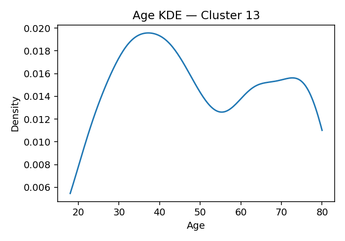
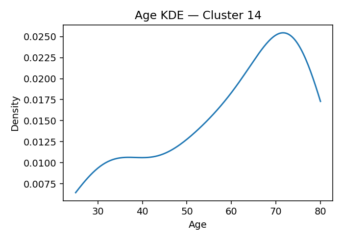
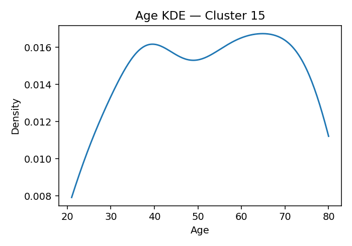
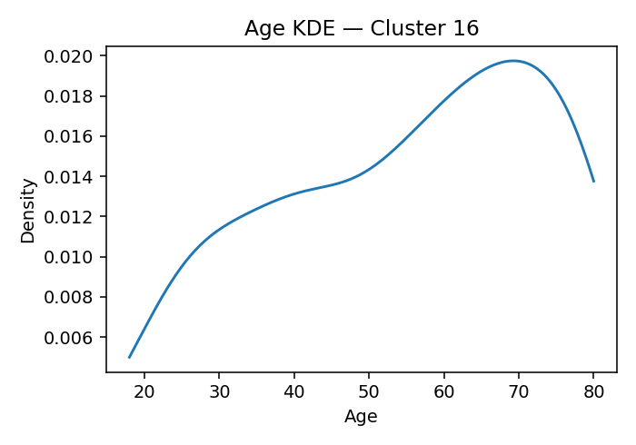
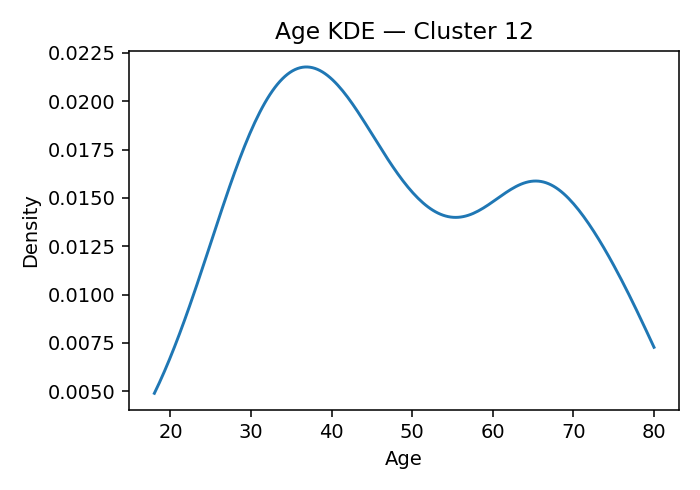
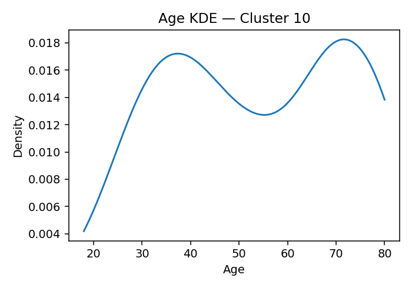
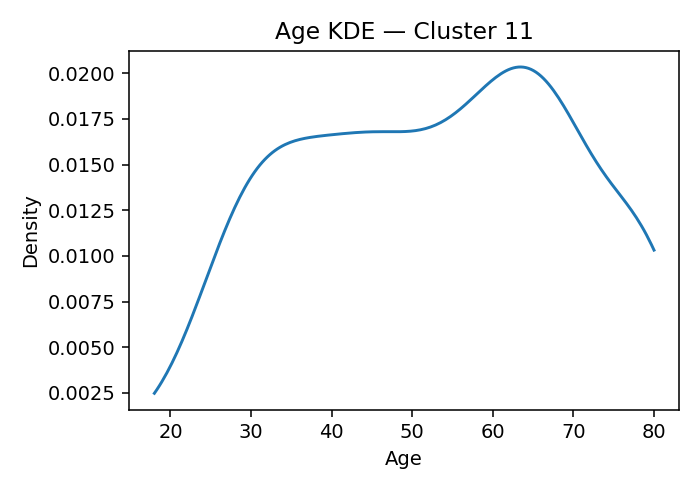
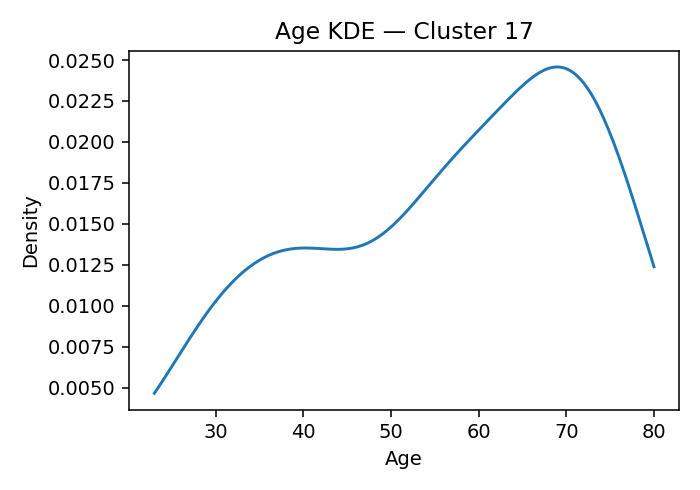

# ANES Ideology Clusters (K=18, silhouette=0.137 if computed)

## Cluster 13
**Population share (weighted):** 19.2%
**Avg Party ID:** 1.95 (p10–p90: 1.0–3.0)
**Vote intention (weighted):** Harris 92.2% · Trump 2.6% · Other 5.2% · Non-voting 4.4%
**Gender (weighted):** Man 49.3% · Woman 44.6% · Nonbinary 6.1% · Other 0.1%
**Education (weighted):** College 82.7% | No college 17.3%
**Homogeneity:** avg z-dist 1.5609, feature z-std 0.3464, domain dispersion 0.1726

**Ideology summary:** Cluster 13 holds consistently liberal views across all domains, with negative mean z-scores indicating opposition to conservative positions on abortion (-0.52), immigration (-0.92), redistribution (-0.53), environment (-0.63), health (-0.37), defense (-0.41), and religion (-0.68). Variation is low in health and defense (SD=0.05), suggesting strong consensus, while immigration (SD=0.39) and religion (SD=0.42) show somewhat more internal diversity. Overall, the cluster is moderately homogeneous (avg z-dist 1.561), with a liberal-leaning party ID (mean 1.95) and high college education (82.7%), predominantly supporting Harris (92.2%) over Trump (2.6%).

## Cluster 14
**Population share (weighted):** 2.7%
**Avg Party ID:** 2.49 (p10–p90: 1.0–6.0)
**Vote intention (weighted):** Harris 84.9% · Trump 11.5% · Other 3.6% · Non-voting 6.4%
**Gender (weighted):** Man 46.5% · Woman 53.5% · Nonbinary 0.0% · Other 0.0%
**Education (weighted):** College 74.4% | No college 25.6%
**Homogeneity:** avg z-dist 2.8762, feature z-std 0.7118, domain dispersion 0.6081

**Ideology summary:** Cluster 14 holds generally liberal views on abortion, immigration, redistribution, environment, health, and defense, as indicated by negative domain means (z-scores from -0.21 to -0.47). In contrast, they are strongly conservative on religion (+1.39), showing a clear divergence in this domain. Variation is moderate across domains, with immigration (SD=0.66) and health (SD=0.64) showing the most heterogeneity, while religion is relatively homogeneous (SD=0.36). Overall, the cluster is moderately politically engaged (Party ID mean 2.49) and leans heavily toward Harris (84.9%) with high college education (74.4%).

## Cluster 5
**Population share (weighted):** 11.1%
**Avg Party ID:** 2.77 (p10–p90: 1.0–5.0)
**Vote intention (weighted):** Harris 80.6% · Trump 12.3% · Other 7.2% · Non-voting 10.5%
**Gender (weighted):** Man 48.9% · Woman 50.4% · Nonbinary 0.2% · Other 0.5%
**Education (weighted):** College 77.6% | No college 22.4%
**Homogeneity:** avg z-dist 1.7716, feature z-std 0.3766, domain dispersion 0.2173

**Ideology summary:** Cluster 5 holds generally liberal views on abortion (-0.43), immigration (-0.47), environment (-0.50), health (-0.34), defense (-0.39), and religion (-0.63), with a slight conservative tilt on redistribution (+0.11). Variation is low in health (SD=0.06) and defense (SD=0.04), indicating strong consensus, while religion (SD=0.43) and immigration (SD=0.39) show more internal diversity. Overall homogeneity is moderate (avg z-dist=1.772), reflecting some within-cluster variation. The cluster leans Democratic (Harris 80.6%) with high college education (77.6%) and moderate party ID (mean 2.77).

## Cluster 1
**Population share (weighted):** 4.8%
**Avg Party ID:** 2.95 (p10–p90: 1.0–6.0)
**Vote intention (weighted):** Harris 75.9% · Trump 21.1% · Other 3.1% · Non-voting 17.6%
**Gender (weighted):** Man 23.0% · Woman 75.4% · Nonbinary 0.0% · Other 1.6%
**Education (weighted):** College 58.8% | No college 41.2%
**Homogeneity:** avg z-dist 2.9329, feature z-std 0.6191, domain dispersion 1.0337

**Ideology summary:** Cluster 1 holds generally liberal views on abortion, immigration, redistribution, environment, health, and religion, as indicated by negative mean z-scores ranging from -0.24 to -0.36. Defense stands out with a strongly conservative mean z-score of +2.64 and zero variation, indicating unanimous conservative views on this domain. Variation within domains is moderate to low, especially minimal for health (SD=0.06) and defense (SD=0.00), suggesting relative homogeneity in these areas, while immigration shows the highest variation (SD=0.67). Overall, the cluster exhibits moderate homogeneity (avg z-dist=2.933), with a liberal-leaning profile except for a strong consensus on conservative defense attitudes.

## Cluster 7
**Population share (weighted):** 4.6%
**Avg Party ID:** 3.63 (p10–p90: 1.0–7.0)
**Vote intention (weighted):** Harris 45.5% · Trump 45.0% · Other 9.5% · Non-voting 15.9%
**Gender (weighted):** Man 43.3% · Woman 56.1% · Nonbinary 0.0% · Other 0.6%
**Education (weighted):** College 41.1% | No college 58.9%
**Homogeneity:** avg z-dist 2.6121, feature z-std 0.5478, domain dispersion 0.1116

**Ideology summary:** Cluster 7 exhibits generally liberal views, with negative mean z-scores on abortion (-0.17), redistribution (-0.26), environment (-0.25), health (-0.33), defense (-0.37), and religion (-0.26), while immigration is neutral (-0.00). Variation is low in health (0.07) and defense (0.05), indicating strong consensus on these domains, but higher in immigration (0.70) and religion (0.64), showing more diverse opinions there. The cluster is moderately homogeneous (avg z-dist 2.612), with moderate variation across features (z-std 0.548) and low domain dispersion (0.112), reflecting consistent liberal-leaning attitudes overall. Party ID is mixed, with nearly equal support for Harris and Trump, suggesting ideological diversity within the group.

## Cluster 3
**Population share (weighted):** 3.3%
**Avg Party ID:** 3.87 (p10–p90: 1.0–7.0)
**Vote intention (weighted):** Harris 44.1% · Trump 50.8% · Other 5.1% · Non-voting 34.1%
**Gender (weighted):** Man 41.4% · Woman 58.6% · Nonbinary 0.0% · Other 0.0%
**Education (weighted):** College 53.0% | No college 47.0%
**Homogeneity:** avg z-dist 4.0097, feature z-std 0.9193, domain dispersion 0.7451

**Ideology summary:** Cluster 3 shows a mixed ideological profile: they are slightly liberal on abortion (-0.14) and religion (-0.33), but slightly conservative on immigration (+0.08) and redistribution (+0.29). They are strongly conservative on environment (+1.21), health (+1.21), and especially defense (+1.77). Variation is highest in health (SD=1.73) and defense (SD=1.36), indicating diverse views within the cluster on these domains, while redistribution (SD=0.45) and abortion (SD=0.55) are more homogeneous. Overall, moderate homogeneity is reflected in domain dispersion (0.745) and feature z-std (0.919), with an average ideological distance of 4.010.

## Cluster 15
**Population share (weighted):** 1.9%
**Avg Party ID:** 3.88 (p10–p90: 1.0–7.0)
**Vote intention (weighted):** Harris 57.2% · Trump 34.6% · Other 8.2% · Non-voting 36.9%
**Gender (weighted):** Man 45.6% · Woman 53.9% · Nonbinary 0.5% · Other 0.0%
**Education (weighted):** College 29.5% | No college 70.5%
**Homogeneity:** avg z-dist 3.8364, feature z-std 0.8763, domain dispersion 1.1784

**Ideology summary:** Cluster 15 shows generally liberal views on abortion (-0.10) and religion (-0.49), with moderate conservatism on immigration (+0.17), environment (+0.29), and defense (+0.74). Redistribution is notably liberal (-0.56), while health is strongly conservative (+3.16) with no variation, indicating unanimous conservative views on health. Defense has the highest variation (SD=1.45), suggesting diverse opinions. Overall, the cluster is moderately heterogeneous (avg z-dist 3.836), with a strong Republican leaning (Party ID mean 3.88) and a majority supporting Trump (34.6%) over Harris (57.2%).

## Cluster 16
**Population share (weighted):** 3.0%
**Avg Party ID:** 3.91 (p10–p90: 1.0–7.0)
**Vote intention (weighted):** Harris 51.7% · Trump 40.4% · Other 7.9% · Non-voting 13.8%
**Gender (weighted):** Man 38.1% · Woman 59.8% · Nonbinary 0.0% · Other 2.1%
**Education (weighted):** College 47.7% | No college 52.3%
**Homogeneity:** avg z-dist 3.2661, feature z-std 0.7525, domain dispersion 0.375

**Ideology summary:** Cluster 16 holds generally liberal views on abortion (-0.20), immigration (-0.10), environment (-0.05), health (-0.32), defense (-0.02), and religion (-0.61), with the strongest liberal stance on religion. They are moderately conservative on redistribution (+0.71). Variation is lowest on health (SD=0.07), indicating strong agreement, and highest on defense (SD=0.97), showing diverse opinions. Overall, the cluster is moderately heterogeneous (avg z-dist 3.266), with moderate dispersion across domains (0.375).

## Cluster 12
**Population share (weighted):** 5.6%
**Avg Party ID:** 3.99 (p10–p90: 1.0–7.0)
**Vote intention (weighted):** Harris 41.5% · Trump 47.0% · Other 11.5% · Non-voting 16.7%
**Gender (weighted):** Man 31.1% · Woman 68.9% · Nonbinary 0.0% · Other 0.0%
**Education (weighted):** College 57.3% | No college 42.7%
**Homogeneity:** avg z-dist 3.2726, feature z-std 0.7138, domain dispersion 0.5977

**Ideology summary:** Cluster 12 shows generally liberal views on abortion (-0.14), redistribution (-0.23), health (-0.33), and religion (-0.33), with a neutral stance on immigration (0.00). They are notably conservative on the environment (+1.36) and defense (+0.72). Variation is low for health (SD=0.07) indicating strong consensus, moderate for environment (0.44) and redistribution (0.50), but high for defense (1.44) and immigration (0.70), suggesting diverse opinions especially on defense. Overall, the cluster is moderately heterogeneous (avg z-dist 3.273) with moderate domain dispersion (0.598). Party ID is centered around 4 (scale 1–7), with a mix of Harris and Trump supporters and a majority college-educated.

## Cluster 8
**Population share (weighted):** 3.6%
**Avg Party ID:** 4.22 (p10–p90: 1.0–7.0)
**Vote intention (weighted):** Harris 38.0% · Trump 59.1% · Other 2.9% · Non-voting 28.0%
**Gender (weighted):** Man 65.3% · Woman 32.5% · Nonbinary 0.4% · Other 1.8%
**Education (weighted):** College 41.1% | No college 58.9%
**Homogeneity:** avg z-dist 4.2348, feature z-std 1.0113, domain dispersion 0.7414

**Ideology summary:** Cluster 8 is strongly conservative on abortion (mean z = +2.22) with moderate homogeneity (SD = 0.77), indicating general agreement but some variation. They are slightly conservative on immigration (+0.20), environment (+0.40), health (+0.35), and defense (+0.62), with defense and health showing higher variation (SDs 1.41 and 1.38), suggesting diverse views within the cluster. Redistribution (-0.17) and religion (-0.06) lean slightly liberal but near neutral, with moderate variation. Overall, the cluster shows moderate domain dispersion (0.741) and average ideological spread (feature z-std 1.011), reflecting a predominantly conservative profile with some internal diversity.

## Cluster 6
**Population share (weighted):** 2.9%
**Avg Party ID:** 4.24 (p10–p90: 1.0–7.0)
**Vote intention (weighted):** Harris 44.4% · Trump 37.5% · Other 18.1% · Non-voting 35.7%
**Gender (weighted):** Man 43.1% · Woman 55.0% · Nonbinary 0.8% · Other 1.1%
**Education (weighted):** College 42.9% | No college 57.1%
**Homogeneity:** avg z-dist 3.7296, feature z-std 0.9247, domain dispersion 1.0569

**Ideology summary:** Cluster 6 exhibits strongly conservative views on abortion (+2.12), health (+2.76), defense (+2.12), and environment (+1.26), with moderate conservatism on immigration (+0.04), redistribution (+0.10), and religion (+0.14). Variation is highest in health (SD=1.11), defense (1.13), and religion (1.11), indicating more diverse opinions in these domains, while abortion (0.80), immigration (0.66), redistribution (0.59), and environment (0.65) show more homogeneity. Overall, the cluster is moderately homogeneous (avg z-dist 3.73) with a conservative central tendency, reflected also in party ID mean of 4.24 and notable support for both Harris (44.4%) and Trump (37.5%).

## Cluster 9
**Population share (weighted):** 2.4%
**Avg Party ID:** 4.36 (p10–p90: 1.0–7.0)
**Vote intention (weighted):** Harris 38.5% · Trump 57.1% · Other 4.4% · Non-voting 5.2%
**Gender (weighted):** Man 43.1% · Woman 56.1% · Nonbinary 0.0% · Other 0.7%
**Education (weighted):** College 64.5% | No college 35.5%
**Homogeneity:** avg z-dist 3.3709, feature z-std 0.7808, domain dispersion 1.1385

**Ideology summary:** Cluster 9 shows slightly liberal views on abortion (-0.10) and religion (-0.53), with modestly conservative stances on immigration (+0.08), redistribution (+0.22), environment (+0.09), and defense (+0.04). Health stands out as strongly conservative (+3.16) with no variation, indicating unanimous agreement on this domain. Variation is moderate to high in defense (1.04) and environment (0.84), suggesting diverse opinions there, while abortion, immigration, redistribution, and religion show moderate homogeneity. Overall, the cluster is moderately heterogeneous (avg z-dist 3.371) with a center leaning slightly conservative except for health and religion, and a Party ID mean of 4.36 reflects a mixed partisan composition.

## Cluster 0
**Population share (weighted):** 10.4%
**Avg Party ID:** 4.67 (p10–p90: 1.0–7.0)
**Vote intention (weighted):** Harris 29.6% · Trump 60.6% · Other 9.8% · Non-voting 10.9%
**Gender (weighted):** Man 53.4% · Woman 44.7% · Nonbinary 1.3% · Other 0.5%
**Education (weighted):** College 61.7% | No college 38.3%
**Homogeneity:** avg z-dist 2.1014, feature z-std 0.4242, domain dispersion 0.3337

**Ideology summary:** Cluster 0 exhibits moderately conservative views on immigration (+0.57) but tends to be slightly liberal on abortion (-0.05), redistribution (-0.09), environment (-0.19), health (-0.31), defense (-0.36), and religion (-0.57). Variation is low for health (0.07) and defense (0.14), indicating consensus, while abortion (0.48) and religion (0.49) show more internal diversity. Overall, the cluster is moderately heterogeneous (avg z-dist 2.101) with moderate domain dispersion (0.334), reflecting some variation across issues despite a generally centrist-to-liberal stance except on immigration.

## Cluster 10
**Population share (weighted):** 3.1%
**Avg Party ID:** 5.37 (p10–p90: 2.0–7.0)
**Vote intention (weighted):** Harris 19.1% · Trump 74.1% · Other 6.8% · Non-voting 10.5%
**Gender (weighted):** Man 38.1% · Woman 61.6% · Nonbinary 0.3% · Other 0.0%
**Education (weighted):** College 56.9% | No college 43.1%
**Homogeneity:** avg z-dist 2.9968, feature z-std 0.7006, domain dispersion 0.3591

**Ideology summary:** Cluster 10 shows a moderately conservative stance on immigration (+0.54) and a slightly conservative view on environment (+0.19), while holding liberal positions on redistribution (-0.51), health (-0.27), defense (-0.14), and religion (-0.54). Abortion views are near neutral (+0.01). Variation is highest in defense (0.79) and environment (0.73), indicating diverse opinions there, while health (0.26) and redistribution (0.42) are more homogeneous. Overall, the cluster is moderately heterogeneous (avg z-dist 2.997) with moderate domain dispersion (0.359), reflecting some internal diversity despite a central tendency toward conservative immigration and liberal redistribution and religion.

## Cluster 11
**Population share (weighted):** 6.9%
**Avg Party ID:** 5.38 (p10–p90: 3.0–7.0)
**Vote intention (weighted):** Harris 11.7% · Trump 81.5% · Other 6.8% · Non-voting 12.2%
**Gender (weighted):** Man 65.4% · Woman 34.6% · Nonbinary 0.0% · Other 0.0%
**Education (weighted):** College 73.8% | No college 26.2%
**Homogeneity:** avg z-dist 2.1091, feature z-std 0.4527, domain dispersion 0.3476

**Ideology summary:** Cluster 11 exhibits moderately conservative views on abortion (+0.31), immigration (+0.15), redistribution (+0.47), and environment (+0.33), while showing more liberal stances on health (-0.26), defense (-0.35), and religion (-0.46). Variation is low for health (SD=0.06) and defense (0.21), indicating homogeneity in these domains, but higher for religion (0.59) and abortion (0.46), suggesting more diverse opinions. Overall, the cluster is somewhat ideologically consistent (domain dispersion 0.348) with a strong Republican leaning (Trump 81.5%) and high college education (73.8%).

## Cluster 17
**Population share (weighted):** 5.0%
**Avg Party ID:** 5.68 (p10–p90: 4.0–7.0)
**Vote intention (weighted):** Harris 9.8% · Trump 82.3% · Other 7.9% · Non-voting 3.1%
**Gender (weighted):** Man 54.2% · Woman 45.5% · Nonbinary 0.0% · Other 0.3%
**Education (weighted):** College 67.4% | No college 32.6%
**Homogeneity:** avg z-dist 3.1036, feature z-std 0.8111, domain dispersion 0.5224

**Ideology summary:** Cluster 17 holds generally conservative views on abortion (+0.77), immigration (+0.56), redistribution (+0.27), environment (+0.37), and strongly conservative views on religion (+1.50). They are slightly more liberal on health (-0.13) and defense (-0.12). Variation is moderate to high in defense (0.82), health (0.65), and environment (0.64), indicating some internal diversity, while religion is more homogeneous (SD 0.33). Overall, the cluster is moderately homogeneous (avg z-dist 3.104) with a strong Republican leaning (82.3% Trump supporters) and a majority college-educated (67.4%).

## Cluster 4
**Population share (weighted):** 3.6%
**Avg Party ID:** 5.93 (p10–p90: 4.0–7.0)
**Vote intention (weighted):** Harris 8.7% · Trump 85.4% · Other 6.0% · Non-voting 6.1%
**Gender (weighted):** Man 48.9% · Woman 51.1% · Nonbinary 0.0% · Other 0.0%
**Education (weighted):** College 57.0% | No college 43.0%
**Homogeneity:** avg z-dist 2.9033, feature z-std 0.7069, domain dispersion 0.4296

**Ideology summary:** Cluster 4 exhibits generally conservative views on abortion (+0.72) and immigration (+0.64), with moderate conservatism on redistribution (+0.30) and environment (+0.29). They lean more liberal on health (-0.27), defense (-0.23), and religion (-0.46). Variation is lowest for health (SD=0.07), indicating strong agreement, while immigration (0.65) and defense (0.61) show greater internal diversity. Overall homogeneity is moderate (avg z-dist 2.903), with a conservative Party ID mean (5.93) and strong Trump support (85.4%), suggesting a predominantly conservative cluster with some internal variation on certain domains.

## Cluster 2
**Population share (weighted):** 6.0%
**Avg Party ID:** 6.07 (p10–p90: 5.0–7.0)
**Vote intention (weighted):** Harris 2.6% · Trump 94.4% · Other 2.9% · Non-voting 7.1%
**Gender (weighted):** Man 57.9% · Woman 42.1% · Nonbinary 0.0% · Other 0.0%
**Education (weighted):** College 66.4% | No college 33.6%
**Homogeneity:** avg z-dist 1.8909, feature z-std 0.4422, domain dispersion 0.5072

**Ideology summary:** Cluster 2 exhibits moderately conservative views on abortion (+0.23), immigration (+1.12), redistribution (+0.60), and environment (+0.47), with the strongest conservatism on immigration. They lean slightly liberal on health (-0.23), defense (-0.32), and religion (-0.31). Variation is lowest for immigration (SD=0.30) and redistribution (0.32), indicating relative agreement, while religion shows the highest variation (0.57), suggesting more diverse views. Overall, the cluster is moderately homogeneous (avg z-dist 1.891), with a strong Republican identification (94.4% Trump supporters) and a majority college-educated (66.4%).

## Methodology
Data: ANES 2024 Time Series. Weighted percentages/means use the first available pre-election weight. Clustering is unweighted (K-means).
Ideology features: seven domains (abortion, immigration, redistribution, environment, health, defense, religion). All items sign-aligned so higher = more conservative. We exclude leader/candidate evaluations, issue salience, and “party better on issue”.
Missingness: ANES negatives → missing. Keep respondents with ≥60% ideology items. Median impute per feature.
Scaling & clustering: z-scores; K chosen by silhouette over K=12…20; K-means with many starts.
Summaries: per cluster — weighted vote shares (Harris/Trump/Other/Non-voting), weighted party-ID mean and p10–p90, weighted gender shares, weighted college/no-college, an age KDE image, population share.
Homogeneity: domain z-means and SDs; plus average z-distance to centroid and mean per-feature z-std.
LLM text: built from domain means/SDs and topline stats; it must reference homogeneity and discuss both means and variation.