# ANES Ideology Clusters (K=10, silhouette=0.146 if computed)

## Cluster 0
**Avg Party ID:** 1.93 | **% Harris (weighted):** 93.2%

**Homogeneity:** avg z-dist=1.8856, feature z-std=0.4663, domain dispersion=0.0032

**Gender (weighted):** Man: 47.8%, Woman: 47.5%, Nonbinary: 4.7%, Other: 0.0%

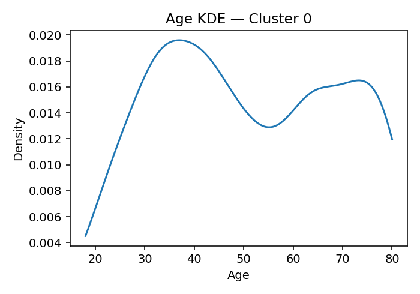

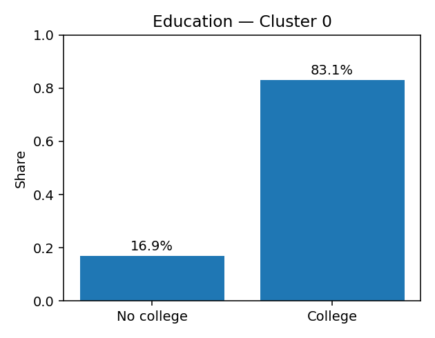

**Ideology summary:** Cluster 0 holds moderately conservative views on abortion, favoring more restrictions and less permissiveness. They strongly support stricter immigration policies, including ending birthright citizenship and building a border wall. Their stance on redistribution is conservative, preferring fewer services and reduced welfare spending, while they favor increased defense spending and show low religious attendance. Environmental regulation and government health intervention are viewed less conservatively.

## Cluster 1
**Avg Party ID:** 6.0 | **% Harris (weighted):** 3.6%

**Homogeneity:** avg z-dist=2.3634, feature z-std=0.5583, domain dispersion=0.0012

**Gender (weighted):** Man: 58.5%, Woman: 41.2%, Nonbinary: 0.0%, Other: 0.3%

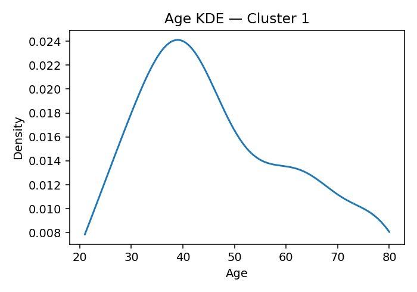

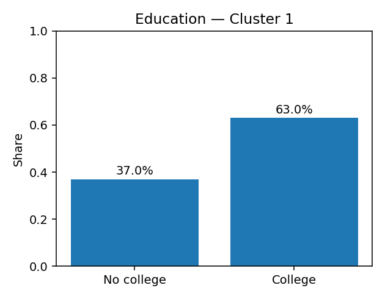

**Ideology summary:** Cluster 1 holds moderately conservative views on abortion, favoring some restrictions but not the most stringent. They are relatively lenient on immigration policies, opposing harsh penalties and border wall construction. Their stance on redistribution is mixed, with moderate support for welfare and aid, while showing strong conservatism on environmental regulation and defense spending. Religious attendance is low to moderate.

## Cluster 2
**Avg Party ID:** 3.79 | **% Harris (weighted):** 53.3%

**Homogeneity:** avg z-dist=3.7285, feature z-std=0.8355, domain dispersion=0.0057

**Gender (weighted):** Man: 35.8%, Woman: 62.9%, Nonbinary: 0.0%, Other: 1.3%

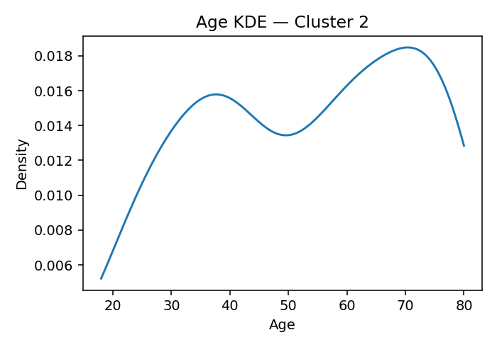

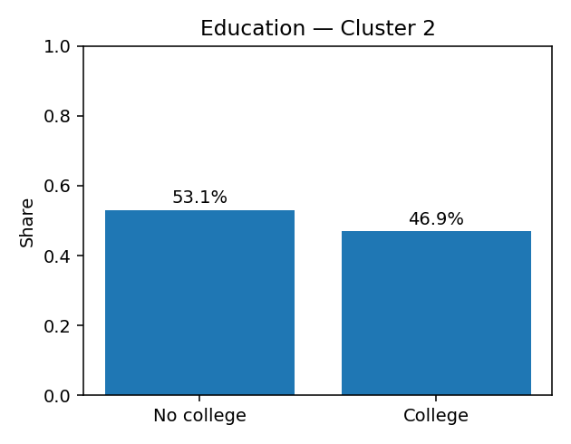

**Ideology summary:** Cluster 2 holds moderately conservative views on abortion, favoring more restrictions and less permissiveness. They support stricter immigration policies, including ending birthright citizenship and building a border wall. Their positions on redistribution, environment, health, defense, and religion are near neutral, showing little preference for either more conservative or liberal policies.

## Cluster 3
**Avg Party ID:** 3.71 | **% Harris (weighted):** 42.7%

**Homogeneity:** avg z-dist=3.0245, feature z-std=0.6583, domain dispersion=0.0049

**Gender (weighted):** Man: 33.7%, Woman: 66.0%, Nonbinary: 0.0%, Other: 0.4%

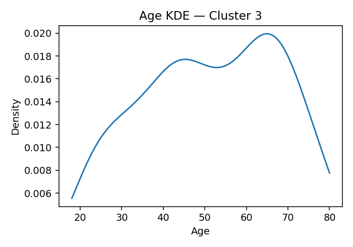

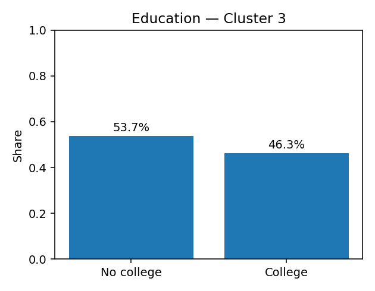

**Ideology summary:** Cluster 3 holds moderately conservative views on abortion, favoring more restrictions but not the most extreme positions. They show mixed stances on immigration, somewhat supporting stricter policies like ending birthright citizenship and building a border wall. Their positions on redistribution, environment, health, defense, and religion are close to neutral, with slight tendencies toward conservative preferences on welfare spending and defense spending.

## Cluster 4
**Avg Party ID:** 4.15 | **% Harris (weighted):** 38.7%

**Homogeneity:** avg z-dist=3.9753, feature z-std=0.9994, domain dispersion=0.0031

**Gender (weighted):** Man: 46.8%, Woman: 51.7%, Nonbinary: 0.6%, Other: 0.8%

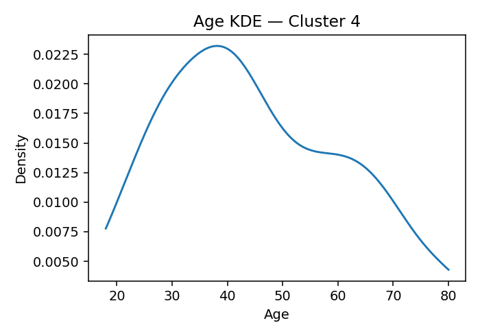

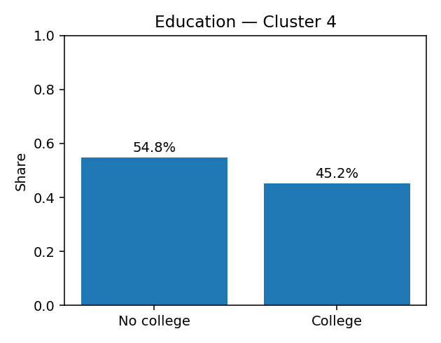

**Ideology summary:** Cluster 4 holds moderately conservative views on abortion, favoring more restrictions and less permissiveness. They lean toward stricter immigration policies, including support for ending birthright citizenship and building a border wall. Their positions are strongly conservative on redistribution, environment regulation, health care (favoring private insurance), and defense spending, while religious attendance is relatively low.

## Cluster 5
**Avg Party ID:** 4.42 | **% Harris (weighted):** 40.5%

**Homogeneity:** avg z-dist=3.402, feature z-std=0.7506, domain dispersion=0.008

**Gender (weighted):** Man: 37.5%, Woman: 62.3%, Nonbinary: 0.1%, Other: 0.0%

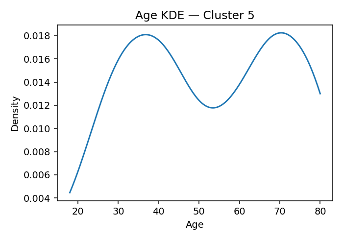

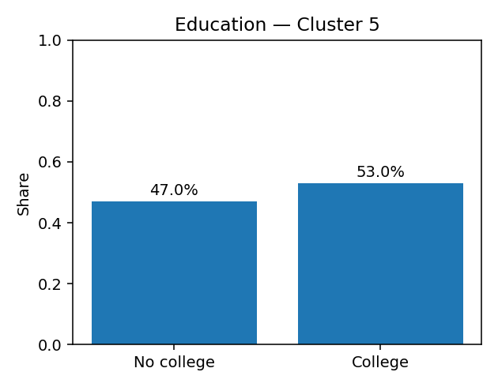

**Ideology summary:** Cluster 5 holds moderately conservative views on abortion, favoring more restrictions and less permissiveness. Their stance on immigration is somewhat conservative, supporting measures like ending birthright citizenship and building a border wall. They prefer reduced welfare spending and government intervention, show low support for environmental regulations, favor increased defense spending, and have moderate religious attendance.

## Cluster 6
**Avg Party ID:** 5.49 | **% Harris (weighted):** 16.4%

**Homogeneity:** avg z-dist=3.4052, feature z-std=0.8727, domain dispersion=0.0028

**Gender (weighted):** Man: 49.6%, Woman: 50.1%, Nonbinary: 0.0%, Other: 0.2%

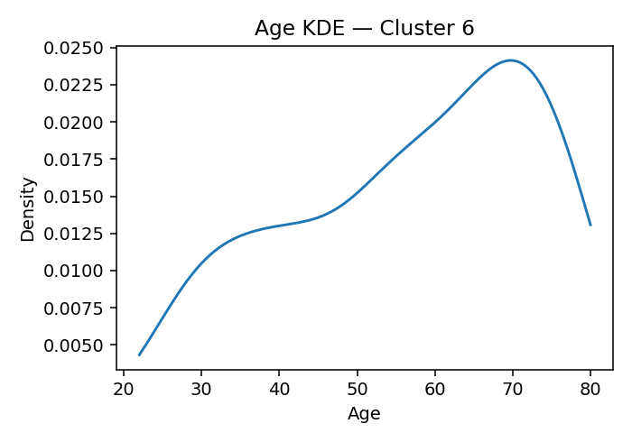

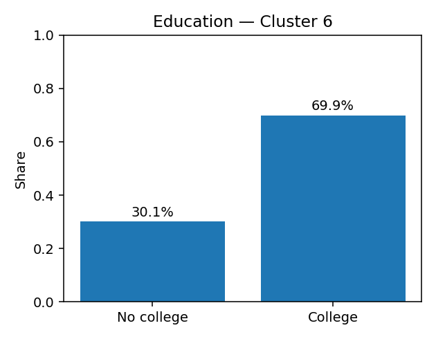

**Ideology summary:** Cluster 6 holds moderately conservative views on abortion, favoring more restrictions and less permissiveness. Their positions on immigration are slightly conservative, supporting some enforcement but less strongly on border walls or ending birthright citizenship. They show strong conservatism on redistribution, environment regulation, and defense spending, favoring fewer services, less environmental regulation, and higher defense budgets, while their health and religion views are near neutral to slightly conservative.

## Cluster 7
**Avg Party ID:** 3.98 | **% Harris (weighted):** 48.4%

**Homogeneity:** avg z-dist=4.013, feature z-std=0.9308, domain dispersion=0.0062

**Gender (weighted):** Man: 39.9%, Woman: 59.5%, Nonbinary: 0.2%, Other: 0.4%

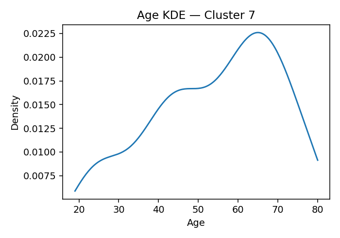

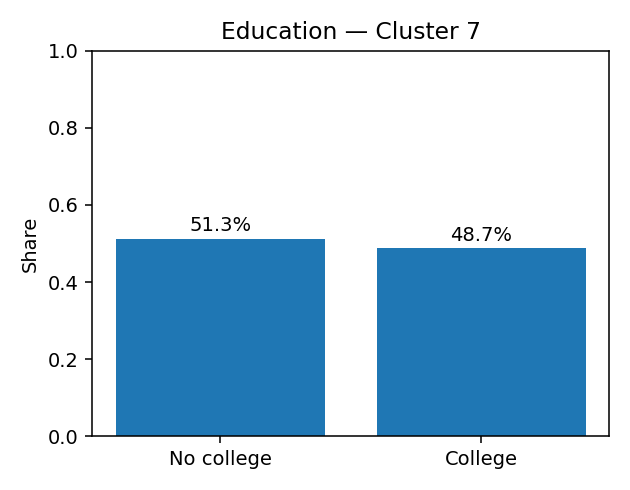

**Ideology summary:** Cluster 7 holds moderately conservative views on abortion, favoring more restrictions but not strongly opposing legality. They support stricter immigration policies, including ending birthright citizenship and building a border wall. Their stance on redistribution is moderately conservative, favoring fewer services and less welfare spending. Environmental regulation is viewed as somewhat burdensome to business, with moderate skepticism toward government action on climate change. They prefer private over government health insurance and support increased defense spending. Religious attendance is low to moderate, indicating a modest role of religion in their views.

## Cluster 8
**Avg Party ID:** 3.79 | **% Harris (weighted):** 53.0%

**Homogeneity:** avg z-dist=2.3486, feature z-std=0.5347, domain dispersion=0.0043

**Gender (weighted):** Man: 49.6%, Woman: 49.1%, Nonbinary: 0.7%, Other: 0.6%

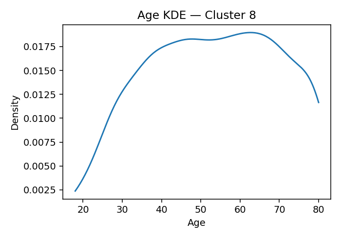

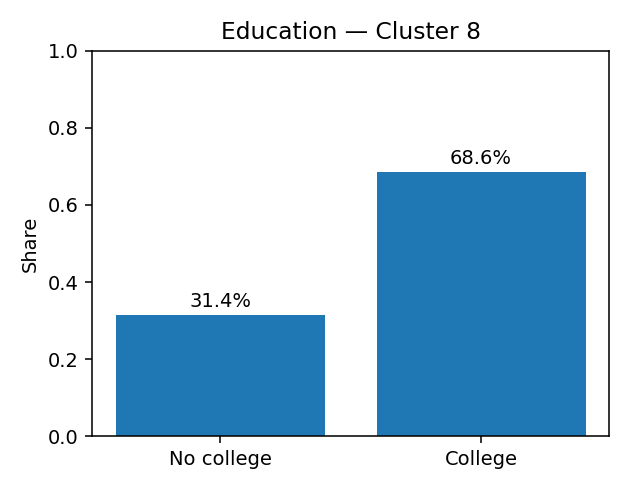

**Ideology summary:** Cluster 8 holds moderately conservative views on abortion, favoring more restrictions but not at the highest level. They show mixed positions on immigration, somewhat supporting stricter policies like ending birthright citizenship and building a border wall. The cluster is moderately conservative on redistribution and health, prefers less government intervention on the environment, strongly favors increased defense spending, and reports relatively low religious attendance.

## Cluster 9
**Avg Party ID:** 4.23 | **% Harris (weighted):** 37.9%

**Homogeneity:** avg z-dist=4.2542, feature z-std=1.0178, domain dispersion=0.0035

**Gender (weighted):** Man: 65.2%, Woman: 32.6%, Nonbinary: 0.4%, Other: 1.8%

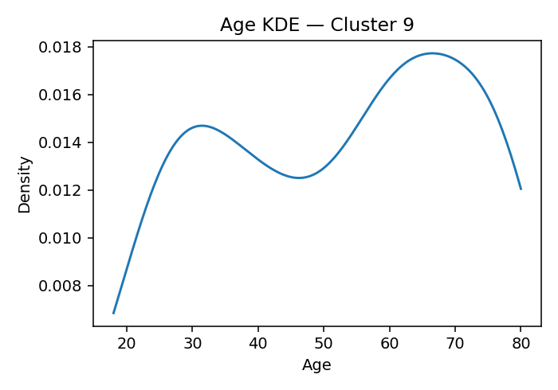

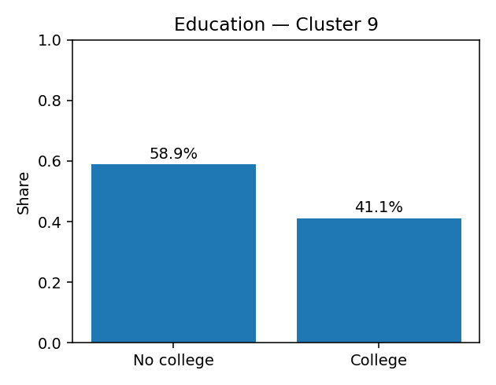

**Ideology summary:** Cluster 9 holds moderately conservative views on abortion, favoring more restrictions and less permissiveness. Their stance on immigration is somewhat conservative, supporting measures like ending birthright citizenship and building a border wall to a limited extent. They prefer reduced welfare spending and government services, show moderate concern for environmental regulation, favor increased defense spending, and have low to moderate religious attendance.

## Methodology

**Data.** ANES 2024 Time Series (public release). Percentages and means use the first available pre-election weight in the file. Clustering itself is unweighted (standard K-means).

**Ideology features.** Variables cover seven domains: abortion, immigration, redistribution/government role, environment/climate, health insurance, defense spending, and religiosity (attendance). All items are sign-aligned so higher = more conservative. We exclude leader evaluations, candidate thermometers, issue salience, and “which party is better” items.

**Missingness.** ANES negative codes are treated as missing. Respondents must answer ≥60% of ideology items. Remaining gaps are median-imputed per variable before clustering.

**Scaling and clustering.** Features are standardized (z-scores). We select K by maximizing silhouette over K=10…20, then fit K-means with multiple starts.

**Summaries.** For each cluster we report: weighted % intending to vote Harris, weighted mean party ID (1=Strong Dem … 7=Strong Rep), a gender breakdown (weighted), an age density plot (for shape; unweighted), and an education histogram (College vs No college, weighted).

**Domain indices & homogeneity.** For each domain we average item z-scores (sign-aligned). Homogeneity is summarized by: (1) average z-distance to centroid, (2) mean per-feature z-std within cluster, and (3) dispersion across domain indices.

**LLM text.** A short, neutral description is generated from the domain indices and ideology item means only. The prompt asks: “Describe their views on abortion, immigration, redistribution, environment, health, defense, and religion, but only based on the data you see.” The OpenAI API key is supplied externally via a variable named `key`.
