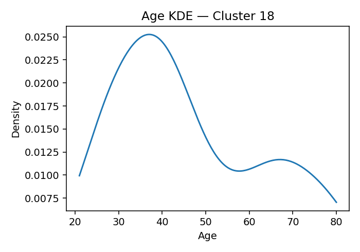

# ANES Ideology Clusters (K=19, silhouette=0.099 if computed)

## Cluster 0
**Population share (weighted):** 4.3%  ·  **Sample size (n):** 142
**Avg Party ID:** 1.73 (p10–p90: 1.0–3.0)
**Vote intention (weighted):** Harris 93.4% · Trump 5.4% · Other 1.3% · Non-voting 0.9%
**Gender (weighted):** Man 55.2% · Woman 44.5% · Nonbinary 0.3% · Other 0.0%
**Race & Hispanic (weighted):** White NH 74.0% · Black NH 8.7% · Hispanic 9.5% · Asian/NHPI NH 6.4% · Native/Other NH 0.6% · Multiracial NH 0.9%
**Education (weighted):** College 87.0% | No college 13.0%
**Economic vulnerability (higher=worse):** mean 2.17 (p20–p80: 1.0-3.0)
**Homogeneity:** avg z-dist 4.721, feature z-std 0.8661, domain dispersion 0.3574

**Ideology summary:** Cluster 0 exhibits a generally liberal ideology with negative mean z-scores on abortion (-0.45), immigration (-0.57), redistribution (-0.21), environment (-0.55), health (-0.20), defense (-0.20), religion (-0.71), democracy (-0.36), foreign policy (-0.36), and trans rights (-0.55). Exceptions include slight conservatism on racial disparity (+0.02) and vaccines (+0.53), and strong conservatism on efficacy/trust/corruption (+0.99). Variation is moderate to high, especially on trans rights (0.90), defense (0.75), and health (0.72), indicating some within-cluster diversity. The cluster is politically homogeneous (avg z-dist 4.721) with a strong Democratic ID (mean 1.73) and high college education (87%), alongside moderate economic vulnerability (mean 2.17).

## Cluster 9
**Population share (weighted):** 12.3%  ·  **Sample size (n):** 587
**Avg Party ID:** 2.04 (p10–p90: 1.0–3.0)
**Vote intention (weighted):** Harris 90.7% · Trump 2.6% · Other 6.7% · Non-voting 6.6%
**Gender (weighted):** Man 46.3% · Woman 44.3% · Nonbinary 9.3% · Other 0.1%
**Race & Hispanic (weighted):** White NH 56.5% · Black NH 18.9% · Hispanic 14.8% · Asian/NHPI NH 4.3% · Native/Other NH 0.2% · Multiracial NH 5.4%
**Education (weighted):** College 79.5% | No college 20.5%
**Economic vulnerability (higher=worse):** mean 2.79 (p20–p80: 2.0-4.0)
**Homogeneity:** avg z-dist 1.9225, feature z-std 0.3763, domain dispersion 0.4053

**Ideology summary:** Cluster 9 exhibits a generally liberal ideology across most domains, with negative mean z-scores on abortion (-0.52), immigration (-0.95), redistribution (-0.53), environment (-0.62), health (-0.35), defense (-0.38), religion (-0.54), and democracy (-0.26). Exceptions include slightly conservative stances on racial disparity (+0.21), efficacy/trust/corruption (+0.08), vaccines (+0.31), foreign policy (+0.30), and trans rights (+0.31). Variation is moderate overall, with higher dispersion in vaccines (0.77), trans rights (0.71), and foreign policy (0.57), indicating less consensus in these areas. The group is politically homogeneous (avg z-dist 1.922) with strong Democratic identification (mean 2.04) and low Trump support (2.6%), high college education (79.5%), and moderate economic vulnerability (mean 2.79).

## Cluster 18
**Population share (weighted):** 4.2%  ·  **Sample size (n):** 127
**Avg Party ID:** 2.36 (p10–p90: 1.0–6.0)
**Vote intention (weighted):** Harris 85.2% · Trump 8.0% · Other 6.8% · Non-voting 7.4%
**Gender (weighted):** Man 49.7% · Woman 46.5% · Nonbinary 2.3% · Other 1.5%
**Race & Hispanic (weighted):** White NH 74.5% · Black NH 9.0% · Hispanic 4.0% · Asian/NHPI NH 7.0% · Native/Other NH 0.0% · Multiracial NH 5.4%
**Education (weighted):** College 85.7% | No college 14.3%
**Economic vulnerability (higher=worse):** mean 2.52 (p20–p80: 2.0-3.0)
**Homogeneity:** avg z-dist 5.2144, feature z-std 0.9721, domain dispersion 0.3514

**Ideology summary:** Cluster 18 exhibits a generally liberal ideology across most domains, with negative mean z-scores in abortion (-0.46), immigration (-0.64), redistribution (-0.30), environment (-0.50), health (-0.30), defense (-0.31), religion (-0.53), democracy (-0.15), and trans rights (-0.97). Slightly conservative tendencies appear in efficacy/trust/corruption (+0.40), vaccines (+0.10), and foreign policy (+0.13), while racial disparity is near neutral (-0.04). Variation is moderate to high in immigration (0.63), religion (0.67), vaccines (0.97), and foreign policy (0.68), indicating some heterogeneity, but overall homogeneity is moderate (avg z-dist 5.214, domain dispersion 0.351). The cluster is predominantly liberal-leaning (Party ID mean 2.36), highly college-educated (85.7%), with moderate economic vulnerability (mean 2.52).

## Cluster 16
**Population share (weighted):** 3.3%  ·  **Sample size (n):** 92
**Avg Party ID:** 2.59 (p10–p90: 1.0–5.0)
**Vote intention (weighted):** Harris 86.0% · Trump 12.8% · Other 1.2% · Non-voting 2.5%
**Gender (weighted):** Man 55.8% · Woman 44.2% · Nonbinary 0.0% · Other 0.0%
**Race & Hispanic (weighted):** White NH 54.6% · Black NH 19.7% · Hispanic 8.5% · Asian/NHPI NH 13.2% · Native/Other NH 0.0% · Multiracial NH 4.0%
**Education (weighted):** College 77.0% | No college 23.0%
**Economic vulnerability (higher=worse):** mean 2.48 (p20–p80: 2.0-3.0)
**Homogeneity:** avg z-dist 5.3061, feature z-std 1.0078, domain dispersion 0.4854

**Ideology summary:** Cluster 16 exhibits a generally liberal stance on most domains, with negative mean z-scores for abortion (-0.09), immigration (-0.43), redistribution (-0.22), environment (-0.43), health (-0.26), defense (-0.21), efficacy/trust/corruption (-0.71), democracy (-0.27), foreign policy (-0.22), and trans rights (-0.41). Religion (+1.30) and vaccines (+0.44) are exceptions, showing more conservative leanings, while racial disparity is near neutral (+0.08). Variation within domains is moderate, with the highest SDs in abortion (0.83) and trans rights (0.83), indicating some heterogeneity. The group is relatively homogeneous overall (avg z-dist 5.306), with a strong Democratic identification (mean 2.59), high college education (77%), and moderate economic vulnerability (mean 2.48).

## Cluster 2
**Population share (weighted):** 10.0%  ·  **Sample size (n):** 712
**Avg Party ID:** 2.62 (p10–p90: 1.0–6.0)
**Vote intention (weighted):** Harris 83.1% · Trump 11.9% · Other 5.1% · Non-voting 3.1%
**Gender (weighted):** Man 53.7% · Woman 46.3% · Nonbinary 0.0% · Other 0.0%
**Race & Hispanic (weighted):** White NH 69.0% · Black NH 6.4% · Hispanic 16.5% · Asian/NHPI NH 4.9% · Native/Other NH 0.0% · Multiracial NH 3.2%
**Education (weighted):** College 79.3% | No college 20.7%
**Economic vulnerability (higher=worse):** mean 2.57 (p20–p80: 2.0-4.0)
**Homogeneity:** avg z-dist 2.1123, feature z-std 0.3872, domain dispersion 0.3178

**Ideology summary:** Cluster 2 exhibits a generally liberal ideology across most domains, with negative mean z-scores in abortion (-0.41), immigration (-0.57), redistribution (-0.10), environment (-0.54), health (-0.33), defense (-0.38), religion (-0.55), racial disparity (-0.06), efficacy/trust/corruption (-0.01), democracy (-0.29), and foreign policy (-0.69). Exceptions include vaccines (+0.49) and trans rights (+0.13), which lean conservative. Variation is moderate to high in trans rights (0.80), vaccines (0.58), religion (0.52), and immigration (0.45), indicating some heterogeneity, while defense (0.04) and health (0.14) show low variation, reflecting homogeneity. The group is politically liberal (Party ID mean 2.62), highly college-educated (79.3%), with moderate economic vulnerability (mean 2.57), suggesting ideology aligns with lower conservatism and moderate economic concerns.

## Cluster 3
**Population share (weighted):** 5.8%  ·  **Sample size (n):** 227
**Avg Party ID:** 3.15 (p10–p90: 1.0–6.0)
**Vote intention (weighted):** Harris 63.3% · Trump 27.8% · Other 9.0% · Non-voting 12.6%
**Gender (weighted):** Man 25.1% · Woman 74.4% · Nonbinary 0.0% · Other 0.5%
**Race & Hispanic (weighted):** White NH 45.2% · Black NH 27.8% · Hispanic 19.6% · Asian/NHPI NH 2.3% · Native/Other NH 0.1% · Multiracial NH 5.0%
**Education (weighted):** College 57.4% | No college 42.6%
**Economic vulnerability (higher=worse):** mean 3.31 (p20–p80: 2.0-5.0)
**Homogeneity:** avg z-dist 3.6431, feature z-std 0.6396, domain dispersion 0.7483

**Ideology summary:** Cluster 3 exhibits a generally moderate to slightly liberal ideology on abortion (-0.20), immigration (-0.18), redistribution (-0.33), health (-0.32), religion (-0.15), racial disparity (-0.06), democracy (-0.16), and trans rights (-0.03), with small to moderate variation except very low variation in health (0.07) and racial disparity (0.28). It is notably conservative on defense (+2.66) with no variation, and slightly conservative on environment (+0.07), efficacy/trust/corruption (+0.25), vaccines (+0.21), and foreign policy (+0.23), though these domains show moderate to high variation (0.56–0.95). The group's homogeneity is moderate (avg z-dist 3.643, domain dispersion 0.748), with a Party ID mean of 3.15 indicating a mixed partisan composition, a majority college-educated (57.4%), and moderate economic vulnerability (mean 3.31).

## Cluster 1
**Population share (weighted):** 3.2%  ·  **Sample size (n):** 175
**Avg Party ID:** 3.42 (p10–p90: 1.0–6.0)
**Vote intention (weighted):** Harris 48.5% · Trump 39.7% · Other 11.8% · Non-voting 17.4%
**Gender (weighted):** Man 41.4% · Woman 57.8% · Nonbinary 0.0% · Other 0.9%
**Race & Hispanic (weighted):** White NH 46.8% · Black NH 25.8% · Hispanic 22.9% · Asian/NHPI NH 1.3% · Native/Other NH 1.2% · Multiracial NH 2.0%
**Education (weighted):** College 47.0% | No college 53.0%
**Economic vulnerability (higher=worse):** mean 3.67 (p20–p80: 2.0-5.0)
**Homogeneity:** avg z-dist 3.0916, feature z-std 0.5404, domain dispersion 0.223

**Ideology summary:** Cluster 1 exhibits a generally liberal orientation on abortion (-0.12), redistribution (-0.21), environment (-0.24), health (-0.32), defense (-0.36), religion (-0.20), democracy (-0.16), and trans rights (+0.10 slightly conservative). Immigration (+0.06), racial disparity (+0.13), vaccines (+0.44), and foreign policy (+0.20) lean more conservative. Variation is low in health (0.08) and defense (0.05) but higher in religion (0.83), foreign policy (0.83), and trans rights (0.89), indicating heterogeneity in these domains. The group is moderately homogeneous overall (avg z-dist 3.092), with a mean Party ID of 3.42 and moderate economic vulnerability (mean 3.67).

## Cluster 13
**Population share (weighted):** 4.1%  ·  **Sample size (n):** 219
**Avg Party ID:** 3.83 (p10–p90: 1.0–7.0)
**Vote intention (weighted):** Harris 54.2% · Trump 36.7% · Other 9.1% · Non-voting 21.6%
**Gender (weighted):** Man 35.7% · Woman 63.6% · Nonbinary 0.0% · Other 0.7%
**Race & Hispanic (weighted):** White NH 65.5% · Black NH 16.2% · Hispanic 13.1% · Asian/NHPI NH 2.7% · Native/Other NH 1.3% · Multiracial NH 1.2%
**Education (weighted):** College 45.5% | No college 54.5%
**Economic vulnerability (higher=worse):** mean 3.6 (p20–p80: 2.0-5.0)
**Homogeneity:** avg z-dist 4.1438, feature z-std 0.7311, domain dispersion 0.3044

**Ideology summary:** Cluster 13 exhibits a generally moderate to slightly liberal ideology on abortion (-0.16), health (-0.32), religion (-0.53), and democracy (-0.22), while showing more conservative stances on redistribution (+0.60), environment (+0.34), defense (+0.46), and trans rights (+0.26). Immigration, racial disparity, efficacy/trust/corruption, vaccines, and foreign policy are near neutral. Variation is highest in defense (1.36), vaccines (1.06), and environment (0.94), indicating diverse views, while health (0.08) and racial disparity (0.39) are more homogeneous. The cluster has moderate ideological dispersion (domain dispersion 0.304) and moderate homogeneity (avg z-dist 4.144), with a Party ID mean of 3.83 and economic vulnerability centered around 3.60.

## Cluster 12
**Population share (weighted):** 10.9%  ·  **Sample size (n):** 599
**Avg Party ID:** 4.11 (p10–p90: 1.0–7.0)
**Vote intention (weighted):** Harris 39.9% · Trump 45.3% · Other 14.9% · Non-voting 21.4%
**Gender (weighted):** Man 50.2% · Woman 49.5% · Nonbinary 0.3% · Other 0.0%
**Race & Hispanic (weighted):** White NH 58.6% · Black NH 10.8% · Hispanic 18.2% · Asian/NHPI NH 7.2% · Native/Other NH 0.2% · Multiracial NH 4.9%
**Education (weighted):** College 62.0% | No college 38.0%
**Economic vulnerability (higher=worse):** mean 2.92 (p20–p80: 2.0-4.0)
**Homogeneity:** avg z-dist 2.6482, feature z-std 0.4593, domain dispersion 0.3549

**Ideology summary:** Cluster 12 exhibits a moderately mixed ideology with slightly liberal leanings on abortion (-0.19), environment (-0.21), health (-0.31), defense (-0.38), religion (-0.53), and democracy (-0.18), while showing conservative tendencies on immigration (+0.12), redistribution (+0.04), racial disparity (+0.09), efficacy/trust/corruption (+0.37), vaccines (+0.43), foreign policy (+0.61), and trans rights (+0.55). Variation is low in health (0.07) and defense (0.05), indicating consensus, but higher in religion (0.69), vaccines (0.65), and trans rights (0.73), reflecting diverse views. The group's moderate party ID mean (4.11) and economic vulnerability (2.92) suggest a centrist profile with some ideological heterogeneity across domains.

## Cluster 8
**Population share (weighted):** 3.9%  ·  **Sample size (n):** 241
**Avg Party ID:** 4.14 (p10–p90: 1.0–7.0)
**Vote intention (weighted):** Harris 44.6% · Trump 50.2% · Other 5.2% · Non-voting 18.2%
**Gender (weighted):** Man 38.6% · Woman 60.7% · Nonbinary 0.2% · Other 0.5%
**Race & Hispanic (weighted):** White NH 56.1% · Black NH 11.7% · Hispanic 16.2% · Asian/NHPI NH 7.4% · Native/Other NH 0.0% · Multiracial NH 8.6%
**Education (weighted):** College 50.8% | No college 49.2%
**Economic vulnerability (higher=worse):** mean 3.74 (p20–p80: 3.0-5.0)
**Homogeneity:** avg z-dist 4.2901, feature z-std 0.7393, domain dispersion 0.8475

**Ideology summary:** Cluster 8 exhibits a generally moderate ideology with slight conservatism on immigration (+0.17), environment (+0.22), defense (+0.54), efficacy/trust/corruption (+0.34), vaccines (+0.49), foreign policy (+0.19), and trans rights (+0.11), while showing mild liberal leanings on abortion (-0.08), redistribution (-0.06), religion (-0.13), and democracy (-0.26). Health stands out with a strong conservative mean (+3.20) and zero variation, indicating uniformity in this domain. Variation is highest in defense (1.39) and trans rights (0.91), suggesting diverse views, whereas racial disparity (0.38) and democracy (0.31) are more homogeneous. The cluster's moderate party ID (mean 4.14) and economic vulnerability (mean 3.74) reflect a balanced but slightly conservative profile with moderate internal ideological diversity.

## Cluster 10
**Population share (weighted):** 3.3%  ·  **Sample size (n):** 121
**Avg Party ID:** 4.15 (p10–p90: 1.0–7.0)
**Vote intention (weighted):** Harris 37.6% · Trump 53.8% · Other 8.6% · Non-voting 37.4%
**Gender (weighted):** Man 43.0% · Woman 55.5% · Nonbinary 0.4% · Other 1.1%
**Race & Hispanic (weighted):** White NH 41.5% · Black NH 20.1% · Hispanic 23.7% · Asian/NHPI NH 5.1% · Native/Other NH 2.1% · Multiracial NH 7.6%
**Education (weighted):** College 49.3% | No college 50.7%
**Economic vulnerability (higher=worse):** mean 3.73 (p20–p80: 2.0-6.0)
**Homogeneity:** avg z-dist 4.3682, feature z-std 0.8675, domain dispersion 1.0259

**Ideology summary:** Cluster 10 exhibits a predominantly conservative ideology, with strong positive means on abortion (+1.73), environment (+1.36), health (+2.94), and defense (+2.24), indicating conservative stances especially on health and defense. Immigration (+0.02), redistribution (+0.09), religion (+0.17), democracy (+0.04), foreign policy (+0.26), and trans rights (+0.25) show slight conservatism, while racial disparity (-0.10), efficacy/trust/corruption (-0.26), and vaccines (-0.46) lean modestly liberal. Variation is moderate to high in abortion (SD=1.13), health (0.92), defense (1.05), religion (1.15), and vaccines (1.22), suggesting some within-group diversity; other domains show lower SDs, indicating more homogeneity. The group has moderate ideological dispersion (domain SD=1.026) and average homogeneity (feature z-std=0.868), with a strong Republican leaning (Party ID mean=4.15) and moderate economic vulnerability (mean=3.73).

## Cluster 5
**Population share (weighted):** 3.2%  ·  **Sample size (n):** 140
**Avg Party ID:** 4.19 (p10–p90: 1.0–7.0)
**Vote intention (weighted):** Harris 39.2% · Trump 56.7% · Other 4.1% · Non-voting 28.3%
**Gender (weighted):** Man 67.6% · Woman 29.7% · Nonbinary 0.5% · Other 2.1%
**Race & Hispanic (weighted):** White NH 56.1% · Black NH 16.9% · Hispanic 5.7% · Asian/NHPI NH 13.5% · Native/Other NH 1.1% · Multiracial NH 6.7%
**Education (weighted):** College 40.5% | No college 59.5%
**Economic vulnerability (higher=worse):** mean 3.46 (p20–p80: 2.0-5.0)
**Homogeneity:** avg z-dist 4.6445, feature z-std 0.83, domain dispersion 0.5962

**Ideology summary:** Cluster 5 exhibits a generally conservative ideology, especially strongly on abortion (+2.19) and moderately on defense (+0.72), environment (+0.41), health (+0.31), and immigration (+0.20). Domains like redistribution (-0.17), religion (-0.02), racial disparity (-0.08), and democracy (-0.26) lean slightly liberal. Variation is moderate to high across domains, with defense (SD=1.45) and health (SD=1.35) showing the greatest heterogeneity, while democracy (SD=0.41) and racial disparity (SD=0.59) are more homogeneous. The group has a high Party ID mean (4.19) with a broad range, moderate economic vulnerability (mean 3.46), and moderate overall ideological dispersion (domain dispersion 0.596).

## Cluster 11
**Population share (weighted):** 2.4%  ·  **Sample size (n):** 60
**Avg Party ID:** 4.56 (p10–p90: 2.0–7.0)
**Vote intention (weighted):** Harris 27.4% · Trump 61.0% · Other 11.5% · Non-voting 36.8%
**Gender (weighted):** Man 54.2% · Woman 45.8% · Nonbinary 0.0% · Other 0.0%
**Race & Hispanic (weighted):** White NH 49.5% · Black NH 10.7% · Hispanic 27.6% · Asian/NHPI NH 4.1% · Native/Other NH 0.4% · Multiracial NH 7.6%
**Education (weighted):** College 44.4% | No college 55.6%
**Economic vulnerability (higher=worse):** mean 3.22 (p20–p80: 2.0-4.0)
**Homogeneity:** avg z-dist 8.8071, feature z-std 1.6474, domain dispersion 0.6648

**Ideology summary:** Cluster 11 exhibits a generally conservative ideology on abortion (+0.52), health (+0.56), defense (+0.48), environment (+0.38), foreign policy (+0.31), and immigration (+0.07), while showing liberal leanings on religion (-0.32), vaccines (-0.40), and trans rights (-0.31). Redistribution (-0.06), racial disparity (+0.03), and efficacy/trust/corruption (-0.05) are near neutral. Democracy is strongly conservative (+2.30) with moderate variation (SD=0.98). Variation is highest in health (SD=1.52) and defense (SD=1.37), indicating some internal diversity, while redistribution and racial disparity show lower variation. The group is moderately homogeneous (avg z-dist 8.807) with a strong Republican identification (mean 4.56) and notable economic vulnerability (mean 3.22).

## Cluster 14
**Population share (weighted):** 4.0%  ·  **Sample size (n):** 184
**Avg Party ID:** 4.73 (p10–p90: 1.0–7.0)
**Vote intention (weighted):** Harris 33.4% · Trump 60.6% · Other 6.0% · Non-voting 9.8%
**Gender (weighted):** Man 39.9% · Woman 60.1% · Nonbinary 0.0% · Other 0.0%
**Race & Hispanic (weighted):** White NH 63.9% · Black NH 12.7% · Hispanic 18.7% · Asian/NHPI NH 0.1% · Native/Other NH 0.8% · Multiracial NH 3.8%
**Education (weighted):** College 56.9% | No college 43.1%
**Economic vulnerability (higher=worse):** mean 3.41 (p20–p80: 2.0-5.0)
**Homogeneity:** avg z-dist 3.588, feature z-std 0.6292, domain dispersion 0.4415

**Ideology summary:** Cluster 14 exhibits a moderately conservative ideology overall, with strong conservatism on environment (+1.43), vaccines (+0.50), trans rights (+0.64), and immigration (+0.30), while showing liberal tendencies on redistribution (-0.14), health (-0.31), democracy (-0.13), and racial disparity (-0.11). Variation is generally moderate, lowest in health (0.08) and highest in religion (0.94) and defense (0.83), indicating some domain-specific heterogeneity. The group is somewhat heterogeneous (avg z-dist 3.588) with moderate domain dispersion (0.441) and an average Party ID leaning toward Republican (mean 4.73), with economic vulnerability centered around 3.41.

## Cluster 6
**Population share (weighted):** 2.0%  ·  **Sample size (n):** 53
**Avg Party ID:** 5.1 (p10–p90: 3.0–7.0)
**Vote intention (weighted):** Harris 13.6% · Trump 74.0% · Other 12.4% · Non-voting 24.9%
**Gender (weighted):** Man 64.1% · Woman 35.9% · Nonbinary 0.0% · Other 0.0%
**Race & Hispanic (weighted):** White NH 71.4% · Black NH 5.3% · Hispanic 15.3% · Asian/NHPI NH 0.4% · Native/Other NH 2.5% · Multiracial NH 5.2%
**Education (weighted):** College 36.5% | No college 63.5%
**Economic vulnerability (higher=worse):** mean 3.34 (p20–p80: 3.0-4.0)
**Homogeneity:** avg z-dist 7.4613, feature z-std 1.4184, domain dispersion 0.4922

**Ideology summary:** Cluster 6 exhibits a generally conservative ideology with positive mean z-scores in abortion (+0.39), immigration (+0.61), redistribution (+0.17), environment (+0.40), health (+0.17), defense (+0.16), efficacy/trust/corruption (+0.84), democracy (+1.29), foreign policy (+0.22), and trans rights (+0.20). Religion (-0.03), racial disparity (-0.10), and vaccines (-0.90) lean slightly liberal. Variation is moderate to high across domains, especially in health (SD=1.18), defense (1.13), and trans rights (1.03), indicating some within-cluster diversity. The cluster is moderately homogeneous (avg z-dist 7.461) with a strong Republican identification (mean 5.10) and moderate economic vulnerability (mean 3.34).

## Cluster 17
**Population share (weighted):** 4.0%  ·  **Sample size (n):** 111
**Avg Party ID:** 5.45 (p10–p90: 2.0–7.0)
**Vote intention (weighted):** Harris 17.4% · Trump 76.3% · Other 6.3% · Non-voting 3.3%
**Gender (weighted):** Man 52.0% · Woman 48.0% · Nonbinary 0.0% · Other 0.0%
**Race & Hispanic (weighted):** White NH 78.6% · Black NH 2.0% · Hispanic 7.8% · Asian/NHPI NH 8.1% · Native/Other NH 0.0% · Multiracial NH 3.5%
**Education (weighted):** College 75.9% | No college 24.1%
**Economic vulnerability (higher=worse):** mean 2.63 (p20–p80: 2.0-4.0)
**Homogeneity:** avg z-dist 5.8253, feature z-std 1.0328, domain dispersion 0.3913

**Ideology summary:** Cluster 17 exhibits a moderately conservative ideology overall, with positive mean z-scores on abortion (+0.29), immigration (+0.55), redistribution (+0.24), environment (+0.20), religion (+0.81), and trans rights (+0.61). Domains such as health (-0.04), defense (-0.14), racial disparity (-0.01), efficacy/trust/corruption (-0.38), democracy (-0.26), vaccines (-0.55), and foreign policy (-0.22) lean liberal on average. Variation is highest in vaccines (SD=1.14) and religion (SD=0.89), indicating less consensus, while democracy (SD=0.29) and racial disparity (SD=0.37) show more homogeneity. The cluster has moderate ideological dispersion (domain dispersion=0.391) and average homogeneity (avg z-dist=5.825), with a strong Republican identification (76.3% Trump) and relatively low economic vulnerability (mean 2.63).

## Cluster 15
**Population share (weighted):** 6.4%  ·  **Sample size (n):** 436
**Avg Party ID:** 5.78 (p10–p90: 5.0–7.0)
**Vote intention (weighted):** Harris 7.0% · Trump 88.9% · Other 4.0% · Non-voting 5.9%
**Gender (weighted):** Man 62.4% · Woman 37.6% · Nonbinary 0.0% · Other 0.0%
**Race & Hispanic (weighted):** White NH 83.4% · Black NH 1.5% · Hispanic 8.7% · Asian/NHPI NH 1.9% · Native/Other NH 0.6% · Multiracial NH 3.9%
**Education (weighted):** College 66.0% | No college 34.0%
**Economic vulnerability (higher=worse):** mean 2.84 (p20–p80: 2.0-4.0)
**Homogeneity:** avg z-dist 2.7762, feature z-std 0.5227, domain dispersion 0.3528

**Ideology summary:** Cluster 15 exhibits a moderately conservative ideology overall, with positive means on abortion (+0.38), immigration (+0.86), redistribution (+0.56), environment (+0.49), efficacy/trust/corruption (+0.26), vaccines (+0.20), foreign policy (+0.48), and trans rights (+0.45). Domains like health (-0.19), defense (-0.30), religion (-0.27), and democracy (-0.16) lean slightly liberal, while racial disparity is neutral (0.00). Variation is generally moderate, with high heterogeneity in religion (SD=0.83), vaccines (0.79), and trans rights (0.87), indicating diverse views within the cluster on these topics. The cluster is politically conservative (Party ID mean 5.78) with high Trump support (88.9%) and moderate economic vulnerability (mean 2.84), reflecting a somewhat cohesive but nuanced ideological profile.

## Cluster 4
**Population share (weighted):** 7.7%  ·  **Sample size (n):** 548
**Avg Party ID:** 5.87 (p10–p90: 4.8–7.0)
**Vote intention (weighted):** Harris 7.6% · Trump 87.0% · Other 5.4% · Non-voting 8.8%
**Gender (weighted):** Man 61.4% · Woman 37.0% · Nonbinary 0.1% · Other 1.5%
**Race & Hispanic (weighted):** White NH 82.3% · Black NH 5.7% · Hispanic 4.4% · Asian/NHPI NH 2.6% · Native/Other NH 0.1% · Multiracial NH 4.9%
**Education (weighted):** College 60.9% | No college 39.1%
**Economic vulnerability (higher=worse):** mean 3.03 (p20–p80: 2.0-4.0)
**Homogeneity:** avg z-dist 2.5091, feature z-std 0.4542, domain dispersion 0.4178

**Ideology summary:** Cluster 4 exhibits a moderately conservative ideology overall, with positive mean z-scores on abortion (+0.30), immigration (+0.77), redistribution (+0.28), environment (+0.24), efficacy/trust/corruption (+0.28), vaccines (+0.60), and trans rights (+0.50). Domains such as health (-0.24), defense (-0.33), religion (-0.15), racial disparity (-0.04), democracy (-0.28), and foreign policy (-0.78) lean more liberal. Variation is moderate to high in religion (SD=0.88) and trans rights (SD=0.86), indicating heterogeneity, while defense (0.19) and health (0.26) are more homogeneous. The group is strongly aligned with Trump (87%) and has moderate economic vulnerability (mean 3.03), suggesting conservative preferences coexist with some economic concerns.

## Cluster 7
**Population share (weighted):** 4.9%  ·  **Sample size (n):** 134
**Avg Party ID:** 6.16 (p10–p90: 5.0–7.0)
**Vote intention (weighted):** Harris 3.9% · Trump 90.0% · Other 6.1% · Non-voting 1.4%
**Gender (weighted):** Man 48.3% · Woman 51.4% · Nonbinary 0.0% · Other 0.3%
**Race & Hispanic (weighted):** White NH 90.6% · Black NH 1.2% · Hispanic 5.6% · Asian/NHPI NH 1.8% · Native/Other NH 0.4% · Multiracial NH 0.4%
**Education (weighted):** College 54.4% | No college 45.6%
**Economic vulnerability (higher=worse):** mean 2.58 (p20–p80: 2.0-3.0)
**Homogeneity:** avg z-dist 5.7276, feature z-std 1.0552, domain dispersion 0.4344

**Ideology summary:** Cluster 7 exhibits a moderately conservative ideology overall, with positive means on abortion (+0.33), immigration (+0.76), redistribution (+0.34), environment (+0.44), religion (+0.45), efficacy/trust/corruption (+0.86), and trans rights (+0.72). Domains like health (-0.15), defense (-0.20), democracy (-0.20), vaccines (-0.62), foreign policy (-0.15), and racial disparity (-0.01) lean slightly liberal. Variation is moderate to high, especially in religion (SD=1.03) and vaccines (SD=1.00), indicating heterogeneity in these areas, while efficacy/trust/corruption shows lower variation (SD=0.39). The cluster is politically homogeneous (Party ID mean 6.16, mostly Trump supporters) with moderate economic vulnerability (mean 2.58).

## Cross-cluster comparison
Several clusters exhibit similarity across multiple domains yet diverge notably on one or two key dimensions. For instance, clusters 2 and 9 both represent sizable population shares (10.0% and 12.3%, respectively) with relatively low mean party identification scores (2.62 and 2.04), indicating a Democratic-leaning orientation. Both clusters show high vote shares for Harris (83.1% and 90.7%) and low support for Trump (11.9% and 2.6%), alongside high college attainment rates (79.3% and 79.5%) and moderate economic vulnerability (means of 2.57 and 2.79). However, cluster 9 has a slightly lower nonvoting rate (6.6% vs. 3.1%) and a marginally more homogeneous profile as indicated by a lower homog_avgdist (1.9225 vs. 2.1123). This suggests that while both clusters are strongly Democratic and well-educated, cluster 9 is somewhat more politically cohesive and less economically vulnerable.

Another pair worth comparing is clusters 4 and 15, both characterized by strong Republican leanings with high mean party ID scores (5.87 and 5.78) and substantial Trump vote shares (87.0% and 88.9%). Both clusters have moderate college attainment (60.9% and 66.0%) and similar economic vulnerability means (3.03 and 2.84). The key difference lies in population share and voter turnout: cluster 4 accounts for 7.7% of the population with a nonvoting rate of 8.8%, whereas cluster 15 comprises 6.4% with a slightly lower nonvoting rate of 5.9%. Additionally, cluster 15 exhibits a lower homog_avgdist (2.7762 vs. 2.5091), indicating marginally greater homogeneity. These contrasts suggest that while both clusters are Republican strongholds with comparable socioeconomic profiles, cluster 15 may represent a more politically engaged and cohesive subset.

Clusters 1 and 3 also share similarities in party ID range (means of 3.42 and 3.15) and moderate Trump vote shares (39.7% and 27.8%), with both showing elevated economic vulnerability (means of 3.67 and 3.31) and moderate college attainment (47.0% and 57.4%). However, cluster 1 has a notably higher nonvoting rate (17.4% vs. 12.6%) and a lower Harris vote share (48.5% compared to 63.3%). Furthermore, cluster 3 has a higher homog_dispers (0.7483 vs. 0.223), indicating greater internal diversity. These differences point to cluster 1 as a more economically vulnerable and less politically engaged group with a more dispersed profile, whereas cluster 3 appears somewhat more cohesive and politically active.

In summary, these comparisons reveal that clusters often align closely on party identification, vote shares, and socioeconomic indicators but can differ meaningfully in political engagement levels, population size, and internal homogeneity. Such distinctions are critical for understanding the nuanced composition of voter segments within the broader electorate.

## Methodology
- **Data:** ANES 2024 Time Series. Weighted stats use the first available pre-election weight. Clustering is unweighted (K-means).
- **Conservative-high coding:** All listed issue items were recoded so higher = more conservative. See script comments by variable.
- **Domains:** abortion, immigration, redistribution, environment, health, defense, religion, racial disparity, efficacy/trust/corruption, democracy, vaccines, foreign policy, trans rights.
- **Missingness:** Negative ANES codes → missing. Keep respondents with ≥60% ideology items. Median impute per feature.
- **Scaling & clustering:** z-scores; K chosen by silhouette in [12,20]; K-means (multi-start).
- **Outputs:** weighted vote shares (Harris/Trump/Other/Non-voting), weighted party-ID mean + p10–p90, gender & race/Hispanic shares, college/no-college, **economic vulnerability** (mean & p20–p80 from income summaries, inverted), age KDE, population share (weighted) & sample size.
- **Homogeneity:** avg z-distance to centroid, mean per-feature z-std, dispersion across domain indices.
- **LLM:** per-cluster summaries reference domain means/SDs and homogeneity; cross-cluster comparison summarizes similarities/differences.