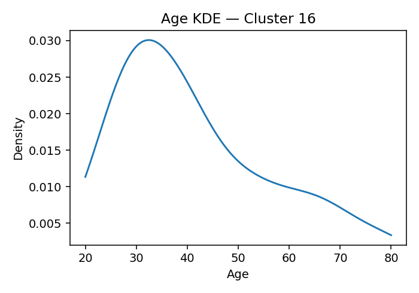

# ANES Ideology Clusters (K=18, silhouette=0.137 if computed)

## Cluster 13
**Population share (weighted):** 19.2%  ·  **Sample size (n):** 904
**Avg Party ID:** 1.95 (p10–p90: 1.0–3.0)
**Vote intention (weighted):** Harris 92.2% · Trump 2.6% · Other 5.2% · Non-voting 4.4%
**Gender (weighted):** Man 49.3% · Woman 44.6% · Nonbinary 6.1% · Other 0.1%
**Education (weighted):** College 82.7% | No college 17.3%
**Homogeneity:** avg z-dist 1.5609, feature z-std 0.3464, domain dispersion 0.1726

**Ideology summary:** Cluster 13 holds generally liberal views across all domains, with negative mean z-scores indicating opposition to conservative positions on abortion (-0.52), immigration (-0.92), redistribution (-0.53), environment (-0.63), health (-0.37), defense (-0.41), and religion (-0.68). Variation is low in health and defense (SD=0.05), suggesting strong consensus there, while immigration and religion show more within-cluster diversity (SD=0.39 and 0.42). Overall, the cluster is moderately homogeneous (avg z-dist 1.561), with members predominantly identifying with a party leaning liberal (Party ID mean 1.95) and high college education (82.7%).

## Cluster 14
**Population share (weighted):** 2.7%  ·  **Sample size (n):** 88
**Avg Party ID:** 2.49 (p10–p90: 1.0–6.0)
**Vote intention (weighted):** Harris 84.9% · Trump 11.5% · Other 3.6% · Non-voting 6.4%
**Gender (weighted):** Man 46.5% · Woman 53.5% · Nonbinary 0.0% · Other 0.0%
**Education (weighted):** College 74.4% | No college 25.6%
**Homogeneity:** avg z-dist 2.8762, feature z-std 0.7118, domain dispersion 0.6081

**Ideology summary:** Cluster 14 holds generally liberal views on abortion, immigration, redistribution, environment, health, and defense, as indicated by negative domain means ranging from -0.21 to -0.47. In contrast, they are strongly conservative on religion (+1.39). Variation within domains is moderate, with immigration and health showing the highest diversity (SDs 0.66 and 0.64), suggesting some internal disagreement. Overall, the cluster is moderately homogeneous (avg z-dist 2.876), with a strong Democratic leaning (Party ID mean 2.49) and high college education (74.4%).

## Cluster 5
**Population share (weighted):** 11.1%  ·  **Sample size (n):** 791
**Avg Party ID:** 2.77 (p10–p90: 1.0–5.0)
**Vote intention (weighted):** Harris 80.6% · Trump 12.3% · Other 7.2% · Non-voting 10.5%
**Gender (weighted):** Man 48.9% · Woman 50.4% · Nonbinary 0.2% · Other 0.5%
**Education (weighted):** College 77.6% | No college 22.4%
**Homogeneity:** avg z-dist 1.7716, feature z-std 0.3766, domain dispersion 0.2173

**Ideology summary:** Cluster 5 holds generally liberal views on abortion (-0.43), immigration (-0.47), environment (-0.50), health (-0.34), defense (-0.39), and religion (-0.63), with a slightly conservative stance on redistribution (+0.11). Variation is low for health (0.06) and defense (0.04), indicating strong consensus, while religion (0.43) and immigration (0.39) show more within-cluster diversity. Overall homogeneity is moderate (avg z-dist 1.772), reflecting some internal variation despite a predominantly liberal orientation. The cluster leans Democratic (Harris 80.6%) with high college education (77.6%).

## Cluster 1
**Population share (weighted):** 4.8%  ·  **Sample size (n):** 193
**Avg Party ID:** 2.95 (p10–p90: 1.0–6.0)
**Vote intention (weighted):** Harris 75.9% · Trump 21.1% · Other 3.1% · Non-voting 17.6%
**Gender (weighted):** Man 23.0% · Woman 75.4% · Nonbinary 0.0% · Other 1.6%
**Education (weighted):** College 58.8% | No college 41.2%
**Homogeneity:** avg z-dist 2.9329, feature z-std 0.6191, domain dispersion 1.0337

**Ideology summary:** Cluster 1 holds generally liberal views on abortion, immigration, redistribution, environment, health, and religion, as indicated by negative mean z-scores ranging from -0.24 to -0.36. In contrast, they are strongly conservative on defense (+2.64) with no variation in that domain, indicating uniformity. Variation within domains is moderate to low, especially very low for health (0.06) and zero for defense, suggesting high homogeneity in those areas. Overall, the cluster shows moderate internal diversity (avg z-dist 2.933) but consistent conservative stance on defense and liberal tendencies elsewhere.

## Cluster 7
**Population share (weighted):** 4.6%  ·  **Sample size (n):** 198
**Avg Party ID:** 3.63 (p10–p90: 1.0–7.0)
**Vote intention (weighted):** Harris 45.5% · Trump 45.0% · Other 9.5% · Non-voting 15.9%
**Gender (weighted):** Man 43.3% · Woman 56.1% · Nonbinary 0.0% · Other 0.6%
**Education (weighted):** College 41.1% | No college 58.9%
**Homogeneity:** avg z-dist 2.6121, feature z-std 0.5478, domain dispersion 0.1116

**Ideology summary:** Cluster 7 shows generally liberal views across most domains, with negative mean z-scores on abortion (-0.17), redistribution (-0.26), environment (-0.25), health (-0.33), defense (-0.37), and religion (-0.26), while immigration is neutral (-0.00). Variation is low in health (0.07) and defense (0.05), indicating consensus, but higher in immigration (0.70) and religion (0.64), suggesting more diverse opinions there. Overall, the cluster is moderately homogeneous (domain dispersion 0.112) with a balanced partisan split (Harris 45.5%, Trump 45.0%) and moderate college education (41.1%).

## Cluster 3
**Population share (weighted):** 3.3%  ·  **Sample size (n):** 136
**Avg Party ID:** 3.87 (p10–p90: 1.0–7.0)
**Vote intention (weighted):** Harris 44.1% · Trump 50.8% · Other 5.1% · Non-voting 34.1%
**Gender (weighted):** Man 41.4% · Woman 58.6% · Nonbinary 0.0% · Other 0.0%
**Education (weighted):** College 53.0% | No college 47.0%
**Homogeneity:** avg z-dist 4.0097, feature z-std 0.9193, domain dispersion 0.7451

**Ideology summary:** Cluster 3 shows a mixed ideological profile: slightly liberal on abortion (-0.14) and religion (-0.33), slightly conservative on immigration (+0.08) and redistribution (+0.29), and strongly conservative on environment (+1.21), health (+1.21), and defense (+1.77). Variation is highest in health (SD=1.73) and defense (SD=1.36), indicating diverse views within the cluster on these domains, while redistribution (SD=0.45) and abortion (SD=0.55) are more homogeneous. Overall, the cluster is moderately heterogeneous (avg z-dist 4.010) with a moderate domain dispersion (0.745), reflecting some internal diversity despite a general conservative tilt on key policy areas.

## Cluster 15
**Population share (weighted):** 1.9%  ·  **Sample size (n):** 111
**Avg Party ID:** 3.88 (p10–p90: 1.0–7.0)
**Vote intention (weighted):** Harris 57.2% · Trump 34.6% · Other 8.2% · Non-voting 36.9%
**Gender (weighted):** Man 45.6% · Woman 53.9% · Nonbinary 0.5% · Other 0.0%
**Education (weighted):** College 29.5% | No college 70.5%
**Homogeneity:** avg z-dist 3.8364, feature z-std 0.8763, domain dispersion 1.1784

**Ideology summary:** Cluster 15 shows generally liberal views on abortion (-0.10) and redistribution (-0.56), with moderately conservative stances on immigration (+0.17), environment (+0.29), defense (+0.74), and notably strong conservatism on health (+3.16). Religion is relatively liberal (-0.49). Variation is lowest in health (0.00), indicating uniformity, while defense shows high variation (1.45), suggesting diverse opinions. Overall, the cluster is moderately heterogeneous (avg z-dist 3.836), with a strong Republican leaning (Party ID mean 3.88) and low college education (29.5%).

## Cluster 16
**Population share (weighted):** 3.0%  ·  **Sample size (n):** 179
**Avg Party ID:** 3.91 (p10–p90: 1.0–7.0)
**Vote intention (weighted):** Harris 51.7% · Trump 40.4% · Other 7.9% · Non-voting 13.8%
**Gender (weighted):** Man 38.1% · Woman 59.8% · Nonbinary 0.0% · Other 2.1%
**Education (weighted):** College 47.7% | No college 52.3%
**Homogeneity:** avg z-dist 3.2661, feature z-std 0.7525, domain dispersion 0.375

**Ideology summary:** Cluster 16 exhibits generally liberal views on abortion (-0.20), immigration (-0.10), health (-0.32), environment (-0.05), defense (-0.02), and religion (-0.61), with a notably conservative stance on redistribution (+0.71). Variation is moderate to high in defense (0.97) and environment (0.81), indicating diverse opinions, while health (0.07) shows strong homogeneity. Overall, the cluster is moderately heterogeneous (avg z-dist 3.266), with a relatively high Party ID mean (3.91) spanning the full range, reflecting mixed political identities.

## Cluster 12
**Population share (weighted):** 5.6%  ·  **Sample size (n):** 228
**Avg Party ID:** 3.99 (p10–p90: 1.0–7.0)
**Vote intention (weighted):** Harris 41.5% · Trump 47.0% · Other 11.5% · Non-voting 16.7%
**Gender (weighted):** Man 31.1% · Woman 68.9% · Nonbinary 0.0% · Other 0.0%
**Education (weighted):** College 57.3% | No college 42.7%
**Homogeneity:** avg z-dist 3.2726, feature z-std 0.7138, domain dispersion 0.5977

**Ideology summary:** Cluster 12 shows generally liberal views on abortion (-0.14), redistribution (-0.23), health (-0.33), and religion (-0.33), with a neutral stance on immigration (0.00). They are notably conservative on the environment (+1.36) and defense (+0.72). Variation is low for health (0.07) and environment (0.44), indicating consensus, but high for defense (1.44) and immigration (0.70), suggesting diverse opinions. Overall, the cluster is moderately heterogeneous (avg z-dist 3.273) with a slightly conservative partisan leaning (Party ID mean 3.99) and mixed electoral preferences.

## Cluster 8
**Population share (weighted):** 3.6%  ·  **Sample size (n):** 171
**Avg Party ID:** 4.22 (p10–p90: 1.0–7.0)
**Vote intention (weighted):** Harris 38.0% · Trump 59.1% · Other 2.9% · Non-voting 28.0%
**Gender (weighted):** Man 65.3% · Woman 32.5% · Nonbinary 0.4% · Other 1.8%
**Education (weighted):** College 41.1% | No college 58.9%
**Homogeneity:** avg z-dist 4.2348, feature z-std 1.0113, domain dispersion 0.7414

**Ideology summary:** Cluster 8 shows a strongly conservative stance on abortion (+2.22) and moderately conservative views on defense (+0.62), environment (+0.40), health (+0.35), and immigration (+0.20). Redistribution (-0.17) and religion (-0.06) lean slightly liberal but are near neutral. Variation is highest in defense (1.41) and health (1.38), indicating diverse opinions, while abortion is relatively more homogeneous (0.77 SD). Overall, the cluster is moderately homogeneous (domain dispersion 0.741) with a strong Republican identification (mean Party ID 4.22) and majority Trump support.

## Cluster 6
**Population share (weighted):** 2.9%  ·  **Sample size (n):** 123
**Avg Party ID:** 4.24 (p10–p90: 1.0–7.0)
**Vote intention (weighted):** Harris 44.4% · Trump 37.5% · Other 18.1% · Non-voting 35.7%
**Gender (weighted):** Man 43.1% · Woman 55.0% · Nonbinary 0.8% · Other 1.1%
**Education (weighted):** College 42.9% | No college 57.1%
**Homogeneity:** avg z-dist 3.7296, feature z-std 0.9247, domain dispersion 1.0569

**Ideology summary:** Cluster 6 exhibits strongly conservative views on abortion (+2.12), health (+2.76), defense (+2.12), and environment (+1.26), with moderately conservative stances on immigration (+0.04), redistribution (+0.10), and religion (+0.14). Variation is highest in health, defense, and religion (SDs ~1.1), indicating more within-cluster diversity on these domains, while abortion, immigration, redistribution, and environment show moderate homogeneity (SDs ~0.6–0.8). Overall, the cluster is relatively homogeneous (avg z-dist 3.73) with a strong conservative leaning, reflected also in a Party ID mean of 4.24 and a mix of political support (Harris 44.4%, Trump 37.5%).

## Cluster 9
**Population share (weighted):** 2.4%  ·  **Sample size (n):** 151
**Avg Party ID:** 4.36 (p10–p90: 1.0–7.0)
**Vote intention (weighted):** Harris 38.5% · Trump 57.1% · Other 4.4% · Non-voting 5.2%
**Gender (weighted):** Man 43.1% · Woman 56.1% · Nonbinary 0.0% · Other 0.7%
**Education (weighted):** College 64.5% | No college 35.5%
**Homogeneity:** avg z-dist 3.3709, feature z-std 0.7808, domain dispersion 1.1385

**Ideology summary:** Cluster 9 shows generally moderate to slightly conservative views on immigration (+0.08), redistribution (+0.22), environment (+0.09), and defense (+0.04), with abortion (-0.10) and religion (-0.53) leaning somewhat liberal. Health stands out as strongly liberal (-3.16) with no variation, indicating unanimous liberal views in this domain. Variation is highest in defense (1.04) and environment (0.84), suggesting diverse opinions there, while health is completely homogeneous. Overall, the cluster is moderately heterogeneous (domain dispersion 1.139) with a Party ID mean of 4.36, reflecting a mixed partisan composition.

## Cluster 0
**Population share (weighted):** 10.4%  ·  **Sample size (n):** 553
**Avg Party ID:** 4.67 (p10–p90: 1.0–7.0)
**Vote intention (weighted):** Harris 29.6% · Trump 60.6% · Other 9.8% · Non-voting 10.9%
**Gender (weighted):** Man 53.4% · Woman 44.7% · Nonbinary 1.3% · Other 0.5%
**Education (weighted):** College 61.7% | No college 38.3%
**Homogeneity:** avg z-dist 2.1014, feature z-std 0.4242, domain dispersion 0.3337

**Ideology summary:** Cluster 0 shows slightly liberal views on abortion (-0.05), redistribution (-0.09), environment (-0.19), health (-0.31), defense (-0.36), and religion (-0.57), with a moderately conservative stance on immigration (+0.57). Variation is lowest in health (0.07) and defense (0.14), indicating consensus, while abortion (0.48) and religion (0.49) show more internal diversity. Overall, the cluster is moderately heterogeneous (avg z-dist 2.101) with moderate domain dispersion (0.334). The group leans somewhat conservative in party ID (mean 4.67) and has a majority Trump support (60.6%) alongside a high college education rate (61.7%).

## Cluster 10
**Population share (weighted):** 3.1%  ·  **Sample size (n):** 188
**Avg Party ID:** 5.37 (p10–p90: 2.0–7.0)
**Vote intention (weighted):** Harris 19.1% · Trump 74.1% · Other 6.8% · Non-voting 10.5%
**Gender (weighted):** Man 38.1% · Woman 61.6% · Nonbinary 0.3% · Other 0.0%
**Education (weighted):** College 56.9% | No college 43.1%
**Homogeneity:** avg z-dist 2.9968, feature z-std 0.7006, domain dispersion 0.3591

**Ideology summary:** Cluster 10 shows a moderately conservative stance on immigration (+0.54) and environment (+0.19), with near-neutral views on abortion (+0.01). They lean liberal on redistribution (-0.51), health (-0.27), and religion (-0.54), and are slightly liberal on defense (-0.14). Variation is highest in defense (0.79) and environment (0.73), indicating diverse opinions there, while health is more homogeneous (0.26). Overall, the cluster is moderately conservative in party ID (mean 5.37) with substantial internal variation (avg z-dist 2.997), reflecting a mix of conservative and liberal views across domains.

## Cluster 11
**Population share (weighted):** 6.9%  ·  **Sample size (n):** 431
**Avg Party ID:** 5.38 (p10–p90: 3.0–7.0)
**Vote intention (weighted):** Harris 11.7% · Trump 81.5% · Other 6.8% · Non-voting 12.2%
**Gender (weighted):** Man 65.4% · Woman 34.6% · Nonbinary 0.0% · Other 0.0%
**Education (weighted):** College 73.8% | No college 26.2%
**Homogeneity:** avg z-dist 2.1091, feature z-std 0.4527, domain dispersion 0.3476

**Ideology summary:** Cluster 11 shows moderately conservative views on abortion (+0.31), immigration (+0.15), redistribution (+0.47), and environment (+0.33), while being more liberal on health (-0.26), defense (-0.35), and religion (-0.46). Variation is low for health (0.06) and moderate for other domains, with religion showing the highest variation (0.59), indicating some diversity in religious views. Overall, the cluster is moderately homogeneous (avg z-dist 2.109) with a slight conservative tilt, reflected in a Party ID mean of 5.38 and strong Trump support (81.5%).

## Cluster 17
**Population share (weighted):** 5.0%  ·  **Sample size (n):** 161
**Avg Party ID:** 5.68 (p10–p90: 4.0–7.0)
**Vote intention (weighted):** Harris 9.8% · Trump 82.3% · Other 7.9% · Non-voting 3.1%
**Gender (weighted):** Man 54.2% · Woman 45.5% · Nonbinary 0.0% · Other 0.3%
**Education (weighted):** College 67.4% | No college 32.6%
**Homogeneity:** avg z-dist 3.1036, feature z-std 0.8111, domain dispersion 0.5224

**Ideology summary:** Cluster 17 holds generally conservative views on abortion (+0.77), immigration (+0.56), redistribution (+0.27), environment (+0.37), and strongly conservative views on religion (+1.50). They are slightly liberal on health (-0.13) and defense (-0.12). Variation is moderate to high in defense (0.82), health (0.65), and environment (0.64), indicating some internal diversity, while religion is more homogeneous (0.33 SD). Overall, the cluster is moderately conservative with some variation across domains, especially defense and health, and shows relatively high party loyalty to Trump (82.3%) and a majority college-educated (67.4%).

## Cluster 4
**Population share (weighted):** 3.6%  ·  **Sample size (n):** 115
**Avg Party ID:** 5.93 (p10–p90: 4.0–7.0)
**Vote intention (weighted):** Harris 8.7% · Trump 85.4% · Other 6.0% · Non-voting 6.1%
**Gender (weighted):** Man 48.9% · Woman 51.1% · Nonbinary 0.0% · Other 0.0%
**Education (weighted):** College 57.0% | No college 43.0%
**Homogeneity:** avg z-dist 2.9033, feature z-std 0.7069, domain dispersion 0.4296

**Ideology summary:** Cluster 4 holds generally conservative views on abortion (+0.72), immigration (+0.64), redistribution (+0.30), and environment (+0.29), while being more liberal on health (-0.27), defense (-0.23), and religion (-0.46). Variation is lowest in health (0.07), indicating strong consensus, and highest in immigration (0.65) and defense (0.61), showing more diverse opinions. Overall, the cluster is moderately homogeneous (avg z-dist 2.903) with moderate domain dispersion (0.430). The group leans strongly Republican (Party ID mean 5.93) with high Trump support (85.4%) and a majority college-educated (57%).

## Cluster 2
**Population share (weighted):** 6.0%  ·  **Sample size (n):** 529
**Avg Party ID:** 6.07 (p10–p90: 5.0–7.0)
**Vote intention (weighted):** Harris 2.6% · Trump 94.4% · Other 2.9% · Non-voting 7.1%
**Gender (weighted):** Man 57.9% · Woman 42.1% · Nonbinary 0.0% · Other 0.0%
**Education (weighted):** College 66.4% | No college 33.6%
**Homogeneity:** avg z-dist 1.8909, feature z-std 0.4422, domain dispersion 0.5072

**Ideology summary:** Cluster 2 exhibits moderately conservative views on abortion (+0.23), immigration (+1.12), redistribution (+0.60), and environment (+0.47), with the strongest conservatism on immigration. They lean slightly liberal on health (-0.23), defense (-0.32), and religion (-0.31). Variation is lowest on immigration (SD=0.30) and redistribution (0.32), indicating relative agreement, while religion shows the highest variation (0.57), suggesting diverse views. Overall, the cluster is moderately homogeneous (avg z-dist 1.891) with a strong Republican identification (mean Party ID 6.07) and high Trump support (94.4%).

## Cross-cluster comparison
The provided data delineates 18 distinct ideology clusters characterized by their population shares, party identification (PID) distributions, vote shares in Harris and Trump polls, educational attainment, and mean positions across seven policy domains: abortion, immigration, redistribution, environment, health, defense, and religion. A comparative analysis reveals several clusters that are broadly similar across most domains but diverge notably on one or two dimensions, as well as clusters that differ more comprehensively.

Clusters 0 and 7 exhibit considerable similarity in their moderate-to-conservative stances across most domains, with both showing slightly negative or near-neutral positions on abortion, redistribution, environment, health, defense, and religion. Cluster 0 (10.4% population share, PID mean 4.67) leans somewhat more Republican in vote share (Trump 60.6%) compared to cluster 7 (4.6% population share, PID mean 3.63, Trump 45.0%). The key contrast lies in immigration: cluster 0 holds a moderately positive position (0.57), indicating a more restrictive or conservative stance, whereas cluster 7 is nearly neutral (-0.002). This suggests that while both clusters share a generally conservative profile, cluster 0 is more restrictive on immigration.

Clusters 2 and 4 both represent strongly Republican-leaning groups with high Trump support (94.4% and 85.4%, respectively) and PID means above 5.9. They share positive positions on abortion (0.23 and 0.72), immigration (1.12 and 0.64), and redistribution (0.60 and 0.30), indicating conservative or right-leaning views on these issues. However, cluster 4 is somewhat less supportive of redistribution and environment policies than cluster 2, with cluster 4’s environment position near neutral (0.29) versus cluster 2’s more positive stance (0.47). Additionally, cluster 4 exhibits a more negative position on religion (-0.46) compared to cluster 2 (-0.31), suggesting subtle differences in religious attitudes despite overall similarity.

Clusters 1 and 5 both lean Democratic with PID means below 3.0 and high Harris vote shares (75.9% and 80.6%). They share negative positions on abortion, immigration, environment, health, defense, and religion, consistent with liberal policy preferences. The notable contrast is in redistribution: cluster 1 holds a more negative position (-0.32), indicating less support for redistribution, whereas cluster 5 is slightly positive (0.11), suggesting more openness to redistribution policies. This difference may reflect varying economic policy attitudes within a broadly liberal constituency.

Clusters 3 and 6, both smaller groups with moderate PID means (3.87 and 4.24) and mixed vote shares (Harris 44.1% and 44.4%, Trump 50.8% and 37.5%), show some alignment on immigration and religion but diverge sharply on health and defense. Cluster 6 exhibits strongly positive positions on health (2.76) and defense (2.12), indicating strong support for expansive policies or spending in these areas, whereas cluster 3 also shows positive but less extreme positions (health 1.21, defense 1.77). Additionally, cluster 6’s abortion stance is strongly positive (2.12), contrasting with cluster 3’s near-neutral to slightly negative position (-0.14). These differences highlight distinct emphases on social and defense policies despite some shared moderate partisan identification.

Cluster 13 stands out as the largest single cluster (19.2% population share) with a strongly Democratic PID mean (1.95) and very high Harris vote share (92.2%). It consistently holds negative positions across all domains, reflecting liberal stances on abortion (-0.52), immigration (-0.92), redistribution (-0.53), environment (-0.63), health (-0.37), defense (-0.41), and religion (-0.68). This cluster contrasts sharply with cluster 2, a smaller but strongly Republican group (6.0% share, PID mean 6.07), which holds positive positions on abortion, immigration, redistribution, and environment, underscoring the polarized nature of these two large ideological segments.

In summary, the clusters reveal a spectrum of ideological profiles with some groups sharing broad policy orientations but differing on key issues such as immigration, redistribution, or religion. Clusters 0 and 7, as well as 2 and 4, exemplify this pattern of similarity with targeted contrasts. Meanwhile, clusters 1 and 5 illustrate intra-liberal variation on economic redistribution. The largest clusters, 13 and 2, represent the ideological poles with consistent and opposing positions across domains, reflecting the broader partisan divide in the population. Population shares and vote distributions further contextualize these clusters, indicating their relative size and electoral significance.

## Methodology
- **Data:** ANES 2024 Time Series. Weighted stats use the first available pre-election weight in the file. Clustering is unweighted (K-means).
- **Ideology features:** Seven domains (abortion, immigration, redistribution/government role, environment/climate, health insurance, defense spending, religiosity). Signs aligned so higher = more conservative. Leader/candidate evaluations, issue salience, and “party better on issue” are excluded.
- **Missingness:** Negative ANES codes treated as missing. Keep respondents with ≥60% ideology items. Median impute per feature for clustering.
- **Scaling & clustering:** Standardize features (z). Choose K by silhouette over K=12…20; fit K-means with many starts.
- **Per-cluster outputs:** weighted vote shares (Harris/Trump/Other/Non-voting), weighted party-ID mean and p10–p90, weighted gender shares, weighted college/no-college, age KDE image, **population share (weighted)** and **sample size (n)**.
- **Homogeneity:** Report (1) average z-distance to centroid, (2) mean per-feature z-std, (3) dispersion across domain z-means.
- **LLM text:** Summaries and comparison are generated from the domain means/SDs and toplines; they must reference homogeneity and discuss both means and variation. The OpenAI API key is supplied externally via a variable named `key`.