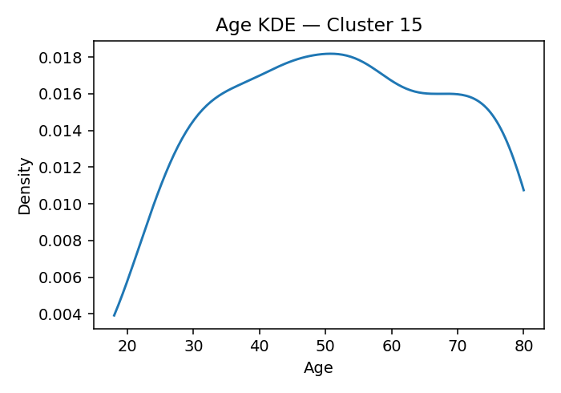

# ANES Ideology Clusters (K=17, silhouette=0.050 if computed)

## Cluster 3
**Population share (weighted):** 10.7%  ·  **Sample size (n):** 558
**Avg Party ID:** 1.79 (p10–p90: 1.0–3.0)
**Vote (weighted, normalized):** Harris 83.3% · Trump 0.3% · Other 2.8% · Non-voting 4.0% · Unknown 9.7%
**Gender (weighted):** Man 41.9% · Woman 50.6% · Nonbinary 7.0% · Other 0.1%
**Race & Hispanic (weighted):** White NH 52.9% · Black NH 17.3% · Hispanic 18.2% · Asian/NHPI NH 6.0% · Native/Other NH 0.2% · Multiracial NH 5.3%
**Education (weighted):** College 79.6% | No college 19.3%
**Economic vulnerability (higher=worse):** mean 2.62 (p20–p80: 2.0-3.0)
**Homogeneity:** avg z-distance 3.5365, feature z-std 0.5047, domain dispersion 0.449

**Ideology summary:** Cluster 3 is generally liberal across most domains, with negative mean z-scores on abortion (-0.50), immigration (-0.80), redistribution (-0.38), environment (-0.61), health (-0.28), defense (-0.25), religion (-0.20), democracy (-0.26), vaccines (-0.64), trans rights (-0.92), minority representation (-0.83), and DEI/affirmative action (-1.32). Slightly conservative tendencies appear on racial disparity (+0.07), efficacy/trust/corruption (+0.16), Israel aid (+0.07), and notably Ukraine aid (+0.53). The cluster sees the U.S. threat level as average (0.00). Variation is moderate to low across domains, with the lowest SD in vaccines (0.00) and DEI/affirmative action (0.24), indicating relative homogeneity in these views. Economic vulnerability is moderate (mean 2.62), and the cluster is predominantly college-educated (79.6%) and strongly supports Harris (83.3%), reflecting a cohesive, liberal-leaning profile with some nuanced conservative stances on foreign aid and trust.

## Cluster 15
**Population share (weighted):** 8.4%  ·  **Sample size (n):** 458
**Avg Party ID:** 2.06 (p10–p90: 1.0–3.0)
**Vote (weighted, normalized):** Harris 82.5% · Trump 5.5% · Other 0.6% · Non-voting 1.9% · Unknown 9.6%
**Gender (weighted):** Man 43.8% · Woman 53.7% · Nonbinary 2.5% · Other 0.0%
**Race & Hispanic (weighted):** White NH 59.6% · Black NH 14.3% · Hispanic 19.1% · Asian/NHPI NH 3.4% · Native/Other NH 0.0% · Multiracial NH 3.4%
**Education (weighted):** College 84.2% | No college 15.8%
**Economic vulnerability (higher=worse):** mean 2.66 (p20–p80: 2.0-4.0)
**Homogeneity:** avg z-distance 3.9021, feature z-std 0.5668, domain dispersion 0.3045

**Ideology summary:** Cluster 15 exhibits generally liberal ideology across most domains, with negative z-scores on abortion (-0.46), immigration (-0.58), redistribution (-0.23), environment (-0.54), health (-0.24), religion (-0.34), racial disparity (-0.08), vaccines (-0.60), and trans rights (-0.72), minority representation (-0.81). Exceptions include slightly conservative stances on Ukraine aid (+0.27) and DEI/affirmative action (+0.19). Variation within domains is moderate to high, especially in defense (0.78), religion (0.82), and Ukraine aid (0.84), indicating some internal diversity. The cluster tends to perceive the U.S. as somewhat under threat (+0.10). Members are predominantly liberal-leaning Democrats (Harris 82.5%), highly educated (84.2% college), and experience moderate economic vulnerability (mean 2.66). Overall, the cluster is fairly homogeneous with moderate domain dispersion.

## Cluster 14
**Population share (weighted):** 7.4%  ·  **Sample size (n):** 214
**Avg Party ID:** 2.09 (p10–p90: 1.0–4.0)
**Vote (weighted, normalized):** Harris 83.7% · Trump 5.8% · Other 0.6% · Non-voting 1.4% · Unknown 8.5%
**Gender (weighted):** Man 51.7% · Woman 47.6% · Nonbinary 0.2% · Other 0.0%
**Race & Hispanic (weighted):** White NH 71.0% · Black NH 12.2% · Hispanic 6.7% · Asian/NHPI NH 8.4% · Native/Other NH 0.3% · Multiracial NH 1.5%
**Education (weighted):** College 81.5% | No college 18.5%
**Economic vulnerability (higher=worse):** mean 2.42 (p20–p80: 2.0-3.0)
**Homogeneity:** avg z-distance 6.6587, feature z-std 0.9283, domain dispersion 0.3807

**Ideology summary:** Cluster 14 exhibits generally liberal ideology across most domains, with negative mean z-scores on abortion (-0.37), immigration (-0.52), redistribution (-0.21), environment (-0.53), health (-0.22), defense (-0.25), trans rights (-0.65), minority representation (-0.49), and DEI/affirmative action (-0.50). Slightly conservative tendencies appear on Israel aid (+0.11) and more strongly on Ukraine aid (+0.86). The cluster shows moderate homogeneity (avg z-dist 6.659) with relatively low variation in racial disparity (-0.02, SD 0.26) and democracy (-0.34, SD 0.27), but higher variation in religion (SD 1.01) and DEI (SD 0.81). They perceive a slightly elevated U.S. threat level (+0.12). Economic vulnerability is moderate (mean 2.42), and the cluster leans strongly Democratic (Harris 83.7%) with high college education (81.5%).

## Cluster 16
**Population share (weighted):** 4.3%  ·  **Sample size (n):** 112
**Avg Party ID:** 2.35 (p10–p90: 1.0–4.15)
**Vote (weighted, normalized):** Harris 70.6% · Trump 7.7% · Other 6.1% · Non-voting 8.5% · Unknown 7.2%
**Gender (weighted):** Man 49.6% · Woman 46.4% · Nonbinary 2.4% · Other 1.5%
**Race & Hispanic (weighted):** White NH 51.7% · Black NH 17.8% · Hispanic 14.8% · Asian/NHPI NH 6.2% · Native/Other NH 0.0% · Multiracial NH 8.0%
**Education (weighted):** College 80.5% | No college 19.5%
**Economic vulnerability (higher=worse):** mean 2.51 (p20–p80: 2.0-3.0)
**Homogeneity:** avg z-distance 7.2739, feature z-std 1.0345, domain dispersion 0.347

**Ideology summary:** Cluster 16 exhibits a generally liberal ideology across most domains, with negative mean z-scores on abortion (-0.42), immigration (-0.52), redistribution (-0.34), environment (-0.46), health (-0.19), religion (-0.38), trans rights (-0.69), minority representation (-0.62), and DEI/affirmative action (-0.57). The cluster is moderately conservative only on efficacy/trust/corruption (+0.49) and near neutral on racial disparity (-0.01) and democracy (-0.07). Variation within domains is moderate to high, especially on defense (0.91), vaccines (0.95), and Ukraine aid (0.99), indicating some internal diversity. The cluster tends to see the U.S. as slightly less under threat (-0.20). With high college education (80.5%) and moderate economic vulnerability (mean 2.51), the group is fairly homogeneous (avg z-dist 7.274) and leans strongly Democratic (Harris 70.6%, Trump 7.7%).

## Cluster 0
**Population share (weighted):** 7.0%  ·  **Sample size (n):** 279
**Avg Party ID:** 2.85 (p10–p90: 1.0–5.0)
**Vote (weighted, normalized):** Harris 58.9% · Trump 12.6% · Other 10.1% · Non-voting 12.4% · Unknown 6.0%
**Gender (weighted):** Man 43.1% · Woman 51.3% · Nonbinary 4.8% · Other 0.8%
**Race & Hispanic (weighted):** White NH 51.5% · Black NH 15.1% · Hispanic 18.4% · Asian/NHPI NH 4.8% · Native/Other NH 0.3% · Multiracial NH 9.8%
**Education (weighted):** College 80.6% | No college 18.9%
**Economic vulnerability (higher=worse):** mean 2.97 (p20–p80: 2.0-4.0)
**Homogeneity:** avg z-distance 4.7161, feature z-std 0.6837, domain dispersion 0.2558

**Ideology summary:** Cluster 0 exhibits generally liberal ideology across most domains, with negative mean z-scores on abortion (-0.37), immigration (-0.56), redistribution (-0.22), environment (-0.24), health (-0.24), religion (-0.36), trans rights (-0.39), minority representation (-0.61), and DEI/affirmative action (-0.45). Slightly conservative leanings appear on defense (+0.14), efficacy/trust/corruption (+0.04), vaccines (+0.02), Israel aid (+0.04), and Ukraine aid (+0.15), though these means are close to neutral. The cluster perceives less U.S. threat (-0.66). Variation is moderate to high in environment, health, defense, vaccines, and aid domains, indicating some internal diversity, while racial disparity and threat show lower variation. Economic vulnerability is moderate (mean 2.97), and the cluster is relatively homogeneous with average z-distance 4.716 and feature standard deviation 0.684.

## Cluster 1
**Population share (weighted):** 6.6%  ·  **Sample size (n):** 429
**Avg Party ID:** 3.37 (p10–p90: 1.0–6.0)
**Vote (weighted, normalized):** Harris 57.4% · Trump 22.1% · Other 5.8% · Non-voting 5.9% · Unknown 8.7%
**Gender (weighted):** Man 55.3% · Woman 42.7% · Nonbinary 0.4% · Other 1.0%
**Race & Hispanic (weighted):** White NH 80.0% · Black NH 0.5% · Hispanic 11.0% · Asian/NHPI NH 6.3% · Native/Other NH 0.0% · Multiracial NH 0.5%
**Education (weighted):** College 72.6% | No college 25.6%
**Economic vulnerability (higher=worse):** mean 2.72 (p20–p80: 2.0-4.0)
**Homogeneity:** avg z-distance 4.4463, feature z-std 0.6726, domain dispersion 0.3175

**Ideology summary:** Cluster 1 exhibits generally liberal views on abortion (-0.36), immigration (-0.23), environment (-0.35), health (-0.21), defense (-0.23), religion (-0.55), vaccines (-0.30), trans rights (-0.16), and democracy (-0.26), with modestly conservative stances on redistribution (+0.03), racial disparity (+0.02), and Israel aid (+0.09). It strongly supports minority representation (+0.61), DEI/affirmative action (+0.40), and Ukraine aid (+0.53). The cluster perceives a somewhat elevated U.S. threat level (+0.18) without ideological framing. Variation is moderate to high across domains, especially in health, defense, religion, and vaccines, indicating some internal diversity. Economic vulnerability is moderate (mean 2.72), and the group leans Democratic (Harris 57.4%, Trump 22.1%) with high college attainment (72.6%).

## Cluster 11
**Population share (weighted):** 7.4%  ·  **Sample size (n):** 318
**Avg Party ID:** 3.45 (p10–p90: 1.0–6.08)
**Vote (weighted, normalized):** Harris 36.7% · Trump 28.7% · Other 6.0% · Non-voting 16.9% · Unknown 11.8%
**Gender (weighted):** Man 34.1% · Woman 63.6% · Nonbinary 0.9% · Other 0.9%
**Race & Hispanic (weighted):** White NH 41.2% · Black NH 35.8% · Hispanic 13.8% · Asian/NHPI NH 4.2% · Native/Other NH 0.6% · Multiracial NH 3.2%
**Education (weighted):** College 46.8% | No college 52.5%
**Economic vulnerability (higher=worse):** mean 3.82 (p20–p80: 2.0-5.0)
**Homogeneity:** avg z-distance 5.59, feature z-std 0.7719, domain dispersion 0.3194

**Ideology summary:** Cluster 11 shows a generally moderate ideological profile with slight conservatism on immigration (+0.08), defense (+0.24), Ukraine aid (+0.29), and efficacy/trust/corruption (+0.10), while leaning liberal on redistribution (-0.30) and strongly liberal on DEI/affirmative action (-1.20). Other domains, including abortion (-0.06), religion (-0.00), racial disparity (+0.01), and democracy (+0.00), are near neutral. Variation is moderate to high in health (SD=1.08), defense (1.23), and vaccines (0.93), indicating diverse views within the cluster, while racial disparity (0.15) and DEI (0.36) show more consensus. The cluster tends to see the U.S. as less under threat (-0.21). Economic vulnerability is moderate (mean 3.82), and party ID leans somewhat Democratic (mean 3.45), with 46.8% college-educated.

## Cluster 9
**Population share (weighted):** 2.8%  ·  **Sample size (n):** 121
**Avg Party ID:** 4.15 (p10–p90: 2.0–7.0)
**Vote (weighted, normalized):** Harris 30.3% · Trump 33.8% · Other 1.7% · Non-voting 29.4% · Unknown 4.8%
**Gender (weighted):** Man 59.5% · Woman 37.2% · Nonbinary 0.6% · Other 2.0%
**Race & Hispanic (weighted):** White NH 50.7% · Black NH 8.5% · Hispanic 15.0% · Asian/NHPI NH 15.8% · Native/Other NH 1.0% · Multiracial NH 8.1%
**Education (weighted):** College 43.7% | No college 56.1%
**Economic vulnerability (higher=worse):** mean 3.47 (p20–p80: 2.0-5.0)
**Homogeneity:** avg z-distance 6.3592, feature z-std 0.8995, domain dispersion 0.6441

**Ideology summary:** Cluster 9 is strongly conservative on abortion (+2.39) with moderate conservatism on defense (+0.69), environment (+0.34), health (+0.28), religion (+0.31), trans rights (+0.27), and minority representation (+0.25). Immigration (+0.15), racial disparity (+0.10), and redistribution (-0.14) are near neutral or slightly liberal, while democracy (-0.42), vaccines (-0.50), Israel aid (-0.29), Ukraine aid (-0.48), and DEI/affirmative action (-0.16) lean modestly liberal. The cluster perceives slightly less U.S. threat (-0.17). Variation is moderate to high in defense (1.47 SD) and health (1.34 SD), but very low in democracy (0.00 SD), indicating some domain homogeneity. Overall homogeneity is moderate (avg z-dist 6.36). Economic vulnerability is moderate (mean 3.47), and party ID centers around 4.15 with a balanced split between Harris and Trump supporters.

## Cluster 2
**Population share (weighted):** 5.0%  ·  **Sample size (n):** 223
**Avg Party ID:** 4.22 (p10–p90: 2.0–7.0)
**Vote (weighted, normalized):** Harris 26.4% · Trump 38.9% · Other 6.5% · Non-voting 24.3% · Unknown 3.9%
**Gender (weighted):** Man 35.7% · Woman 63.6% · Nonbinary 0.2% · Other 0.4%
**Race & Hispanic (weighted):** White NH 61.8% · Black NH 15.5% · Hispanic 15.9% · Asian/NHPI NH 1.9% · Native/Other NH 0.2% · Multiracial NH 2.7%
**Education (weighted):** College 46.5% | No college 52.7%
**Economic vulnerability (higher=worse):** mean 3.61 (p20–p80: 2.0-5.0)
**Homogeneity:** avg z-distance 6.3082, feature z-std 0.8841, domain dispersion 0.5293

**Ideology summary:** Cluster 2 shows a moderately conservative stance on immigration (+0.21), redistribution (+0.05), environment (+0.87), health (+1.43), defense (+1.48), racial disparity (+0.10), trans rights (+0.14), minority representation (+0.24), and DEI/affirmative action (+0.07), with slightly liberal views on abortion (-0.11), religion (-0.20), efficacy/trust/corruption (-0.05), democracy (-0.20), vaccines (-0.40), and Israel aid (-0.01). Variation is highest in health (SD=1.79) and defense (SD=1.54), indicating some internal diversity, while racial disparity and democracy show lower variation. The cluster tends to see the U.S. as less under threat (-0.26). Economic vulnerability is moderate (mean 3.61), and homogeneity is moderate with average z-distance 6.308 and domain dispersion 0.529.

## Cluster 4
**Population share (weighted):** 2.1%  ·  **Sample size (n):** 98
**Avg Party ID:** 4.29 (p10–p90: 1.0–7.0)
**Vote (weighted, normalized):** Harris 26.2% · Trump 37.0% · Other 4.5% · Non-voting 28.2% · Unknown 4.1%
**Gender (weighted):** Man 41.6% · Woman 54.7% · Nonbinary 1.3% · Other 2.5%
**Race & Hispanic (weighted):** White NH 44.6% · Black NH 17.3% · Hispanic 18.3% · Asian/NHPI NH 4.0% · Native/Other NH 2.8% · Multiracial NH 13.0%
**Education (weighted):** College 46.9% | No college 51.5%
**Economic vulnerability (higher=worse):** mean 4.22 (p20–p80: 2.0-6.0)
**Homogeneity:** avg z-distance 6.0676, feature z-std 0.8909, domain dispersion 1.0281

**Ideology summary:** Cluster 4 is generally conservative on abortion (+2.36), health (+2.72), defense (+2.11), and environment (+1.34), with near-neutral or slightly conservative stances on immigration (+0.13), religion (+0.03), racial disparity (+0.14), democracy (+0.17), trans rights (+0.17), and minority representation (+0.25). They lean slightly liberal on redistribution (-0.02), vaccines (-0.11), Israel aid (-0.40), Ukraine aid (-0.54), and DEI/affirmative action (-0.60), and show moderate distrust or skepticism on efficacy/trust/corruption (-0.50). The cluster perceives less U.S. threat (-0.47) without ideological labeling. Variation is moderate to high in health and defense domains (SD ~1.29), while racial disparity and threat show lower variation (SD ~0.34–0.42). Homogeneity is moderate (avg z-dist 6.068), with economic vulnerability averaging 4.22 on a 2–6 range, indicating moderate economic risk exposure.

## Cluster 6
**Population share (weighted):** 2.5%  ·  **Sample size (n):** 57
**Avg Party ID:** 4.77 (p10–p90: 2.0–7.0)
**Vote (weighted, normalized):** Harris 10.5% · Trump 44.3% · Other 7.2% · Non-voting 34.0% · Unknown 4.0%
**Gender (weighted):** Man 55.1% · Woman 44.9% · Nonbinary 0.0% · Other 0.0%
**Race & Hispanic (weighted):** White NH 47.9% · Black NH 10.6% · Hispanic 29.5% · Asian/NHPI NH 4.3% · Native/Other NH 0.4% · Multiracial NH 7.3%
**Education (weighted):** College 41.7% | No college 58.3%
**Economic vulnerability (higher=worse):** mean 3.28 (p20–p80: 2.0-4.0)
**Homogeneity:** avg z-distance 9.8708, feature z-std 1.3599, domain dispersion 0.6144

**Ideology summary:** Cluster 6 shows a moderately conservative stance on abortion (+0.55), environment (+0.43), health (+0.64), defense (+0.47), democracy (+2.33), vaccines (+0.36), trans rights (+0.08), and minority representation (+0.30), with near-neutral or slightly liberal views on immigration (+0.08), redistribution (-0.04), racial disparity (-0.04), efficacy/trust/corruption (-0.06), religion (-0.27), Israel aid (-0.11), Ukraine aid (-0.52), and DEI/affirmative action (-0.14). Variation is moderate to high in health (1.57 SD) and defense (1.39 SD), while other domains show moderate dispersion; overall homogeneity is moderate (avg z-dist 9.871). This cluster tends to see less U.S. threat (-0.30) without ideological association. Economic vulnerability is moderate (mean 3.28), and party ID leans toward Trump (44.3%) with a substantial non-voting segment (34%).

## Cluster 7
**Population share (weighted):** 3.8%  ·  **Sample size (n):** 256
**Avg Party ID:** 4.87 (p10–p90: 2.0–7.0)
**Vote (weighted, normalized):** Harris 22.5% · Trump 59.3% · Other 1.7% · Non-voting 11.3% · Unknown 5.2%
**Gender (weighted):** Man 33.7% · Woman 66.1% · Nonbinary 0.2% · Other 0.0%
**Race & Hispanic (weighted):** White NH 78.4% · Black NH 4.7% · Hispanic 8.6% · Asian/NHPI NH 5.1% · Native/Other NH 0.5% · Multiracial NH 1.9%
**Education (weighted):** College 55.6% | No college 43.2%
**Economic vulnerability (higher=worse):** mean 3.54 (p20–p80: 2.0-5.0)
**Homogeneity:** avg z-distance 5.3571, feature z-std 0.7727, domain dispersion 0.2845

**Ideology summary:** Cluster 7 shows a moderately conservative profile on immigration (+0.55), Ukraine aid (+0.41), trans rights (+0.32), minority representation (+0.62), and DEI/affirmative action (+0.54), while abortion (-0.05), defense (-0.08), religion (-0.23), efficacy/trust/corruption (-0.23), democracy (-0.29), and vaccines (-0.24) lean slightly liberal. Variation is moderate to high in health (1.02 SD) and defense (0.86 SD), but low in racial disparity (0.16 SD) and democracy (0.27 SD), indicating some domains are more consensus-driven. The cluster perceives the U.S. threat level as near average (+0.03) with moderate agreement (0.36 SD). Economic vulnerability is moderate (mean 3.54), and political identification skews toward Trump supporters (59.3%) with a majority college-educated (55.6%).

## Cluster 5
**Population share (weighted):** 5.7%  ·  **Sample size (n):** 335
**Avg Party ID:** 5.2 (p10–p90: 2.0–7.0)
**Vote (weighted, normalized):** Harris 22.9% · Trump 65.2% · Other 0.4% · Non-voting 2.8% · Unknown 8.7%
**Gender (weighted):** Man 46.5% · Woman 51.5% · Nonbinary 0.0% · Other 0.0%
**Race & Hispanic (weighted):** White NH 76.2% · Black NH 4.3% · Hispanic 12.6% · Asian/NHPI NH 5.3% · Native/Other NH 0.0% · Multiracial NH 0.9%
**Education (weighted):** College 70.9% | No college 29.1%
**Economic vulnerability (higher=worse):** mean 2.91 (p20–p80: 2.0-4.0)
**Homogeneity:** avg z-distance 4.5879, feature z-std 0.663, domain dispersion 0.2481

**Ideology summary:** Cluster 5 shows a moderately conservative profile on abortion, immigration, redistribution, environment, religion, and trans rights, with small positive z-scores (0.05 to 0.27), while being more liberal on health, defense, democracy, vaccines, and Ukraine aid (negative z-scores from -0.12 to -0.25). It is notably liberal on minority representation (-0.56) but conservative on DEI/affirmative action (+0.56), indicating mixed views on racial equity policies. Variation is moderate across domains (SDs mostly 0.4–0.7), with relatively low dispersion (0.248) and average homogeneity (avg z-dist 4.588). The cluster perceives a slightly elevated U.S. threat level (+0.14). Economically, members have moderate vulnerability (mean 2.91), and politically lean conservative (Party ID mean 5.20) with 65% Trump support and 71% college-educated.

## Cluster 10
**Population share (weighted):** 8.1%  ·  **Sample size (n):** 419
**Avg Party ID:** 5.21 (p10–p90: 3.0–7.0)
**Vote (weighted, normalized):** Harris 10.3% · Trump 66.1% · Other 1.5% · Non-voting 13.9% · Unknown 8.2%
**Gender (weighted):** Man 63.5% · Woman 35.8% · Nonbinary 0.1% · Other 0.5%
**Race & Hispanic (weighted):** White NH 63.5% · Black NH 3.5% · Hispanic 16.6% · Asian/NHPI NH 5.5% · Native/Other NH 0.2% · Multiracial NH 7.2%
**Education (weighted):** College 51.2% | No college 48.8%
**Economic vulnerability (higher=worse):** mean 2.91 (p20–p80: 2.0-4.0)
**Homogeneity:** avg z-distance 4.5868, feature z-std 0.6784, domain dispersion 0.3304

**Ideology summary:** Cluster 10 shows a moderately conservative orientation on abortion (+0.16), immigration (+0.36), redistribution (+0.30), and environment (+0.29), while being slightly liberal on health (-0.09), defense (-0.19), religion (-0.08), racial disparity (-0.04), and democracy (-0.19). They are notably conservative on trans rights (+0.65), minority representation (+0.69), and DEI/affirmative action (+0.59), but strongly liberal on vaccines (-0.47). Trust/efficacy/corruption leans conservative (+0.12), and Israel and Ukraine aid are near neutral (+0.06, -0.03). This cluster perceives less U.S. threat (-0.37). Variation is moderate to high across domains, especially religion (0.87) and defense (0.72), with overall moderate homogeneity (avg z-dist 4.587). Economic vulnerability is moderate (mean 2.91), and party ID skews strongly Republican (Trump 66.1%).

## Cluster 8
**Population share (weighted):** 5.2%  ·  **Sample size (n):** 120
**Avg Party ID:** 5.62 (p10–p90: 4.0–7.0)
**Vote (weighted, normalized):** Harris 5.5% · Trump 70.8% · Other 4.1% · Non-voting 9.7% · Unknown 9.9%
**Gender (weighted):** Man 50.0% · Woman 49.3% · Nonbinary 0.0% · Other 0.0%
**Race & Hispanic (weighted):** White NH 82.5% · Black NH 1.2% · Hispanic 9.5% · Asian/NHPI NH 1.1% · Native/Other NH 1.0% · Multiracial NH 3.7%
**Education (weighted):** College 46.6% | No college 51.5%
**Economic vulnerability (higher=worse):** mean 2.79 (p20–p80: 2.0-3.19)
**Homogeneity:** avg z-distance 8.4453, feature z-std 1.1903, domain dispersion 0.4548

**Ideology summary:** Cluster 8 shows a moderately conservative ideology on abortion (+0.21), immigration (+0.59), redistribution (+0.27), environment (+0.31), vaccines (+0.72), trans rights (+0.52), minority representation (+0.55), DEI/affirmative action (+0.54), and democracy (+0.47). It is slightly liberal on religion (-0.32), Israel aid (-0.47), and strongly liberal on Ukraine aid (-1.01), with near-neutral views on health (-0.01), defense (+0.02), racial disparity (+0.06), and threat (-0.04), indicating this cluster does not strongly perceive the U.S. as under threat. Variation is moderate to high across domains, especially vaccines (SD=1.16) and defense (SD=1.01), while racial disparity (SD=0.41) and trans rights (SD=0.50) show lower variation. The cluster is somewhat heterogeneous (avg z-dist=8.445) with moderate domain dispersion (0.455). Economically, members have moderate vulnerability (mean=2.79), and politically lean strongly toward Trump (70.8%) with 46.6% college-educated.

## Cluster 13
**Population share (weighted):** 5.7%  ·  **Sample size (n):** 172
**Avg Party ID:** 6.02 (p10–p90: 5.0–7.0)
**Vote (weighted, normalized):** Harris 4.6% · Trump 85.7% · Other 2.7% · Non-voting 4.2% · Unknown 2.7%
**Gender (weighted):** Man 54.9% · Woman 44.8% · Nonbinary 0.0% · Other 0.3%
**Race & Hispanic (weighted):** White NH 86.7% · Black NH 2.3% · Hispanic 6.2% · Asian/NHPI NH 1.5% · Native/Other NH 0.3% · Multiracial NH 2.7%
**Education (weighted):** College 63.3% | No college 36.4%
**Economic vulnerability (higher=worse):** mean 2.66 (p20–p80: 2.0-4.0)
**Homogeneity:** avg z-distance 7.157, feature z-std 0.9717, domain dispersion 0.4071

**Ideology summary:** Cluster 13 exhibits a moderately conservative ideology on abortion (+0.45), immigration (+0.60), redistribution (+0.36), environment (+0.42), religion (+1.02), vaccines (+0.54), Israel aid (+0.97), trans rights (+0.74), minority representation (+0.58), and DEI/affirmative action (+0.68). It is more liberal on health (-0.11), defense (-0.24), racial disparity (-0.03), democracy (-0.28), and Ukraine aid (-0.33). Variation is moderate to high in religion (0.88 SD) and vaccines (1.18 SD), indicating some internal diversity, while democracy (0.29 SD) and racial disparity (0.36 SD) are more homogeneous. The cluster tends to see the U.S. as somewhat under threat (+0.30) with moderate variation (0.49 SD). Economic vulnerability is moderate (mean 2.66), and the group is predominantly Trump-supporting (85.7%) with a high college education rate (63.3%).

## Cluster 12
**Population share (weighted):** 7.4%  ·  **Sample size (n):** 585
**Avg Party ID:** 6.35 (p10–p90: 5.0–7.0)
**Vote (weighted, normalized):** Harris 2.2% · Trump 83.9% · Other 2.7% · Non-voting 3.9% · Unknown 7.3%
**Gender (weighted):** Man 61.9% · Woman 37.1% · Nonbinary 0.0% · Other 0.3%
**Race & Hispanic (weighted):** White NH 82.7% · Black NH 1.7% · Hispanic 2.0% · Asian/NHPI NH 0.7% · Native/Other NH 0.2% · Multiracial NH 9.1%
**Education (weighted):** College 68.7% | No college 30.6%
**Economic vulnerability (higher=worse):** mean 2.74 (p20–p80: 2.0-4.0)
**Homogeneity:** avg z-distance 3.9956, feature z-std 0.5704, domain dispersion 0.4058

**Ideology summary:** Cluster 12 shows a moderately conservative ideology on abortion (+0.35), immigration (+0.86), redistribution (+0.45), environment (+0.48), Israel aid (+0.34), Ukraine aid (+0.27), trans rights (+0.86), minority representation (+0.75), and DEI/affirmative action (+0.79). It is more liberal on health (-0.14), defense (-0.26), religion (-0.21), racial disparity (near neutral at -0.00), efficacy/trust/corruption (-0.24), democracy (-0.28), and vaccines (-0.09). The cluster perceives a moderate level of U.S. threat (+0.55) without ideological labeling. Variation is moderate to high in religion (0.70 SD), vaccines (0.80 SD), and efficacy/trust (0.63 SD), indicating some internal diversity, while DEI/affirmative action is more homogeneous (0.26 SD). Economic vulnerability is moderate (mean 2.74), and the cluster is predominantly Trump-supporting (83.9%) with high college education (68.7%).

## Methodology
- **Data:** ANES 2024 Time Series. Weighted stats use the first available pre-election weight. Clustering is unweighted (K-means).
- **Domains (pre + post):** abortion; immigration; redistribution; environment; health; defense; religion; racial disparity; efficacy/trust/corruption; democracy; vaccines (neutral middle handled); Israel aid; Ukraine aid; gay rights; **trans rights (all trans items merged)**; DEI/affirmative; minority representation; **threat** (China/Russia/Mexico/Iran as-is; Japan/Israel flipped).
- **Coding:** Conservative-leaning options coded higher; racial disparity kept interpretive (higher = Whites not advantaged; Blacks disadvantaged). The threat domain is summarized neutrally as perceived threat (no ideological labeling).
- **Missingness:** Negative ANES codes set to missing. Keep respondents with ≥60% items answered. Median impute per feature for clustering inputs.
- **Scaling & clustering:** z-scores; K chosen by silhouette in [12,20]; K-means (multi-start).
- **Vote shares:** One denominator (cluster’s total weight): Harris + Trump + Other + Non-voting + Unknown = 100%; use post reported vote/turnout when available, else pre intention.
- **Outputs:** normalized vote shares; party-ID mean + p10–p90; gender & race/Hispanic shares; college/no-college; economic vulnerability (mean & p20–p80); age KDE; population share (weighted) & sample size (n).
- **Homogeneity:** avg z-distance to centroid, mean per-feature z-std, dispersion across domain indices.