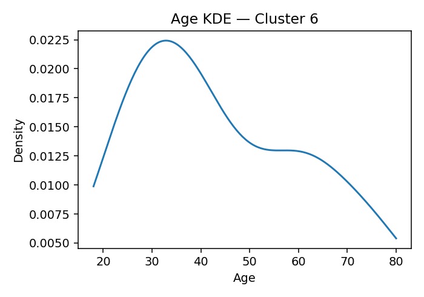
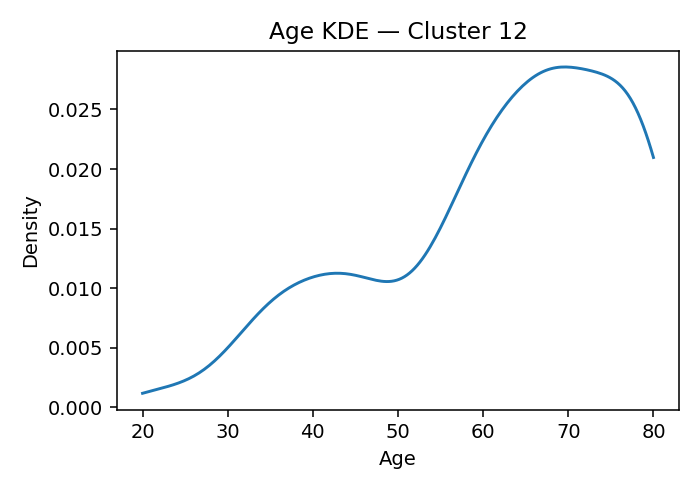

# ANES Ideology Clusters (K=17, silhouette=0.069 if computed)

## Cluster 8
**Population share (weighted):** 6.0%  ·  **Sample size (n):** 167
**Avg Party ID:** 1.81 (p10–p90: 1.0–3.0)
**Vote (weighted):** Harris 3.7% · Trump 96.3% · Other 0.0% · Non-voting 0.0%
**Gender (weighted):** Man 51.0% · Woman 48.7% · Nonbinary 0.3% · Other 0.0%
**Race & Hispanic (weighted):** White NH 71.9% · Black NH 11.8% · Hispanic 5.9% · Asian/NHPI NH 8.8% · Native/Other NH 0.4% · Multiracial NH 1.2%
**Education (weighted):** College 90.8% | No college 9.2%
**Economic vulnerability (higher=worse):** mean 2.3 (p20–p80: 2.0-3.0)
**Homogeneity:** avg z-dist 5.8785, feature z-std 0.8613, domain dispersion 0.4186

**Ideology summary:** Cluster 8 exhibits a predominantly liberal ideology across most domains, with negative mean z-scores on abortion (-0.50), immigration (-0.65), redistribution (-0.26), environment (-0.58), health (-0.24), religion (-0.37), gay rights (-0.73), trans laws (-0.79), minority representation (-0.63), and DEI/affirmative action (-0.66). Exceptions include moderately conservative stances on vaccines (+0.38) and strongly on Ukraine aid (+0.83). Variation is generally moderate, with low SD in abortion (0.21) and gay rights (0.17) indicating homogeneity, but higher SD in religion (0.87), trans laws (0.81), and Israel aid (0.86) showing more internal diversity. The cluster is highly conservative politically (Party ID mean 1.81, 96.3% Trump supporters), highly educated (90.8% college), and economically vulnerable (mean 2.30), suggesting economic concerns coexist with socially liberal views.

## Cluster 10
**Population share (weighted):** 12.5%  ·  **Sample size (n):** 622
**Avg Party ID:** 1.97 (p10–p90: 1.0–3.0)
**Vote (weighted):** Harris 4.8% · Trump 93.6% · Other 1.6% · Non-voting 0.0%
**Gender (weighted):** Man 41.2% · Woman 51.2% · Nonbinary 7.3% · Other 0.3%
**Race & Hispanic (weighted):** White NH 50.9% · Black NH 18.9% · Hispanic 19.3% · Asian/NHPI NH 5.2% · Native/Other NH 0.2% · Multiracial NH 5.5%
**Education (weighted):** College 78.5% | No college 21.5%
**Economic vulnerability (higher=worse):** mean 2.69 (p20–p80: 2.0-3.83)
**Homogeneity:** avg z-dist 2.7384, feature z-std 0.4497, domain dispersion 0.484

**Ideology summary:** Cluster 10 exhibits a generally liberal ideology on social issues such as abortion (-0.49), immigration (-0.79), redistribution (-0.38), environment (-0.57), gay rights (-0.65), minority representation (-0.90), and DEI/affirmative action (-1.30), with moderate variation across these domains (SDs ~0.25–0.38). Conversely, it is more conservative on vaccines (+0.55), Ukraine aid (+0.53), and slightly on racial disparity (+0.08) and efficacy/trust/corruption (+0.17), though these show higher variation (SDs up to 0.86). The group is highly homogeneous (avg z-dist 2.738) with a strong Republican identification (mean 1.97, 93.6% Trump supporters) and high economic vulnerability (mean 2.69), indicating a cohesive but economically vulnerable conservative-leaning cluster with socially liberal tendencies.

## Cluster 2
**Population share (weighted):** 11.9%  ·  **Sample size (n):** 597
**Avg Party ID:** 2.35 (p10–p90: 1.0–4.03)
**Vote (weighted):** Harris 9.4% · Trump 85.3% · Other 5.3% · Non-voting 7.4%
**Gender (weighted):** Man 46.8% · Woman 49.8% · Nonbinary 3.4% · Other 0.0%
**Race & Hispanic (weighted):** White NH 61.5% · Black NH 8.8% · Hispanic 20.0% · Asian/NHPI NH 5.2% · Native/Other NH 0.2% · Multiracial NH 4.3%
**Education (weighted):** College 84.8% | No college 15.2%
**Economic vulnerability (higher=worse):** mean 2.7 (p20–p80: 2.0-4.0)
**Homogeneity:** avg z-dist 3.2482, feature z-std 0.5304, domain dispersion 0.3163

**Ideology summary:** Cluster 2 exhibits a generally liberal ideology across most social domains, with negative mean z-scores on abortion (-0.41), immigration (-0.57), redistribution (-0.21), environment (-0.47), health (-0.29), religion (-0.38), and gay rights (-0.56), indicating more liberal attitudes. Minority representation (-0.78) is the most liberal domain, while vaccines (+0.43), DEI/affirmative action (+0.20), and Ukraine aid (+0.34) show modest conservatism. Variation is moderate to high in defense (0.83), religion (0.74), and Ukraine aid (0.79), suggesting heterogeneity in these areas, while minority representation (0.36) and immigration (0.35) are more homogeneous. The cluster is strongly conservative in party ID (mean 2.35) and economically vulnerable (mean 2.70), with high Trump support (85.3%) and high college education (84.8%).

## Cluster 14
**Population share (weighted):** 3.9%  ·  **Sample size (n):** 106
**Avg Party ID:** 2.4 (p10–p90: 1.0–5.0)
**Vote (weighted):** Harris 7.1% · Trump 86.5% · Other 6.3% · Non-voting 0.0%
**Gender (weighted):** Man 41.1% · Woman 54.5% · Nonbinary 2.7% · Other 1.7%
**Race & Hispanic (weighted):** White NH 49.3% · Black NH 21.3% · Hispanic 15.9% · Asian/NHPI NH 3.8% · Native/Other NH 0.0% · Multiracial NH 9.6%
**Education (weighted):** College 78.3% | No college 21.7%
**Economic vulnerability (higher=worse):** mean 2.57 (p20–p80: 2.0-3.0)
**Homogeneity:** avg z-dist 6.7975, feature z-std 1.0503, domain dispersion 0.3878

**Ideology summary:** Cluster 14 exhibits a generally liberal ideology across most domains, with negative mean z-scores on abortion (-0.40), immigration (-0.45), redistribution (-0.34), environment (-0.45), religion (-0.36), gay rights (-0.46), trans laws (-0.66), minority representation (-0.61), and DEI/affirmative action (-0.57). Exceptions include positive means on efficacy/trust/corruption (+0.59) and vaccines (+0.22), indicating more conservative views there. Variation is moderate to high in defense (0.98 SD), trans laws (0.92), and religion (0.87), suggesting heterogeneity in these areas, while racial disparity (0.30 SD) and abortion (0.36 SD) show more homogeneity. The cluster is economically vulnerable (mean 2.57) and predominantly identifies with Trump (86.5%), despite liberal stances on many social issues.

## Cluster 0
**Population share (weighted):** 5.5%  ·  **Sample size (n):** 181
**Avg Party ID:** 3.15 (p10–p90: 1.0–6.0)
**Vote (weighted):** Harris 29.0% · Trump 71.0% · Other 0.0% · Non-voting 18.9%
**Gender (weighted):** Man 22.8% · Woman 77.0% · Nonbinary 0.0% · Other 0.2%
**Race & Hispanic (weighted):** White NH 40.2% · Black NH 40.5% · Hispanic 13.9% · Asian/NHPI NH 0.8% · Native/Other NH 0.9% · Multiracial NH 3.8%
**Education (weighted):** College 42.8% | No college 57.2%
**Economic vulnerability (higher=worse):** mean 3.94 (p20–p80: 3.0-6.0)
**Homogeneity:** avg z-dist 5.3259, feature z-std 0.7908, domain dispersion 0.5289

**Ideology summary:** Cluster 0 exhibits a moderately conservative ideology overall, with strong conservatism on defense (+1.72), environment (+0.57), Ukraine aid (+0.40), and Israel aid (+0.32), while showing liberal leanings on redistribution (-0.27), DEI/affirmative action (-0.83), minority representation (-0.36), and trans laws (-0.56). Variation is highest in defense (SD=1.50) and vaccines (SD=1.06), indicating heterogeneity in these domains, while racial disparity (SD=0.30) and democracy (SD=0.42) show more consensus. The group is relatively homogeneous (avg z-dist 5.326) with a conservative party ID mean of 3.15, predominantly Trump supporters (71%), moderate economic vulnerability (mean 3.94), and lower college attainment (42.8%).

## Cluster 4
**Population share (weighted):** 5.8%  ·  **Sample size (n):** 292
**Avg Party ID:** 3.37 (p10–p90: 1.0–6.23)
**Vote (weighted):** Harris 24.9% · Trump 69.0% · Other 6.2% · Non-voting 78.5%
**Gender (weighted):** Man 45.3% · Woman 52.7% · Nonbinary 1.1% · Other 1.0%
**Race & Hispanic (weighted):** White NH 40.7% · Black NH 27.8% · Hispanic 20.9% · Asian/NHPI NH 2.7% · Native/Other NH 0.0% · Multiracial NH 7.8%
**Education (weighted):** College 58.5% | No college 41.5%
**Economic vulnerability (higher=worse):** mean 3.58 (p20–p80: 2.0-5.0)
**Homogeneity:** avg z-dist 4.3147, feature z-std 0.6464, domain dispersion 0.3831

**Ideology summary:** Cluster 4 exhibits a generally liberal orientation on most domains, with negative mean z-scores on abortion (-0.11), immigration (-0.04), redistribution (-0.17), environment (-0.19), health (-0.28), defense (-0.20), religion (-0.61), democracy (-0.24), vaccines (-0.16), and efficacy/trust/corruption (+0.03 near neutral). Exceptions include conservative stances on Ukraine aid (+0.50), trans laws (+0.50), minority representation (+0.26), gay rights (+0.15), and slight conservatism on racial disparity (+0.04) and Israel aid (+0.03). The strongest liberal divergence is on DEI/affirmative action (-1.19). Variation is moderate to high in domains like vaccines (1.04 SD), gay rights (0.98), and Israel aid (0.95), indicating heterogeneity, while religion (0.34 SD) and racial disparity (0.29 SD) are more homogeneous. Economic vulnerability is moderate (mean 3.58), and party ID leans strongly Republican (mean 3.37), with high Trump support (69%) and low voter turnout (78.5% non-voting).

## Cluster 7
**Population share (weighted):** 4.2%  ·  **Sample size (n):** 116
**Avg Party ID:** 3.46 (p10–p90: 1.0–7.0)
**Vote (weighted):** Harris 39.9% · Trump 59.0% · Other 1.1% · Non-voting 68.1%
**Gender (weighted):** Man 55.4% · Woman 44.6% · Nonbinary 0.0% · Other 0.0%
**Race & Hispanic (weighted):** White NH 68.7% · Black NH 6.7% · Hispanic 7.0% · Asian/NHPI NH 16.7% · Native/Other NH 0.0% · Multiracial NH 0.9%
**Education (weighted):** College 67.5% | No college 32.5%
**Economic vulnerability (higher=worse):** mean 2.53 (p20–p80: 2.0-3.0)
**Homogeneity:** avg z-dist 6.5675, feature z-std 1.0119, domain dispersion 0.3712

**Ideology summary:** Cluster 7 exhibits a moderately conservative ideology overall, with positive means on religion (+0.63), Israel aid (+0.58), Ukraine aid (+0.63), vaccines (+0.31), and trans laws (+0.20), while showing liberal leanings on environment (-0.16), health (-0.16), defense (-0.26), racial disparity (-0.07), and democracy (-0.33). Variation is moderate to high across domains, especially religion (SD=0.95), vaccines (0.83), and gay rights (0.92), indicating diverse views within the cluster. Economic vulnerability is moderate (mean 2.53), and party ID skews Republican (mean 3.46) with 59% Trump supporters, reflecting a somewhat conservative but heterogeneous group.

## Cluster 3
**Population share (weighted):** 8.8%  ·  **Sample size (n):** 542
**Avg Party ID:** 4.15 (p10–p90: 1.0–7.0)
**Vote (weighted):** Harris 48.4% · Trump 49.5% · Other 2.1% · Non-voting 43.1%
**Gender (weighted):** Man 54.0% · Woman 44.4% · Nonbinary 0.4% · Other 1.2%
**Race & Hispanic (weighted):** White NH 81.2% · Black NH 0.8% · Hispanic 9.5% · Asian/NHPI NH 5.2% · Native/Other NH 0.0% · Multiracial NH 3.3%
**Education (weighted):** College 63.2% | No college 36.8%
**Economic vulnerability (higher=worse):** mean 2.77 (p20–p80: 2.0-4.0)
**Homogeneity:** avg z-dist 3.6243, feature z-std 0.5866, domain dispersion 0.3522

**Ideology summary:** Cluster 3 exhibits a generally moderate to liberal ideology on social issues such as abortion (-0.29), environment (-0.22), health (-0.30), religion (-0.52), democracy (-0.27), and gay rights (-0.33), while showing more conservative stances on redistribution (+0.10), vaccines (+0.39), Ukraine aid (+0.67), minority representation (+0.65), and DEI/affirmative action (+0.57). Variation is moderate to high in domains like vaccines (0.76 SD), Israel aid (0.82), and trans laws (0.87), indicating diverse views within the cluster, whereas health (0.07 SD) and minority representation (0.30 SD) are more homogeneous. Economic vulnerability is moderate (mean 2.77), and party ID is centered around the midpoint (mean 4.15), reflecting a balanced partisan composition with near-equal support for Harris and Trump. Overall, the cluster shows nuanced ideological positions with some polarization on defense, religion, and identity-related issues.

## Cluster 6
**Population share (weighted):** 3.9%  ·  **Sample size (n):** 191
**Avg Party ID:** 4.16 (p10–p90: 1.0–7.0)
**Vote (weighted):** Harris 43.0% · Trump 50.3% · Other 6.7% · Non-voting 43.6%
**Gender (weighted):** Man 45.3% · Woman 50.7% · Nonbinary 1.2% · Other 2.8%
**Race & Hispanic (weighted):** White NH 46.2% · Black NH 16.2% · Hispanic 19.2% · Asian/NHPI NH 8.8% · Native/Other NH 2.3% · Multiracial NH 7.3%
**Education (weighted):** College 48.2% | No college 51.8%
**Economic vulnerability (higher=worse):** mean 3.83 (p20–p80: 2.0-6.0)
**Homogeneity:** avg z-dist 6.0884, feature z-std 0.9394, domain dispersion 0.7695

**Ideology summary:** Cluster 6 exhibits a strongly conservative ideology on abortion (+2.39), health (+1.55), defense (+1.52), and environment (+0.88), with moderate conservatism on immigration (+0.16), religion (+0.24), and gay rights (+0.29). Domains like redistribution (-0.09), democracy (-0.09), vaccines (-0.11), Israel aid (-0.36), Ukraine aid (-0.44), and DEI/affirmative action (-0.41) lean slightly liberal. Variation is highest in health (SD=1.80) and defense (SD=1.55), indicating internal diversity, while immigration (0.53) and racial disparity (0.54) show more homogeneity. The group has a strong Republican leaning (Party ID mean 4.16), moderate economic vulnerability (mean 3.83), and moderate ideological dispersion (domain SD avg ~0.94).

## Cluster 9
**Population share (weighted):** 3.1%  ·  **Sample size (n):** 195
**Avg Party ID:** 4.32 (p10–p90: 2.0–7.0)
**Vote (weighted):** Harris 61.8% · Trump 35.0% · Other 3.2% · Non-voting 0.0%
**Gender (weighted):** Man 45.8% · Woman 53.2% · Nonbinary 0.3% · Other 0.7%
**Race & Hispanic (weighted):** White NH 58.1% · Black NH 7.0% · Hispanic 18.2% · Asian/NHPI NH 6.7% · Native/Other NH 0.0% · Multiracial NH 10.1%
**Education (weighted):** College 56.9% | No college 43.1%
**Economic vulnerability (higher=worse):** mean 3.56 (p20–p80: 2.0-4.5)
**Homogeneity:** avg z-dist 5.4562, feature z-std 0.8245, domain dispersion 0.7902

**Ideology summary:** Cluster 9 exhibits a moderately liberal ideology overall, with negative means on abortion (-0.09), religion (-0.28), efficacy/trust/corruption (-0.12), democracy (-0.21), Israel aid (-0.09), and Ukraine aid (-0.17), and slight conservatism on immigration (+0.18), redistribution (+0.04), environment (+0.41), defense (+0.62), vaccines (+0.23), gay rights (+0.17), minority representation (+0.23), and DEI/affirmative action (+0.13). Health stands out as highly conservative (+3.28) with zero variation, indicating unanimous agreement. Variation is moderate to high in defense (1.45 SD), trans laws (1.00), environment (0.97), and gay rights (0.93), suggesting some internal diversity. The group is politically moderate-to-liberal (Party ID mean 4.32) with moderate economic vulnerability (mean 3.56), and relatively high homogeneity (avg z-dist 5.456) but notable domain dispersion (0.79), reflecting consistent but nuanced ideological patterns.

## Cluster 11
**Population share (weighted):** 2.6%  ·  **Sample size (n):** 59
**Avg Party ID:** 4.8 (p10–p90: 2.0–7.0)
**Vote (weighted):** Harris 81.8% · Trump 18.2% · Other 0.0% · Non-voting 0.0%
**Gender (weighted):** Man 55.9% · Woman 44.1% · Nonbinary 0.0% · Other 0.0%
**Race & Hispanic (weighted):** White NH 49.4% · Black NH 10.7% · Hispanic 28.4% · Asian/NHPI NH 4.1% · Native/Other NH 0.4% · Multiracial NH 7.0%
**Education (weighted):** College 40.6% | No college 59.4%
**Economic vulnerability (higher=worse):** mean 3.28 (p20–p80: 2.0-4.0)
**Homogeneity:** avg z-dist 9.5797, feature z-std 1.4563, domain dispersion 0.6393

**Ideology summary:** Cluster 11 exhibits a moderately conservative ideology overall, with strong conservatism on democracy (+2.35), health (+0.61), abortion (+0.60), defense (+0.50), environment (+0.41), and gay rights (+0.37), while showing liberal tendencies on vaccines (-0.54), Ukraine aid (-0.53), religion (-0.24), and trans laws (-0.22). Variation is moderate to high in health (SD=1.56), defense (1.41), and abortion (1.12), indicating some internal diversity, but overall homogeneity is moderate (avg z-dist=9.58, domain dispersion=0.639). Economic vulnerability is moderate (mean=3.28), and the group leans strongly Democratic (Harris 81.8%, Trump 18.2%), with 40.6% college-educated.

## Cluster 1
**Population share (weighted):** 6.1%  ·  **Sample size (n):** 313
**Avg Party ID:** 5.02 (p10–p90: 2.07–7.0)
**Vote (weighted):** Harris 73.8% · Trump 22.7% · Other 3.6% · Non-voting 100.0%
**Gender (weighted):** Man 55.5% · Woman 44.5% · Nonbinary 0.0% · Other 0.0%
**Race & Hispanic (weighted):** White NH 71.6% · Black NH 7.2% · Hispanic 13.1% · Asian/NHPI NH 3.9% · Native/Other NH 0.3% · Multiracial NH 3.9%
**Education (weighted):** College 60.8% | No college 39.2%
**Economic vulnerability (higher=worse):** mean 2.89 (p20–p80: 2.0-4.0)
**Homogeneity:** avg z-dist 3.9125, feature z-std 0.5997, domain dispersion 0.27

**Ideology summary:** Cluster 1 exhibits a moderately conservative ideology overall, with positive means on immigration (+0.25), redistribution (+0.25), efficacy/trust/corruption (+0.31), vaccines (+0.35), Israel aid (+0.28), and DEI/affirmative action (+0.55). Domains like health (-0.26), defense (-0.27), democracy (-0.28), trans laws (-0.20), and minority representation (-0.50) lean more liberal. Variation is moderate to high in domains such as trans laws (SD=1.02), gay rights (0.93), and Ukraine aid (0.90), indicating heterogeneity, while racial disparity (0.21) and democracy (0.23) show more consensus. Economic vulnerability is moderate (mean 2.89), with a majority college-educated (60.8%) and strong Democratic identification (mean Party ID 5.02), reflecting a generally centrist-to-conservative stance with some liberal tendencies.

## Cluster 13
**Population share (weighted):** 3.2%  ·  **Sample size (n):** 179
**Avg Party ID:** 5.1 (p10–p90: 2.0–7.0)
**Vote (weighted):** Harris 57.8% · Trump 42.2% · Other 0.0% · Non-voting 45.8%
**Gender (weighted):** Man 46.6% · Woman 52.5% · Nonbinary 0.0% · Other 0.9%
**Race & Hispanic (weighted):** White NH 77.0% · Black NH 5.2% · Hispanic 11.9% · Asian/NHPI NH 4.9% · Native/Other NH 0.4% · Multiracial NH 0.7%
**Education (weighted):** College 60.8% | No college 39.2%
**Economic vulnerability (higher=worse):** mean 3.19 (p20–p80: 2.0-4.0)
**Homogeneity:** avg z-dist 4.8845, feature z-std 0.736, domain dispersion 0.2904

**Ideology summary:** Cluster 13 exhibits a moderately mixed ideological profile with a slight liberal tilt on abortion (-0.01) and redistribution (-0.29), health (-0.28), religion (-0.36), and democracy (-0.20), while showing conservative leanings on immigration (+0.43), environment (+0.48), defense (+0.40), vaccines (+0.44), minority representation (+0.44), and DEI/affirmative action (+0.54). Variation is highest in defense (SD=1.33) and environment (SD=0.92), indicating diverse views there, while health (SD=0.08) is highly homogeneous. Economic vulnerability is moderate (mean=3.19), and party ID skews Democratic (mean=5.10) with 57.8% supporting Harris, reflecting a center-left cluster with some conservative stances and moderate internal diversity.

## Cluster 12
**Population share (weighted):** 5.8%  ·  **Sample size (n):** 129
**Avg Party ID:** 5.67 (p10–p90: 4.0–7.0)
**Vote (weighted):** Harris 85.8% · Trump 12.0% · Other 2.2% · Non-voting 100.0%
**Gender (weighted):** Man 50.8% · Woman 49.2% · Nonbinary 0.0% · Other 0.0%
**Race & Hispanic (weighted):** White NH 86.6% · Black NH 1.1% · Hispanic 6.9% · Asian/NHPI NH 1.1% · Native/Other NH 0.9% · Multiracial NH 3.3%
**Education (weighted):** College 47.8% | No college 52.2%
**Economic vulnerability (higher=worse):** mean 2.72 (p20–p80: 2.0-3.14)
**Homogeneity:** avg z-dist 7.8645, feature z-std 1.218, domain dispersion 0.4498

**Ideology summary:** Cluster 12 exhibits a moderately conservative ideology overall, with positive means on abortion (+0.21), immigration (+0.58), redistribution (+0.25), environment (+0.31), democracy (+0.37), and minority representation (+0.52). Notably, it is more liberal on religion (-0.31), vaccines (-0.62), Israel aid (-0.51), and Ukraine aid (-0.97). Variation is moderate to high across domains, especially defense (SD=1.09) and vaccines (SD=1.06), indicating some internal diversity. Economic vulnerability is moderate (mean 2.72), and party ID skews strongly Democratic (Harris 85.8%), consistent with the generally liberal stances on social and foreign aid issues despite some conservative leanings.

## Cluster 15
**Population share (weighted):** 3.2%  ·  **Sample size (n):** 243
**Avg Party ID:** 5.89 (p10–p90: 4.0–7.0)
**Vote (weighted):** Harris 95.2% · Trump 4.8% · Other 0.0% · Non-voting 84.8%
**Gender (weighted):** Man 72.3% · Woman 27.0% · Nonbinary 0.0% · Other 0.7%
**Race & Hispanic (weighted):** White NH 73.0% · Black NH 6.5% · Hispanic 7.3% · Asian/NHPI NH 0.8% · Native/Other NH 0.7% · Multiracial NH 11.8%
**Education (weighted):** College 55.1% | No college 44.9%
**Economic vulnerability (higher=worse):** mean 3.22 (p20–p80: 2.0-4.0)
**Homogeneity:** avg z-dist 3.973, feature z-std 0.614, domain dispersion 0.4314

**Ideology summary:** Cluster 15 exhibits a moderately conservative ideology overall, with positive mean z-scores on abortion (+0.53), immigration (+0.65), redistribution (+0.35), environment (+0.39), religion (+0.68), and minority representation (+0.70). Notably, gay rights (+1.60) and trans laws (+0.63) show strong conservatism. Domains like health (-0.13), defense (-0.18), and democracy (-0.30) lean slightly liberal. Variation is moderate to high in religion (SD=1.09), Israel aid (0.95), and vaccines (0.77), indicating some internal diversity, while racial disparity (0.18) and democracy (0.22) are more homogeneous. The group has a strong Democratic ID (mean 5.89) and moderate economic vulnerability (mean 3.22), suggesting economic concerns coexist with conservative social and policy attitudes.

## Cluster 16
**Population share (weighted):** 5.4%  ·  **Sample size (n):** 158
**Avg Party ID:** 6.09 (p10–p90: 5.0–7.0)
**Vote (weighted):** Harris 93.3% · Trump 2.6% · Other 4.1% · Non-voting 100.0%
**Gender (weighted):** Man 52.2% · Woman 47.4% · Nonbinary 0.0% · Other 0.3%
**Race & Hispanic (weighted):** White NH 87.1% · Black NH 0.9% · Hispanic 7.7% · Asian/NHPI NH 1.0% · Native/Other NH 0.4% · Multiracial NH 2.9%
**Education (weighted):** College 64.6% | No college 35.4%
**Economic vulnerability (higher=worse):** mean 2.68 (p20–p80: 2.0-4.0)
**Homogeneity:** avg z-dist 6.66, feature z-std 0.9862, domain dispersion 0.4848

**Ideology summary:** Cluster 16 exhibits a moderately conservative ideology overall, with positive mean z-scores on abortion (+0.47), immigration (+0.65), redistribution (+0.37), environment (+0.48), religion (+0.97), Israel aid (+0.99), gay rights (+0.86), trans laws (+0.75), minority representation (+0.55), and DEI/affirmative action (+0.74). Domains like health (-0.17), defense (-0.23), democracy (-0.24), vaccines (-0.54), Ukraine aid (-0.42), and racial disparity (-0.02) lean slightly liberal. Variation is moderate to high in religion (0.88 SD), vaccines (1.05 SD), Ukraine aid (0.93 SD), and gay rights (1.01 SD), indicating some internal diversity. The cluster is politically homogeneous (Party ID mean 6.09) with low economic vulnerability (mean 2.68), suggesting a relatively stable, conservative-leaning group with nuanced views on health, defense, and international aid.

## Cluster 5
**Population share (weighted):** 8.1%  ·  **Sample size (n):** 615
**Avg Party ID:** 6.17 (p10–p90: 5.0–7.0)
**Vote (weighted):** Harris 95.0% · Trump 2.9% · Other 2.1% · Non-voting 100.0%
**Gender (weighted):** Man 57.1% · Woman 42.8% · Nonbinary 0.1% · Other 0.0%
**Race & Hispanic (weighted):** White NH 85.1% · Black NH 1.1% · Hispanic 5.8% · Asian/NHPI NH 2.7% · Native/Other NH 0.1% · Multiracial NH 5.3%
**Education (weighted):** College 67.5% | No college 32.5%
**Economic vulnerability (higher=worse):** mean 2.84 (p20–p80: 2.0-4.0)
**Homogeneity:** avg z-dist 3.6062, feature z-std 0.5644, domain dispersion 0.3809

**Ideology summary:** Cluster 5 exhibits a moderately conservative ideology overall, with positive means on abortion (+0.29), immigration (+0.79), redistribution (+0.48), environment (+0.48), gay rights (+0.54), trans laws (+0.34), minority representation (+0.78), and DEI/affirmative action (+0.78). Domains like religion (-0.49), defense (-0.27), and democracy (-0.22) lean more liberal. Variation is moderate to high in domains such as gay rights (SD=1.02), vaccines (0.82), and Israel aid (0.86), indicating some internal diversity, while racial disparity (0.20) and DEI (0.25) show more consensus. The group is politically homogeneous (Party ID mean 6.17) with low economic vulnerability (mean 2.84), high college education (67.5%), and strong support for Harris (95%).

## Methodology
- **Data:** ANES 2024 Time Series. Weighted stats use the first available pre-election weight. Clustering is unweighted (K-means).
- **Domains (pre + post):** abortion; immigration (PRE + POST); redistribution; environment; health; defense; religion; racial disparity (V241728/29); efficacy/trust/corruption (V241726/37/38); democracy (V241731/743); vaccines (V241732); Israel aid (V241741); Ukraine aid (V241740); gay rights (V241381x/V241385x); trans laws (V241742); DEI/affirmative (V242237/241x/242); minority representation (V242526–29).
- **Coding:** Conservative-leaning options coded higher; racial disparity kept interpretive (higher = Whites **not** advantaged; Blacks **disadvantaged**). Israel/Ukraine are separate axes; both flipped so higher = more support.
- **Missingness:** Negative ANES codes set to missing. Keep respondents with ≥60% items answered. Median impute per feature for clustering inputs.
- **Scaling & clustering:** z-scores; K chosen by silhouette in [12,20]; K-means (multi-start).
- **Outputs:** per cluster — weighted vote shares (Harris/Trump/Other/Non-voting), weighted party-ID mean + p10–p90, gender & race/Hispanic shares, college/no-college, economic vulnerability (mean & p20–p80 from income summary, inverted), age KDE, population share (weighted) & sample size (n).
- **Homogeneity:** avg z-distance to centroid, mean per-feature z-std, dispersion across domain indices.
- **LLM:** optional per-cluster summary and cross-cluster comparison from domain stats (set `key` before import to enable).