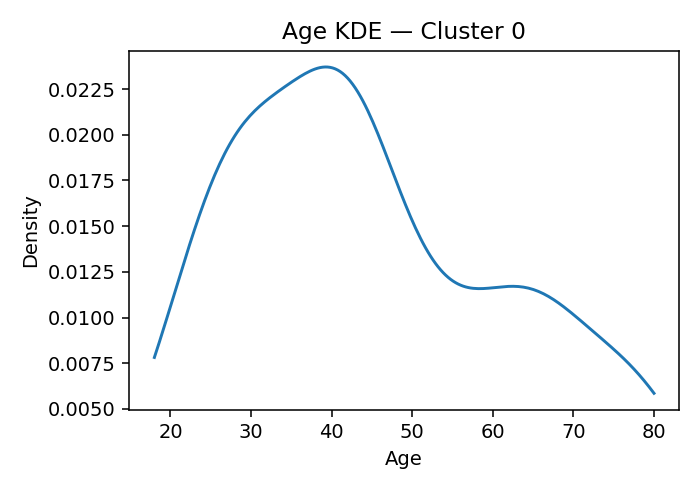

# ANES Ideology Clusters (K=17, silhouette=0.050 if computed)

## Cluster 3
**Population share (weighted):** 10.7%  ·  **Sample size (n):** 558
**Avg Party ID:** 1.79 (p10–p90: 1.0–3.0)
**Vote (weighted, normalized):** Harris 83.3% · Trump 0.3% · Other 2.8% · Non-voting 4.0% · Unknown 9.7%
**Gender (weighted):** Man 41.9% · Woman 50.6% · Nonbinary 7.0% · Other 0.1%
**Race & Hispanic (weighted):** White NH 52.9% · Black NH 17.3% · Hispanic 18.2% · Asian/NHPI NH 6.0% · Native/Other NH 0.2% · Multiracial NH 5.3%
**Education (weighted):** College 79.6% | No college 19.3%
**Economic vulnerability (higher=worse):** mean 2.62 (p20–p80: 2.0-3.0)
**Homogeneity:** avg z-distance 3.5365, feature z-std 0.5047, domain dispersion 0.447

**Ideology summary:** Cluster 3 exhibits a generally liberal ideology across most domains, with negative mean z-scores on abortion (-0.50), immigration (-0.80), redistribution (-0.38), environment (-0.61), health (-0.28), democracy (-0.26), vaccines (-0.64), DEI/affirmative action (-1.32), and minority representation (-0.83). Slightly conservative tendencies appear on racial disparity (+0.07), efficacy/trust/corruption (+0.16), Israel aid (+0.07), Ukraine aid (+0.53), and trans laws (+0.04), though trans additional is strongly liberal (-0.93). Variation is moderate to low in most domains, with particularly low SD in vaccines (0.00) and DEI (0.24), indicating homogeneity, while religion (0.74) and defense (0.65) show higher variation. The group is politically liberal (Party ID mean 1.79), highly supportive of Harris (83.3%), well-educated (79.6% college), and experiences moderate economic vulnerability (mean 2.62), suggesting economic factors may influence their liberal stances.

## Cluster 15
**Population share (weighted):** 8.4%  ·  **Sample size (n):** 458
**Avg Party ID:** 2.06 (p10–p90: 1.0–3.0)
**Vote (weighted, normalized):** Harris 82.5% · Trump 5.5% · Other 0.6% · Non-voting 1.9% · Unknown 9.6%
**Gender (weighted):** Man 43.8% · Woman 53.7% · Nonbinary 2.5% · Other 0.0%
**Race & Hispanic (weighted):** White NH 59.6% · Black NH 14.3% · Hispanic 19.1% · Asian/NHPI NH 3.4% · Native/Other NH 0.0% · Multiracial NH 3.4%
**Education (weighted):** College 84.2% | No college 15.8%
**Economic vulnerability (higher=worse):** mean 2.66 (p20–p80: 2.0-4.0)
**Homogeneity:** avg z-distance 3.9021, feature z-std 0.5668, domain dispersion 0.3036

**Ideology summary:** Cluster 15 exhibits a predominantly liberal ideology across most domains, with negative mean z-scores on abortion (-0.46), immigration (-0.58), redistribution (-0.23), environment (-0.54), health (-0.24), religion (-0.34), vaccines (-0.60), and minority representation (-0.81). Exceptions include slightly conservative stances on Ukraine aid (+0.27), DEI/affirmative action (+0.19), and threat (+0.10). Variation is moderate to high in domains like defense (0.78), religion (0.82), and Ukraine aid (0.84), indicating some internal diversity, while abortion (0.27) and vaccines (0.24) show more homogeneity. The group is largely aligned with the Democratic Party (82.5% Harris supporters) and has relatively low economic vulnerability (mean 2.66 on a 2.00–4.00 scale), consistent with their liberal policy preferences.

## Cluster 14
**Population share (weighted):** 7.4%  ·  **Sample size (n):** 214
**Avg Party ID:** 2.09 (p10–p90: 1.0–4.0)
**Vote (weighted, normalized):** Harris 83.7% · Trump 5.8% · Other 0.6% · Non-voting 1.4% · Unknown 8.5%
**Gender (weighted):** Man 51.7% · Woman 47.6% · Nonbinary 0.2% · Other 0.0%
**Race & Hispanic (weighted):** White NH 71.0% · Black NH 12.2% · Hispanic 6.7% · Asian/NHPI NH 8.4% · Native/Other NH 0.3% · Multiracial NH 1.5%
**Education (weighted):** College 81.5% | No college 18.5%
**Economic vulnerability (higher=worse):** mean 2.42 (p20–p80: 2.0-3.0)
**Homogeneity:** avg z-distance 6.6587, feature z-std 0.9283, domain dispersion 0.3782

**Ideology summary:** Cluster 14 exhibits a generally liberal ideology across most domains, with negative mean z-scores on abortion (-0.37), immigration (-0.52), redistribution (-0.21), environment (-0.53), health (-0.22), defense (-0.25), and trans-related issues (-0.55 to -0.69). Exceptions include slightly conservative stances on Israel aid (+0.11), Ukraine aid (+0.86), and threat perception (+0.12). Variation is moderate to high in religion (SD=1.01), health (0.64), vaccines (0.65), and DEI/affirmative action (0.81), indicating some internal diversity, while domains like racial disparity (0.26) and democracy (0.27) show more homogeneity. The cluster is politically liberal (Party ID mean 2.09), highly educated (81.5% college), and experiences moderate economic vulnerability (mean 2.42), which may influence its progressive leanings.

## Cluster 16
**Population share (weighted):** 4.3%  ·  **Sample size (n):** 112
**Avg Party ID:** 2.35 (p10–p90: 1.0–4.15)
**Vote (weighted, normalized):** Harris 70.6% · Trump 7.7% · Other 6.1% · Non-voting 8.5% · Unknown 7.2%
**Gender (weighted):** Man 49.6% · Woman 46.4% · Nonbinary 2.4% · Other 1.5%
**Race & Hispanic (weighted):** White NH 51.7% · Black NH 17.8% · Hispanic 14.8% · Asian/NHPI NH 6.2% · Native/Other NH 0.0% · Multiracial NH 8.0%
**Education (weighted):** College 80.5% | No college 19.5%
**Economic vulnerability (higher=worse):** mean 2.51 (p20–p80: 2.0-3.0)
**Homogeneity:** avg z-distance 7.2739, feature z-std 1.0345, domain dispersion 0.3535

**Ideology summary:** Cluster 16 exhibits a generally liberal ideology across most domains, with negative mean z-scores on abortion (-0.42), immigration (-0.52), redistribution (-0.34), environment (-0.46), religion (-0.38), and trans-related issues (-0.84 to -0.62). The only notably conservative domain is efficacy/trust/corruption (+0.49). Variation is moderate to high in domains like defense (0.91), vaccines (0.95), and Ukraine aid (0.99), indicating some heterogeneity, while racial disparity (0.29) and abortion (0.35) show more homogeneity. Economic vulnerability is moderate (mean 2.51), and political identification leans strongly Democratic (Harris 70.6%, Party ID mean 2.35), consistent with the liberal profile.

## Cluster 0
**Population share (weighted):** 7.0%  ·  **Sample size (n):** 279
**Avg Party ID:** 2.85 (p10–p90: 1.0–5.0)
**Vote (weighted, normalized):** Harris 58.9% · Trump 12.6% · Other 10.1% · Non-voting 12.4% · Unknown 6.0%
**Gender (weighted):** Man 43.1% · Woman 51.3% · Nonbinary 4.8% · Other 0.8%
**Race & Hispanic (weighted):** White NH 51.5% · Black NH 15.1% · Hispanic 18.4% · Asian/NHPI NH 4.8% · Native/Other NH 0.3% · Multiracial NH 9.8%
**Education (weighted):** College 80.6% | No college 18.9%
**Economic vulnerability (higher=worse):** mean 2.97 (p20–p80: 2.0-4.0)
**Homogeneity:** avg z-distance 4.7161, feature z-std 0.6837, domain dispersion 0.2584

**Ideology summary:** Cluster 0 exhibits a generally liberal ideology with negative mean z-scores on abortion (-0.37), immigration (-0.56), redistribution (-0.22), environment (-0.24), health (-0.24), religion (-0.36), minority representation (-0.61), DEI/affirmative action (-0.45), and threat perception (-0.66). Slightly conservative tendencies appear on defense (+0.14), Ukraine aid (+0.15), trans laws (+0.08), and vaccines (+0.02). Variation is moderate to high in environment (0.66 SD), health (0.61), and defense (1.18), indicating some heterogeneity, while threat (0.30) and racial disparity (0.31) show more consensus. The group is politically liberal (Party ID mean 2.85 on a 1–5 scale favoring Democrats), highly educated (80.6% college), and has moderate economic vulnerability (mean 2.97), suggesting ideology aligns with progressive policy preferences but with nuanced views on defense and some social issues.

## Cluster 1
**Population share (weighted):** 6.6%  ·  **Sample size (n):** 429
**Avg Party ID:** 3.37 (p10–p90: 1.0–6.0)
**Vote (weighted, normalized):** Harris 57.4% · Trump 22.1% · Other 5.8% · Non-voting 5.9% · Unknown 8.7%
**Gender (weighted):** Man 55.3% · Woman 42.7% · Nonbinary 0.4% · Other 1.0%
**Race & Hispanic (weighted):** White NH 80.0% · Black NH 0.5% · Hispanic 11.0% · Asian/NHPI NH 6.3% · Native/Other NH 0.0% · Multiracial NH 0.5%
**Education (weighted):** College 72.6% | No college 25.6%
**Economic vulnerability (higher=worse):** mean 2.72 (p20–p80: 2.0-4.0)
**Homogeneity:** avg z-distance 4.4463, feature z-std 0.6726, domain dispersion 0.3114

**Ideology summary:** Cluster 1 exhibits a generally liberal ideology on social issues like abortion (-0.36), environment (-0.35), vaccines (-0.30), and religion (-0.55), with moderate conservatism on redistribution (+0.03), Israel aid (+0.09), Ukraine aid (+0.53), minority representation (+0.61), and DEI/affirmative action (+0.40). Variation is moderate to high across domains, especially on trans laws (SD=0.83), Israel aid (0.80), and vaccines (0.71), indicating some internal diversity. Homogeneity metrics (avg z-dist 4.446, feature z-std 0.673) suggest moderate ideological coherence. Economic vulnerability is moderate (mean 2.72), and party ID leans Democratic (mean 3.37, with 57.4% Harris supporters), aligning with the overall liberal tilt.

## Cluster 11
**Population share (weighted):** 7.4%  ·  **Sample size (n):** 318
**Avg Party ID:** 3.45 (p10–p90: 1.0–6.08)
**Vote (weighted, normalized):** Harris 36.7% · Trump 28.7% · Other 6.0% · Non-voting 16.9% · Unknown 11.8%
**Gender (weighted):** Man 34.1% · Woman 63.6% · Nonbinary 0.9% · Other 0.9%
**Race & Hispanic (weighted):** White NH 41.2% · Black NH 35.8% · Hispanic 13.8% · Asian/NHPI NH 4.2% · Native/Other NH 0.6% · Multiracial NH 3.2%
**Education (weighted):** College 46.8% | No college 52.5%
**Economic vulnerability (higher=worse):** mean 3.82 (p20–p80: 2.0-5.0)
**Homogeneity:** avg z-distance 5.59, feature z-std 0.7719, domain dispersion 0.3167

**Ideology summary:** Cluster 11 exhibits a moderately mixed ideology with slight conservatism on immigration (+0.08), defense (+0.24), Ukraine aid (+0.29), and trans-related laws (+0.22), but notable liberal leanings on redistribution (-0.30), DEI/affirmative action (-1.20), and threat perception (-0.21). Variation is moderate to high in defense (1.23 SD), health (1.08 SD), and trans laws (1.03 SD), indicating diverse views within the cluster, while racial disparity (0.15 SD) and DEI (0.36 SD) show more consensus. The cluster is politically heterogeneous (Party ID mean 3.45 on a 1–7 scale) with substantial economic vulnerability (mean 3.82), suggesting economic concerns may influence their moderate-to-conservative stances on some domains despite liberal tendencies on redistribution and DEI.

## Cluster 9
**Population share (weighted):** 2.8%  ·  **Sample size (n):** 121
**Avg Party ID:** 4.15 (p10–p90: 2.0–7.0)
**Vote (weighted, normalized):** Harris 30.3% · Trump 33.8% · Other 1.7% · Non-voting 29.4% · Unknown 4.8%
**Gender (weighted):** Man 59.5% · Woman 37.2% · Nonbinary 0.6% · Other 2.0%
**Race & Hispanic (weighted):** White NH 50.7% · Black NH 8.5% · Hispanic 15.0% · Asian/NHPI NH 15.8% · Native/Other NH 1.0% · Multiracial NH 8.1%
**Education (weighted):** College 43.7% | No college 56.1%
**Economic vulnerability (higher=worse):** mean 3.47 (p20–p80: 2.0-5.0)
**Homogeneity:** avg z-distance 6.3592, feature z-std 0.8995, domain dispersion 0.6347

**Ideology summary:** Cluster 9 exhibits a predominantly conservative ideology, strongly so on abortion (+2.39) and moderately conservative on defense (+0.69), environment (+0.34), health (+0.28), religion (+0.31), and minority representation (+0.25). Domains like immigration (+0.15), racial disparity (+0.10), and trans additional rights (+0.27) show mild conservatism, while redistribution (-0.14), democracy (-0.42), vaccines (-0.50), Israel aid (-0.29), Ukraine aid (-0.48), trans laws (-0.31), DEI/affirmative action (-0.16), and threat (-0.17) lean slightly liberal. Variation is moderate to high in defense (1.47 SD) and health (1.34 SD), indicating some internal diversity, but democracy shows no variation (0.00 SD), suggesting consensus. The group is fairly homogeneous overall (avg z-dist 6.36, feature z-std 0.90), with a strong conservative Party ID mean (4.15) and moderate economic vulnerability (mean 3.47), reflecting a somewhat economically vulnerable but ideologically conservative cluster.

## Cluster 2
**Population share (weighted):** 5.0%  ·  **Sample size (n):** 223
**Avg Party ID:** 4.22 (p10–p90: 2.0–7.0)
**Vote (weighted, normalized):** Harris 26.4% · Trump 38.9% · Other 6.5% · Non-voting 24.3% · Unknown 3.9%
**Gender (weighted):** Man 35.7% · Woman 63.6% · Nonbinary 0.2% · Other 0.4%
**Race & Hispanic (weighted):** White NH 61.8% · Black NH 15.5% · Hispanic 15.9% · Asian/NHPI NH 1.9% · Native/Other NH 0.2% · Multiracial NH 2.7%
**Education (weighted):** College 46.5% | No college 52.7%
**Economic vulnerability (higher=worse):** mean 3.61 (p20–p80: 2.0-5.0)
**Homogeneity:** avg z-distance 6.3082, feature z-std 0.8841, domain dispersion 0.5144

**Ideology summary:** Cluster 2 exhibits a moderately conservative ideology overall, with positive means on immigration (+0.21), environment (+0.87), health (+1.43), defense (+1.48), and minority representation (+0.24), while showing liberal leanings on abortion (-0.11), religion (-0.20), democracy (-0.20), vaccines (-0.40), and threat (-0.26). Variation is highest in health (SD=1.79) and defense (SD=1.54), indicating diverse views, whereas racial disparity (SD=0.38) and threat (SD=0.47) are more homogeneous. The average ideological dispersion (feature SD=0.884) and domain dispersion (0.514) suggest moderate internal diversity. Economic vulnerability is moderate (mean 3.61), with a party ID leaning toward Trump (38.9%) over Harris (26.4%), reflecting a somewhat conservative but heterogeneous group.

## Cluster 4
**Population share (weighted):** 2.1%  ·  **Sample size (n):** 98
**Avg Party ID:** 4.29 (p10–p90: 1.0–7.0)
**Vote (weighted, normalized):** Harris 26.2% · Trump 37.0% · Other 4.5% · Non-voting 28.2% · Unknown 4.1%
**Gender (weighted):** Man 41.6% · Woman 54.7% · Nonbinary 1.3% · Other 2.5%
**Race & Hispanic (weighted):** White NH 44.6% · Black NH 17.3% · Hispanic 18.3% · Asian/NHPI NH 4.0% · Native/Other NH 2.8% · Multiracial NH 13.0%
**Education (weighted):** College 46.9% | No college 51.5%
**Economic vulnerability (higher=worse):** mean 4.22 (p20–p80: 2.0-6.0)
**Homogeneity:** avg z-distance 6.0676, feature z-std 0.8909, domain dispersion 0.9993

**Ideology summary:** Cluster 4 exhibits a predominantly conservative ideology, with strong positive means on abortion (+2.36), health (+2.72), defense (+2.11), and environment (+1.34), indicating conservative stances especially on social and defense issues. Variation is moderate to high in health and defense (SD=1.29), suggesting some internal diversity, while domains like racial disparity (SD=0.34) and threat (SD=0.42) show more homogeneity. Economic vulnerability is moderate (mean 4.22), and party ID leans Republican (mean 4.29), consistent with conservative domain positions. Notably, some domains like efficacy/trust/corruption (-0.50), Israel aid (-0.40), Ukraine aid (-0.54), and DEI/affirmative action (-0.60) lean slightly liberal, reflecting nuanced views within the cluster.

## Cluster 6
**Population share (weighted):** 2.5%  ·  **Sample size (n):** 57
**Avg Party ID:** 4.77 (p10–p90: 2.0–7.0)
**Vote (weighted, normalized):** Harris 10.5% · Trump 44.3% · Other 7.2% · Non-voting 34.0% · Unknown 4.0%
**Gender (weighted):** Man 55.1% · Woman 44.9% · Nonbinary 0.0% · Other 0.0%
**Race & Hispanic (weighted):** White NH 47.9% · Black NH 10.6% · Hispanic 29.5% · Asian/NHPI NH 4.3% · Native/Other NH 0.4% · Multiracial NH 7.3%
**Education (weighted):** College 41.7% | No college 58.3%
**Economic vulnerability (higher=worse):** mean 3.28 (p20–p80: 2.0-4.0)
**Homogeneity:** avg z-distance 9.8708, feature z-std 1.3599, domain dispersion 0.6077

**Ideology summary:** Cluster 6 exhibits a moderately conservative ideology overall, with positive means on abortion (+0.55), health (+0.64), defense (+0.47), environment (+0.43), and democracy (+2.33), indicating stronger conservative leanings especially on democratic trust. Domains like religion (-0.27), Ukraine aid (-0.52), trans laws (-0.29), and Israel aid (-0.11) lean more liberal. Variation is moderate to high in health (SD=1.57) and defense (SD=1.39), while threat shows low variation (SD=0.45), suggesting some consensus on perceived threat. Economic vulnerability is moderate (mean 3.28), and party ID skews toward Trump (44.3%), reflecting a conservative-leaning but somewhat heterogeneous group.

## Cluster 7
**Population share (weighted):** 3.8%  ·  **Sample size (n):** 256
**Avg Party ID:** 4.87 (p10–p90: 2.0–7.0)
**Vote (weighted, normalized):** Harris 22.5% · Trump 59.3% · Other 1.7% · Non-voting 11.3% · Unknown 5.2%
**Gender (weighted):** Man 33.7% · Woman 66.1% · Nonbinary 0.2% · Other 0.0%
**Race & Hispanic (weighted):** White NH 78.4% · Black NH 4.7% · Hispanic 8.6% · Asian/NHPI NH 5.1% · Native/Other NH 0.5% · Multiracial NH 1.9%
**Education (weighted):** College 55.6% | No college 43.2%
**Economic vulnerability (higher=worse):** mean 3.54 (p20–p80: 2.0-5.0)
**Homogeneity:** avg z-distance 5.3571, feature z-std 0.7727, domain dispersion 0.2832

**Ideology summary:** Cluster 7 shows a moderately conservative orientation on immigration (+0.55), minority representation (+0.62), DEI/affirmative action (+0.54), Ukraine aid (+0.41), and trans-related domains (+0.31 to +0.37), with near-neutral or slightly liberal stances on abortion (-0.05), defense (-0.08), religion (-0.23), efficacy/trust/corruption (-0.23), democracy (-0.29), and vaccines (-0.24). Variation is moderate to high in health (1.02 SD) and defense (0.86 SD), but low in racial disparity (0.16 SD) and democracy (0.27 SD), indicating some domain-specific heterogeneity. The group is somewhat heterogeneous overall (avg z-dist 5.357) with moderate ideological dispersion (domain dispersion 0.283). Economic vulnerability is moderate (mean 3.54), and party ID leans strongly toward Trump (59.3%), reflecting a conservative-leaning but somewhat mixed ideological profile.

## Cluster 5
**Population share (weighted):** 5.7%  ·  **Sample size (n):** 335
**Avg Party ID:** 5.2 (p10–p90: 2.0–7.0)
**Vote (weighted, normalized):** Harris 22.9% · Trump 65.2% · Other 0.4% · Non-voting 2.8% · Unknown 8.7%
**Gender (weighted):** Man 46.5% · Woman 51.5% · Nonbinary 0.0% · Other 0.0%
**Race & Hispanic (weighted):** White NH 76.2% · Black NH 4.3% · Hispanic 12.6% · Asian/NHPI NH 5.3% · Native/Other NH 0.0% · Multiracial NH 0.9%
**Education (weighted):** College 70.9% | No college 29.1%
**Economic vulnerability (higher=worse):** mean 2.91 (p20–p80: 2.0-4.0)
**Homogeneity:** avg z-distance 4.5879, feature z-std 0.663, domain dispersion 0.2579

**Ideology summary:** Cluster 5 shows a moderately conservative ideology overall, with positive means on immigration (+0.21), redistribution (+0.17), religion (+0.23), trans laws (+0.41), and DEI/affirmative action (+0.56), but notable liberal leanings on minority representation (-0.56), democracy (-0.18), vaccines (-0.19), and Ukraine aid (-0.22). Variation is moderate to high across domains, especially on Israel and Ukraine aid (SD ~0.93) and health (0.74), indicating some internal heterogeneity despite a relatively homogeneous cluster (avg z-dist 4.588, domain dispersion 0.258). Economic vulnerability is moderate (mean 2.91), and party ID skews strongly Republican (Trump 65.2%), aligning with the conservative tilt in key domains like immigration and religion.

## Cluster 10
**Population share (weighted):** 8.1%  ·  **Sample size (n):** 419
**Avg Party ID:** 5.21 (p10–p90: 3.0–7.0)
**Vote (weighted, normalized):** Harris 10.3% · Trump 66.1% · Other 1.5% · Non-voting 13.9% · Unknown 8.2%
**Gender (weighted):** Man 63.5% · Woman 35.8% · Nonbinary 0.1% · Other 0.5%
**Race & Hispanic (weighted):** White NH 63.5% · Black NH 3.5% · Hispanic 16.6% · Asian/NHPI NH 5.5% · Native/Other NH 0.2% · Multiracial NH 7.2%
**Education (weighted):** College 51.2% | No college 48.8%
**Economic vulnerability (higher=worse):** mean 2.91 (p20–p80: 2.0-4.0)
**Homogeneity:** avg z-distance 4.5868, feature z-std 0.6784, domain dispersion 0.3326

**Ideology summary:** Cluster 10 exhibits a moderately conservative ideology overall, with positive mean z-scores on abortion (+0.16), immigration (+0.36), redistribution (+0.30), environment (+0.29), efficacy/trust/corruption (+0.12), and minority representation (+0.69), DEI/affirmative action (+0.59), and trans-related domains (+0.48 to +0.65). Domains such as vaccines (-0.47), defense (-0.19), democracy (-0.19), and threat (-0.37) lean more liberal. Variation is moderate to high in religion (0.87 SD), defense (0.72), and health (0.77), indicating some within-cluster diversity, while racial disparity (0.33) and minority representation (0.37) show more homogeneity. The cluster is economically vulnerable (mean 2.91) and predominantly supports Trump (66.1%), with average ideological dispersion suggesting moderate internal consistency.

## Cluster 8
**Population share (weighted):** 5.2%  ·  **Sample size (n):** 120
**Avg Party ID:** 5.62 (p10–p90: 4.0–7.0)
**Vote (weighted, normalized):** Harris 5.5% · Trump 70.8% · Other 4.1% · Non-voting 9.7% · Unknown 9.9%
**Gender (weighted):** Man 50.0% · Woman 49.3% · Nonbinary 0.0% · Other 0.0%
**Race & Hispanic (weighted):** White NH 82.5% · Black NH 1.2% · Hispanic 9.5% · Asian/NHPI NH 1.1% · Native/Other NH 1.0% · Multiracial NH 3.7%
**Education (weighted):** College 46.6% | No college 51.5%
**Economic vulnerability (higher=worse):** mean 2.79 (p20–p80: 2.0-3.19)
**Homogeneity:** avg z-distance 8.4453, feature z-std 1.1903, domain dispersion 0.4468

**Ideology summary:** Cluster 8 exhibits a moderately conservative ideology overall, with positive means on abortion (+0.21), immigration (+0.59), redistribution (+0.27), environment (+0.31), efficacy/trust/corruption (+0.79), democracy (+0.47), vaccines (+0.72), trans laws (+0.44), minority representation (+0.55), and DEI/affirmative action (+0.54). Religion (-0.32), Israel aid (-0.47), and Ukraine aid (-1.01) lean more liberal. Variation is moderate to high across domains, notably high for vaccines (SD=1.16) and defense (SD=1.01), indicating some heterogeneity within the cluster. Economic vulnerability is moderate (mean 2.79), and party ID strongly skews conservative (Trump 70.8%), consistent with the ideological profile.

## Cluster 13
**Population share (weighted):** 5.7%  ·  **Sample size (n):** 172
**Avg Party ID:** 6.02 (p10–p90: 5.0–7.0)
**Vote (weighted, normalized):** Harris 4.6% · Trump 85.7% · Other 2.7% · Non-voting 4.2% · Unknown 2.7%
**Gender (weighted):** Man 54.9% · Woman 44.8% · Nonbinary 0.0% · Other 0.3%
**Race & Hispanic (weighted):** White NH 86.7% · Black NH 2.3% · Hispanic 6.2% · Asian/NHPI NH 1.5% · Native/Other NH 0.3% · Multiracial NH 2.7%
**Education (weighted):** College 63.3% | No college 36.4%
**Economic vulnerability (higher=worse):** mean 2.66 (p20–p80: 2.0-4.0)
**Homogeneity:** avg z-distance 7.157, feature z-std 0.9717, domain dispersion 0.4043

**Ideology summary:** Cluster 13 exhibits a predominantly conservative ideology, with positive mean z-scores on most domains such as religion (+1.02), Israel aid (+0.97), immigration (+0.60), trans laws (+0.70), and vaccines (+0.54). Domains like defense (-0.24), democracy (-0.28), and Ukraine aid (-0.33) show slight liberal leanings, while health (-0.11) and racial disparity (-0.03) are near neutral. Variation is moderate to high in domains like vaccines (SD=1.18) and religion (SD=0.88), indicating some internal diversity, but overall homogeneity is relatively high (avg z-dist 7.157, feature z-std 0.972). The group is strongly aligned with Trump (85.7%) and has moderate economic vulnerability (mean 2.66), suggesting conservative views coexist with some economic concerns.

## Cluster 12
**Population share (weighted):** 7.4%  ·  **Sample size (n):** 585
**Avg Party ID:** 6.35 (p10–p90: 5.0–7.0)
**Vote (weighted, normalized):** Harris 2.2% · Trump 83.9% · Other 2.7% · Non-voting 3.9% · Unknown 7.3%
**Gender (weighted):** Man 61.9% · Woman 37.1% · Nonbinary 0.0% · Other 0.3%
**Race & Hispanic (weighted):** White NH 82.7% · Black NH 1.7% · Hispanic 2.0% · Asian/NHPI NH 0.7% · Native/Other NH 0.2% · Multiracial NH 9.1%
**Education (weighted):** College 68.7% | No college 30.6%
**Economic vulnerability (higher=worse):** mean 2.74 (p20–p80: 2.0-4.0)
**Homogeneity:** avg z-distance 3.9956, feature z-std 0.5704, domain dispersion 0.395

**Ideology summary:** Cluster 12 exhibits a moderately conservative ideology overall, with positive means on abortion (+0.35), immigration (+0.86), redistribution (+0.45), environment (+0.48), Israel aid (+0.34), Ukraine aid (+0.27), trans laws (+0.22), trans additional (+0.86), minority representation (+0.75), DEI/affirmative action (+0.79), and threat (+0.55). Domains related to defense (-0.26), religion (-0.21), efficacy/trust/corruption (-0.24), democracy (-0.28), health (-0.14), vaccines (-0.09), and racial disparity (0.00) lean slightly liberal. Variation is moderate to high in religion (0.70), vaccines (0.80), trans laws (1.01), and Israel aid (0.74), indicating some internal diversity, while domains like democracy (0.28) and DEI (0.26) show more homogeneity. The cluster is strongly aligned with Trump (83.9%) and has moderate economic vulnerability (mean 2.74), suggesting conservative views coexist with some economic concerns.

## Methodology
- **Data:** ANES 2024 Time Series. Weighted stats use the first available pre-election weight. Clustering is unweighted (K-means).
- **Domains (pre + post):** abortion; immigration (PRE + POST); redistribution; environment; health; defense; religion; racial disparity; efficacy/trust/corruption; democracy; vaccines (neutral middle handled); Israel aid; Ukraine aid; gay rights; trans laws (+ military/bathroom/discrimination); DEI/affirmative; minority representation; threat (China/Russia/Mexico/Iran as-is; Japan/Israel flipped).
- **Coding:** Conservative-leaning options coded higher; racial disparity kept interpretive (higher = Whites not advantaged; Blacks disadvantaged). Threat domain flips Japan/Israel so higher = less threat.
- **Missingness:** Negative ANES codes set to missing. Keep respondents with ≥60% items answered. Median impute per feature for clustering inputs.
- **Scaling & clustering:** z-scores; K chosen by silhouette in [12,20]; K-means (multi-start).
- **Vote shares:** One denominator (cluster’s total weight) so Harris + Trump + Other + Non-voting + Unknown = 100%; use post reported vote/turnout when available, else pre intention.
- **Outputs:** normalized vote shares; party-ID mean + p10–p90; gender & race/Hispanic shares; college/no-college; economic vulnerability (mean & p20–p80); age KDE; population share (weighted) & sample size (n).
- **Homogeneity:** avg z-distance to centroid, mean per-feature z-std, dispersion across domain indices.