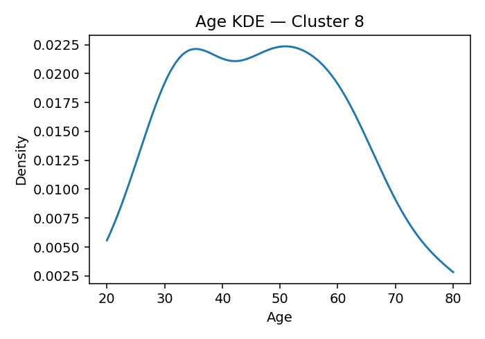
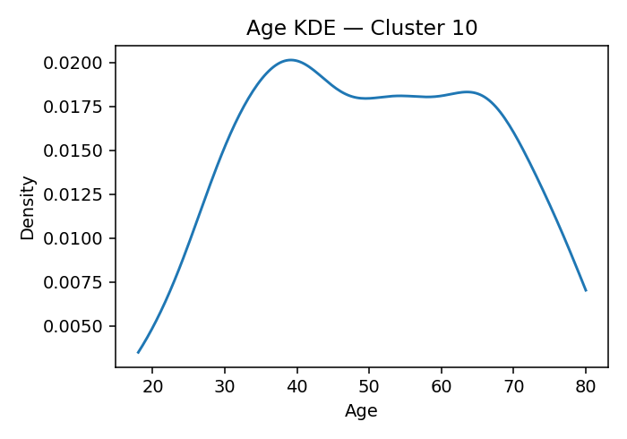
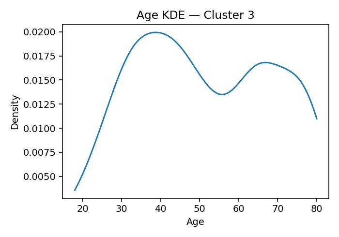
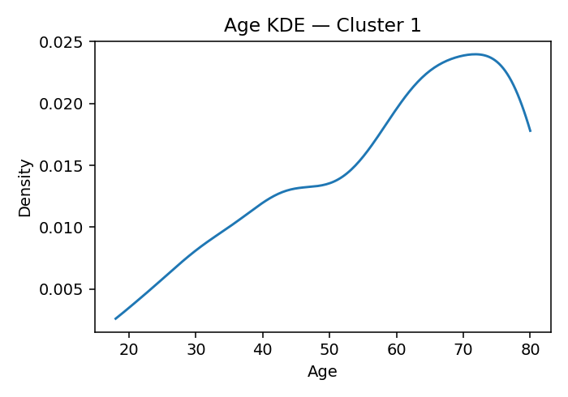
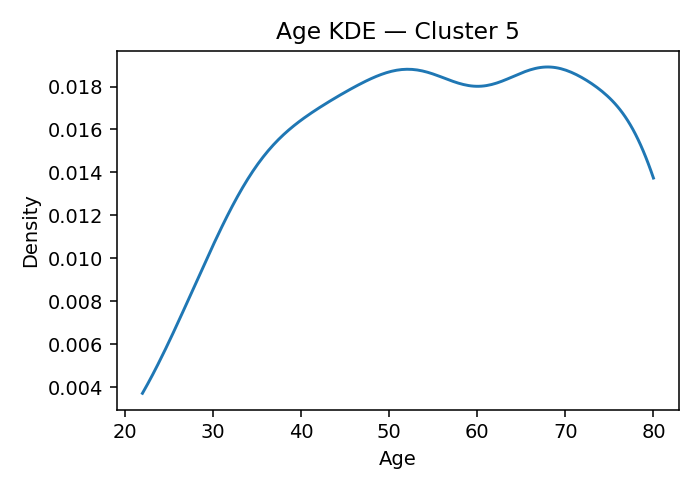

# ANES Ideology Clusters (K=17, silhouette=0.069 if computed)

## Cluster 8
**Population share (weighted):** 6.0%  ·  **Sample size (n):** 167
**Avg Party ID:** 1.81 (p10–p90: 1.0–3.0)
**Vote (weighted):** Harris 84.5% · Trump 0.5% · Other 0.6% · Non-voting 0.0%
**Gender (weighted):** Man 50.8% · Woman 48.4% · Nonbinary 0.3% · Other 0.0%
**Race & Hispanic (weighted):** White NH 71.9% · Black NH 11.8% · Hispanic 5.9% · Asian/NHPI NH 8.8% · Native/Other NH 0.4% · Multiracial NH 1.2%
**Education (weighted):** College 90.8% | No college 9.2%
**Economic vulnerability (higher=worse):** mean 2.3 (p20–p80: 2.0-3.0)
**Homogeneity:** avg z-dist 5.8785, feature z-std 0.8613, domain dispersion 0.4186

**Ideology summary:** Cluster 8 exhibits a predominantly liberal ideology across most domains, with negative mean z-scores on abortion (-0.50), immigration (-0.65), redistribution (-0.26), environment (-0.58), health (-0.24), religion (-0.37), gay rights (-0.73), trans laws (-0.79), minority representation (-0.63), and DEI/affirmative action (-0.66). Exceptions include moderately conservative views on vaccines (+0.38) and strongly conservative support for Ukraine aid (+0.83). Variation is generally moderate, with low dispersion on abortion (0.21) and gay rights (0.17) indicating homogeneity, but higher variation on religion (0.87), health (0.62), and trans laws (0.81). The group is highly homogeneous overall (avg z-dist 5.879), strongly Democratic (Harris 84.5%), highly educated (90.8% college), and experiences moderate economic vulnerability (mean 2.30).

## Cluster 10
**Population share (weighted):** 12.5%  ·  **Sample size (n):** 622
**Avg Party ID:** 1.97 (p10–p90: 1.0–3.0)
**Vote (weighted):** Harris 73.9% · Trump 1.0% · Other 2.2% · Non-voting 0.2%
**Gender (weighted):** Man 41.1% · Woman 51.1% · Nonbinary 7.2% · Other 0.3%
**Race & Hispanic (weighted):** White NH 50.7% · Black NH 18.8% · Hispanic 19.3% · Asian/NHPI NH 5.2% · Native/Other NH 0.2% · Multiracial NH 5.5%
**Education (weighted):** College 77.6% | No college 21.2%
**Economic vulnerability (higher=worse):** mean 2.69 (p20–p80: 2.0-3.83)
**Homogeneity:** avg z-dist 2.7384, feature z-std 0.4497, domain dispersion 0.484

**Ideology summary:** Cluster 10 exhibits a generally liberal ideology on social issues such as abortion (-0.49), immigration (-0.79), redistribution (-0.38), environment (-0.57), gay rights (-0.65), minority representation (-0.90), and DEI/affirmative action (-1.30), with low variation indicating relative homogeneity in these views. Domains like vaccines (+0.55), Ukraine aid (+0.53), and Israel aid (+0.17) show more conservative leanings but with higher variability, especially in Israel aid (SD=0.86). Economic vulnerability is moderate (mean 2.69), and the group strongly identifies with the Democratic Party (mean 1.97) and Harris (73.9%), reflecting a predominantly liberal, college-educated, and politically engaged profile with some nuanced conservative stances on defense, vaccines, and efficacy/trust/corruption.

## Cluster 2
**Population share (weighted):** 11.9%  ·  **Sample size (n):** 597
**Avg Party ID:** 2.35 (p10–p90: 1.0–4.03)
**Vote (weighted):** Harris 69.2% · Trump 7.7% · Other 2.8% · Non-voting 0.2%
**Gender (weighted):** Man 46.8% · Woman 49.8% · Nonbinary 3.4% · Other 0.0%
**Race & Hispanic (weighted):** White NH 61.4% · Black NH 8.8% · Hispanic 20.0% · Asian/NHPI NH 5.2% · Native/Other NH 0.2% · Multiracial NH 4.3%
**Education (weighted):** College 84.8% | No college 15.1%
**Economic vulnerability (higher=worse):** mean 2.7 (p20–p80: 2.0-4.0)
**Homogeneity:** avg z-dist 3.2482, feature z-std 0.5304, domain dispersion 0.3163

**Ideology summary:** Cluster 2 exhibits a generally liberal ideology across most domains, with negative mean z-scores on abortion (-0.41), immigration (-0.57), redistribution (-0.21), environment (-0.47), health (-0.29), religion (-0.38), and gay rights (-0.56), indicating more liberal attitudes. Exceptions include vaccines (+0.43), Ukraine aid (+0.34), and DEI/affirmative action (+0.20), showing some conservative leanings. Variation is moderate to high in defense (0.83 SD), religion (0.74), and Ukraine aid (0.79), suggesting less consensus in these areas, while minority representation (-0.78 mean, 0.36 SD) is strongly liberal and relatively homogeneous. Economic vulnerability is moderate (mean 2.70), and party ID skews strongly Democratic (mean 2.35), consistent with the liberal profile and moderate homogeneity (avg z-dist 3.25).

## Cluster 14
**Population share (weighted):** 3.9%  ·  **Sample size (n):** 106
**Avg Party ID:** 2.4 (p10–p90: 1.0–5.0)
**Vote (weighted):** Harris 65.5% · Trump 6.2% · Other 4.7% · Non-voting 0.4%
**Gender (weighted):** Man 41.1% · Woman 54.5% · Nonbinary 2.7% · Other 1.7%
**Race & Hispanic (weighted):** White NH 48.5% · Black NH 20.9% · Hispanic 15.7% · Asian/NHPI NH 3.7% · Native/Other NH 0.0% · Multiracial NH 9.5%
**Education (weighted):** College 78.3% | No college 21.7%
**Economic vulnerability (higher=worse):** mean 2.57 (p20–p80: 2.0-3.0)
**Homogeneity:** avg z-dist 6.7975, feature z-std 1.0503, domain dispersion 0.3878

**Ideology summary:** Cluster 14 exhibits a generally liberal ideology across most domains, with negative mean z-scores on abortion (-0.40), immigration (-0.45), redistribution (-0.34), environment (-0.45), religion (-0.36), gay rights (-0.46), trans laws (-0.66), minority representation (-0.61), and DEI/affirmative action (-0.57). Exceptions include higher conservatism on efficacy/trust/corruption (+0.59) and vaccines (+0.22). Variation is moderate to high in defense (0.98), trans laws (0.92), and health (0.69), indicating some internal diversity, while racial disparity (0.30) and abortion (0.36) show more homogeneity. The cluster is economically vulnerable (mean 2.57) and predominantly identifies with the Democratic Party (Harris 65.5%), with high college education (78.3%).

## Cluster 0
**Population share (weighted):** 5.5%  ·  **Sample size (n):** 181
**Avg Party ID:** 3.15 (p10–p90: 1.0–6.0)
**Vote (weighted):** Harris 33.5% · Trump 14.5% · Other 0.0% · Non-voting 1.9%
**Gender (weighted):** Man 22.5% · Woman 76.0% · Nonbinary 0.0% · Other 0.2%
**Race & Hispanic (weighted):** White NH 39.9% · Black NH 40.1% · Hispanic 13.8% · Asian/NHPI NH 0.7% · Native/Other NH 0.9% · Multiracial NH 3.8%
**Education (weighted):** College 42.1% | No college 56.3%
**Economic vulnerability (higher=worse):** mean 3.94 (p20–p80: 3.0-6.0)
**Homogeneity:** avg z-dist 5.3259, feature z-std 0.7908, domain dispersion 0.5289

**Ideology summary:** Cluster 0 exhibits a moderately liberal ideology overall, with negative means on abortion (-0.18), redistribution (-0.27), health (-0.09), trans laws (-0.56), minority representation (-0.36), and DEI/affirmative action (-0.83), while showing strong conservatism on defense (+1.72) and moderate conservatism on environment (+0.57), Israel aid (+0.32), and Ukraine aid (+0.40). Variation is highest in defense (SD=1.50) and environment (SD=0.90), indicating diverse views within these domains, while racial disparity (SD=0.30) and democracy (SD=0.42) show more consensus. The group has moderate ideological homogeneity (avg z-dist=5.326) and leans Democratic (Harris 33.5%, Trump 14.5%) with moderate economic vulnerability (mean 3.94).

## Cluster 4
**Population share (weighted):** 5.8%  ·  **Sample size (n):** 292
**Avg Party ID:** 3.37 (p10–p90: 1.0–6.23)
**Vote (weighted):** Harris 36.8% · Trump 14.7% · Other 2.4% · Non-voting 0.0%
**Gender (weighted):** Man 45.1% · Woman 52.4% · Nonbinary 1.1% · Other 1.0%
**Race & Hispanic (weighted):** White NH 39.3% · Black NH 26.8% · Hispanic 20.1% · Asian/NHPI NH 2.6% · Native/Other NH 0.0% · Multiracial NH 7.5%
**Education (weighted):** College 58.5% | No college 41.4%
**Economic vulnerability (higher=worse):** mean 3.58 (p20–p80: 2.0-5.0)
**Homogeneity:** avg z-dist 4.3147, feature z-std 0.6464, domain dispersion 0.3831

**Ideology summary:** Cluster 4 exhibits a generally liberal ideology with negative mean z-scores on abortion (-0.11), immigration (-0.04), redistribution (-0.17), environment (-0.19), health (-0.28), defense (-0.20), religion (-0.61), democracy (-0.24), and vaccines (-0.16). Conversely, it is more conservative on racial disparity (+0.04), efficacy/trust/corruption (+0.03), Israel aid (+0.03), Ukraine aid (+0.50), gay rights (+0.15), trans laws (+0.50), and minority representation (+0.26), but strongly liberal on DEI/affirmative action (-1.19). Variation is moderate to high across domains, notably high for vaccines (1.04), Israel aid (0.95), and gay rights (0.98), indicating some internal heterogeneity despite an average z-distance of 4.315 and moderate domain dispersion (0.383). The group leans Democratic (Harris 36.8%, Trump 14.7%) with a majority college-educated (58.5%) and moderate economic vulnerability (mean 3.58).

## Cluster 7
**Population share (weighted):** 4.2%  ·  **Sample size (n):** 116
**Avg Party ID:** 3.46 (p10–p90: 1.0–7.0)
**Vote (weighted):** Harris 48.2% · Trump 28.9% · Other 0.7% · Non-voting 2.6%
**Gender (weighted):** Man 55.4% · Woman 44.6% · Nonbinary 0.0% · Other 0.0%
**Race & Hispanic (weighted):** White NH 68.7% · Black NH 6.7% · Hispanic 7.0% · Asian/NHPI NH 16.7% · Native/Other NH 0.0% · Multiracial NH 0.9%
**Education (weighted):** College 67.5% | No college 32.5%
**Economic vulnerability (higher=worse):** mean 2.53 (p20–p80: 2.0-3.0)
**Homogeneity:** avg z-dist 6.5675, feature z-std 1.0119, domain dispersion 0.3712

**Ideology summary:** Cluster 7 exhibits a moderately conservative ideology overall, with positive means on religion (+0.63), Israel aid (+0.58), Ukraine aid (+0.63), vaccines (+0.31), and trans laws (+0.20), while showing liberal tendencies on environment (-0.16), health (-0.16), defense (-0.26), racial disparity (-0.07), and democracy (-0.33). Variation is moderate to high across domains, especially religion (SD=0.95), vaccines (0.83), and gay rights (0.92), indicating some internal diversity despite a moderate homogeneity (avg z-dist 6.568, domain dispersion 0.371). The group leans Democratic (Harris 48.2%, Trump 28.9%) with a high college rate (67.5%) and moderate economic vulnerability (mean 2.53), suggesting a relatively educated but economically vulnerable cohort with mixed ideological positions.

## Cluster 3
**Population share (weighted):** 8.8%  ·  **Sample size (n):** 542
**Avg Party ID:** 4.15 (p10–p90: 1.0–7.0)
**Vote (weighted):** Harris 33.1% · Trump 26.6% · Other 1.2% · Non-voting 2.2%
**Gender (weighted):** Man 54.0% · Woman 44.4% · Nonbinary 0.4% · Other 1.2%
**Race & Hispanic (weighted):** White NH 80.7% · Black NH 0.8% · Hispanic 9.4% · Asian/NHPI NH 5.2% · Native/Other NH 0.0% · Multiracial NH 3.2%
**Education (weighted):** College 63.2% | No college 36.8%
**Economic vulnerability (higher=worse):** mean 2.77 (p20–p80: 2.0-4.0)
**Homogeneity:** avg z-dist 3.6243, feature z-std 0.5866, domain dispersion 0.3522

**Ideology summary:** Cluster 3 exhibits a generally moderate to liberal ideology on social issues such as abortion (-0.29), environment (-0.22), health (-0.30), democracy (-0.27), and gay rights (-0.33), while showing conservative leanings on redistribution (+0.10), vaccines (+0.39), Ukraine aid (+0.67), minority representation (+0.65), and DEI/affirmative action (+0.57). Variation is moderate to high in domains like vaccines (0.76 SD), Israel aid (0.82), and trans laws (0.87), indicating diverse views within the cluster, whereas health (0.07 SD) and minority representation (0.30 SD) are more homogeneous. Economic vulnerability is moderate (mean 2.77), and party ID leans Democratic (mean 4.15), reflecting a mixed but somewhat liberal-leaning profile with notable heterogeneity across domains.

## Cluster 6
**Population share (weighted):** 3.9%  ·  **Sample size (n):** 191
**Avg Party ID:** 4.16 (p10–p90: 1.0–7.0)
**Vote (weighted):** Harris 21.5% · Trump 22.4% · Other 0.8% · Non-voting 0.9%
**Gender (weighted):** Man 45.1% · Woman 50.5% · Nonbinary 1.1% · Other 2.8%
**Race & Hispanic (weighted):** White NH 45.9% · Black NH 16.1% · Hispanic 19.1% · Asian/NHPI NH 8.8% · Native/Other NH 2.3% · Multiracial NH 7.2%
**Education (weighted):** College 48.1% | No college 51.7%
**Economic vulnerability (higher=worse):** mean 3.83 (p20–p80: 2.0-6.0)
**Homogeneity:** avg z-dist 6.0884, feature z-std 0.9394, domain dispersion 0.7695

**Ideology summary:** Cluster 6 exhibits a predominantly conservative ideology, especially on abortion (+2.39), health (+1.55), and defense (+1.52), with moderate conservatism on environment (+0.88) and religion (+0.24). Domains like redistribution (-0.09), democracy (-0.09), vaccines (-0.11), Israel aid (-0.36), Ukraine aid (-0.44), and DEI/affirmative action (-0.41) lean slightly liberal. Variation is highest in health (SD=1.80) and defense (SD=1.55), indicating internal diversity, while immigration (SD=0.53) and racial disparity (SD=0.54) show more homogeneity. Economic vulnerability is moderate (mean=3.83), and party ID is strongly conservative (mean=4.16), reflecting a cluster with conservative tendencies but some nuanced liberal views and moderate internal variation.

## Cluster 9
**Population share (weighted):** 3.1%  ·  **Sample size (n):** 195
**Avg Party ID:** 4.32 (p10–p90: 2.0–7.0)
**Vote (weighted):** Harris 22.6% · Trump 39.7% · Other 10.1% · Non-voting 0.0%
**Gender (weighted):** Man 44.4% · Woman 51.5% · Nonbinary 0.3% · Other 0.7%
**Race & Hispanic (weighted):** White NH 58.1% · Black NH 7.0% · Hispanic 18.2% · Asian/NHPI NH 6.7% · Native/Other NH 0.0% · Multiracial NH 10.1%
**Education (weighted):** College 56.7% | No college 43.0%
**Economic vulnerability (higher=worse):** mean 3.56 (p20–p80: 2.0-4.5)
**Homogeneity:** avg z-dist 5.4562, feature z-std 0.8245, domain dispersion 0.7902

**Ideology summary:** Cluster 9 exhibits a moderately conservative ideology overall, with positive means on immigration (+0.18), environment (+0.41), health (+3.28), defense (+0.62), vaccines (+0.23), gay rights (+0.17), minority representation (+0.23), and DEI/affirmative action (+0.13). Domains like abortion (-0.09), religion (-0.28), democracy (-0.21), and Ukraine aid (-0.17) lean slightly liberal. Variation is low in health (SD=0.00) indicating consensus, but high in defense (SD=1.45) and trans laws (SD=1.00), showing heterogeneity. Economic vulnerability is moderate (mean 3.56), and party ID skews toward Trump (39.7%) with a substantial college-educated share (56.7%).

## Cluster 11
**Population share (weighted):** 2.6%  ·  **Sample size (n):** 59
**Avg Party ID:** 4.8 (p10–p90: 2.0–7.0)
**Vote (weighted):** Harris 4.7% · Trump 24.2% · Other 0.0% · Non-voting 0.0%
**Gender (weighted):** Man 55.9% · Woman 44.1% · Nonbinary 0.0% · Other 0.0%
**Race & Hispanic (weighted):** White NH 49.4% · Black NH 10.7% · Hispanic 28.4% · Asian/NHPI NH 4.1% · Native/Other NH 0.4% · Multiracial NH 7.0%
**Education (weighted):** College 40.6% | No college 59.4%
**Economic vulnerability (higher=worse):** mean 3.28 (p20–p80: 2.0-4.0)
**Homogeneity:** avg z-dist 9.5797, feature z-std 1.4563, domain dispersion 0.6393

**Ideology summary:** Cluster 11 exhibits a moderately conservative ideology overall, with positive means on abortion (+0.60), health (+0.61), defense (+0.50), environment (+0.41), democracy (+2.35), and gay rights (+0.37), while showing liberal tendencies on vaccines (-0.54), Ukraine aid (-0.53), religion (-0.24), and trans laws (-0.22). Variation is moderate to high across domains, especially health (SD=1.56) and defense (SD=1.41), indicating diverse views within the cluster. Homogeneity is moderate (avg z-dist=9.58), suggesting some internal ideological spread. Economic vulnerability is moderate (mean=3.28), and party ID leans toward Republicans (mean=4.80, with 24.2% Trump supporters), reflecting a center-right profile with nuanced positions across social and policy issues.

## Cluster 1
**Population share (weighted):** 6.1%  ·  **Sample size (n):** 313
**Avg Party ID:** 5.02 (p10–p90: 2.07–7.0)
**Vote (weighted):** Harris 17.6% · Trump 52.2% · Other 2.7% · Non-voting 0.0%
**Gender (weighted):** Man 55.3% · Woman 44.3% · Nonbinary 0.0% · Other 0.0%
**Race & Hispanic (weighted):** White NH 71.1% · Black NH 7.2% · Hispanic 13.0% · Asian/NHPI NH 3.8% · Native/Other NH 0.3% · Multiracial NH 3.9%
**Education (weighted):** College 60.8% | No college 39.2%
**Economic vulnerability (higher=worse):** mean 2.89 (p20–p80: 2.0-4.0)
**Homogeneity:** avg z-dist 3.9125, feature z-std 0.5997, domain dispersion 0.27

**Ideology summary:** Cluster 1 exhibits a moderately conservative ideology overall, with positive mean z-scores on abortion (+0.10), immigration (+0.25), redistribution (+0.25), efficacy/trust/corruption (+0.31), vaccines (+0.35), Israel aid (+0.28), and party ID leaning strongly toward Trump (52.2%). Domains like health (-0.26), defense (-0.27), democracy (-0.28), trans laws (-0.20), and minority representation (-0.50) show more liberal tendencies. Variation is moderate to high in domains such as trans laws (SD=1.02), gay rights (0.93), and Ukraine aid (0.90), indicating heterogeneity, while racial disparity (0.21) and democracy (0.23) are more homogeneous. Economic vulnerability is moderate (mean 2.89), suggesting some economic insecurity within the group.

## Cluster 13
**Population share (weighted):** 3.2%  ·  **Sample size (n):** 179
**Avg Party ID:** 5.1 (p10–p90: 2.0–7.0)
**Vote (weighted):** Harris 21.5% · Trump 44.5% · Other 4.3% · Non-voting 0.0%
**Gender (weighted):** Man 46.6% · Woman 52.5% · Nonbinary 0.0% · Other 0.9%
**Race & Hispanic (weighted):** White NH 74.1% · Black NH 5.0% · Hispanic 11.4% · Asian/NHPI NH 4.7% · Native/Other NH 0.4% · Multiracial NH 0.7%
**Education (weighted):** College 58.5% | No college 37.7%
**Economic vulnerability (higher=worse):** mean 3.19 (p20–p80: 2.0-4.0)
**Homogeneity:** avg z-dist 4.8845, feature z-std 0.736, domain dispersion 0.2904

**Ideology summary:** Cluster 13 exhibits a moderately mixed ideology with a slight conservative tilt on immigration (+0.43), environment (+0.48), defense (+0.40), vaccines (+0.44), minority representation (+0.44), and DEI/affirmative action (+0.54), while showing liberal leanings on redistribution (-0.29), health (-0.28), religion (-0.36), and democracy (-0.20). Variation is highest in defense (SD=1.33) and environment (SD=0.92), indicating diverse views, whereas health (SD=0.08) is highly homogeneous. Party ID is moderately conservative (mean 5.10), with economic vulnerability at a mid-level (mean 3.19), suggesting some economic insecurity within the group. Overall, the cluster shows moderate ideological heterogeneity with a blend of conservative and liberal positions across domains.

## Cluster 12
**Population share (weighted):** 5.8%  ·  **Sample size (n):** 129
**Avg Party ID:** 5.67 (p10–p90: 4.0–7.0)
**Vote (weighted):** Harris 3.4% · Trump 56.7% · Other 3.4% · Non-voting 0.1%
**Gender (weighted):** Man 50.5% · Woman 48.9% · Nonbinary 0.0% · Other 0.0%
**Race & Hispanic (weighted):** White NH 86.0% · Black NH 1.1% · Hispanic 6.9% · Asian/NHPI NH 1.0% · Native/Other NH 0.9% · Multiracial NH 3.3%
**Education (weighted):** College 47.0% | No college 51.3%
**Economic vulnerability (higher=worse):** mean 2.72 (p20–p80: 2.0-3.14)
**Homogeneity:** avg z-dist 7.8645, feature z-std 1.218, domain dispersion 0.4498

**Ideology summary:** Cluster 12 exhibits a moderately conservative ideology overall, with positive mean z-scores on most domains such as immigration (+0.58), efficacy/trust/corruption (+0.74), democracy (+0.37), and minority representation (+0.52). Notably, it is more liberal on vaccines (-0.62), Israel aid (-0.51), Ukraine aid (-0.97), and religion (-0.31). Variation is moderate to high across domains, especially defense (SD=1.09) and vaccines (SD=1.06), indicating some internal diversity. Economic vulnerability is moderate (mean 2.72), and party ID leans strongly Republican (mean 5.67), reflecting a conservative-leaning but somewhat heterogeneous group.

## Cluster 15
**Population share (weighted):** 3.2%  ·  **Sample size (n):** 243
**Avg Party ID:** 5.89 (p10–p90: 4.0–7.0)
**Vote (weighted):** Harris 3.8% · Trump 62.5% · Other 0.5% · Non-voting 0.2%
**Gender (weighted):** Man 71.5% · Woman 26.7% · Nonbinary 0.0% · Other 0.6%
**Race & Hispanic (weighted):** White NH 71.3% · Black NH 6.4% · Hispanic 7.1% · Asian/NHPI NH 0.7% · Native/Other NH 0.6% · Multiracial NH 11.5%
**Education (weighted):** College 55.1% | No college 44.9%
**Economic vulnerability (higher=worse):** mean 3.22 (p20–p80: 2.0-4.0)
**Homogeneity:** avg z-dist 3.973, feature z-std 0.614, domain dispersion 0.4314

**Ideology summary:** Cluster 15 exhibits a moderately conservative ideology overall, with positive mean z-scores on abortion (+0.53), immigration (+0.65), redistribution (+0.35), environment (+0.39), religion (+0.68), and minority representation (+0.70). Notably, gay rights (+1.60) and trans laws (+0.63) show strong conservatism, while health (-0.13), defense (-0.18), and democracy (-0.30) lean slightly liberal. Variation is moderate to high in religion (SD=1.09), Israel aid (0.95), and vaccines (0.77), indicating some internal diversity, but racial disparity (0.18) and democracy (0.22) are more homogeneous. Economic vulnerability is moderate (mean 3.22), and party ID strongly favors Trump (62.5%), aligning with the conservative profile.

## Cluster 16
**Population share (weighted):** 5.4%  ·  **Sample size (n):** 158
**Avg Party ID:** 6.09 (p10–p90: 5.0–7.0)
**Vote (weighted):** Harris 1.6% · Trump 78.2% · Other 0.0% · Non-voting 2.6%
**Gender (weighted):** Man 52.2% · Woman 47.4% · Nonbinary 0.0% · Other 0.3%
**Race & Hispanic (weighted):** White NH 86.7% · Black NH 0.9% · Hispanic 7.7% · Asian/NHPI NH 1.0% · Native/Other NH 0.4% · Multiracial NH 2.9%
**Education (weighted):** College 64.3% | No college 35.2%
**Economic vulnerability (higher=worse):** mean 2.68 (p20–p80: 2.0-4.0)
**Homogeneity:** avg z-dist 6.66, feature z-std 0.9862, domain dispersion 0.4848

**Ideology summary:** Cluster 16 exhibits a predominantly conservative ideology, with positive mean z-scores on most domains such as religion (+0.97), Israel aid (+0.99), gay rights (+0.86), trans laws (+0.75), immigration (+0.65), and minority representation (+0.55). Exceptions include liberal-leaning means on health (-0.17), defense (-0.23), democracy (-0.24), vaccines (-0.54), and Ukraine aid (-0.42). Variation is moderate to high in domains like religion (SD=0.88), vaccines (1.05), and gay rights (1.01), indicating some internal diversity, while domains like redistribution (0.39) and DEI/affirmative action (0.36) show lower variation. The cluster is politically homogeneous (Party ID mean 6.09, mostly Trump supporters at 78.2%) with moderate economic vulnerability (mean 2.68), suggesting a conservative group with some nuanced views on health and defense.

## Cluster 5
**Population share (weighted):** 8.1%  ·  **Sample size (n):** 615
**Avg Party ID:** 6.17 (p10–p90: 5.0–7.0)
**Vote (weighted):** Harris 2.0% · Trump 73.4% · Other 2.9% · Non-voting 0.2%
**Gender (weighted):** Man 57.0% · Woman 42.7% · Nonbinary 0.1% · Other 0.0%
**Race & Hispanic (weighted):** White NH 82.7% · Black NH 1.0% · Hispanic 5.6% · Asian/NHPI NH 2.6% · Native/Other NH 0.1% · Multiracial NH 5.2%
**Education (weighted):** College 67.3% | No college 32.3%
**Economic vulnerability (higher=worse):** mean 2.84 (p20–p80: 2.0-4.0)
**Homogeneity:** avg z-dist 3.6062, feature z-std 0.5644, domain dispersion 0.3809

**Ideology summary:** Cluster 5 exhibits a moderately conservative ideology overall, with positive means on abortion (+0.29), immigration (+0.79), redistribution (+0.48), environment (+0.48), gay rights (+0.54), trans laws (+0.34), minority representation (+0.78), and DEI/affirmative action (+0.78). Domains like health (-0.17), defense (-0.27), religion (-0.49), and democracy (-0.22) lean more liberal. Variation is moderate to high in domains such as vaccines (0.82 SD), gay rights (1.02 SD), and trans laws (0.93 SD), indicating some internal diversity, while racial disparity (0.20 SD) and DEI (0.25 SD) show more homogeneity. The group is strongly Republican-leaning (Trump 73.4%), with moderate economic vulnerability (mean 2.84) and a high college education rate (67.3%).

## Methodology
- **Data:** ANES 2024 Time Series. Weighted stats use the first available pre-election weight. Clustering is unweighted (K-means).
- **Domains (pre + post):** abortion; immigration (PRE + POST); redistribution; environment; health; defense; religion; racial disparity (V241728/29); efficacy/trust/corruption (V241726/37/38); democracy (V241731/743); vaccines (V241732); Israel aid (V241741); Ukraine aid (V241740); gay rights (V241381x/V241385x); trans laws (V241742); DEI/affirmative (V242237/241x/242); minority representation (V242526–29).
- **Coding:** Conservative-leaning options coded higher; racial disparity kept interpretive (higher = Whites **not** advantaged; Blacks **disadvantaged**). Israel/Ukraine are separate axes; both flipped so higher = more support.
- **Missingness:** Negative ANES codes set to missing. Keep respondents with ≥60% items answered. Median impute per feature for clustering inputs.
- **Scaling & clustering:** z-scores; K chosen by silhouette in [12,20]; K-means (multi-start).
- **Outputs:** per cluster — weighted vote shares (Harris/Trump/Other/Non-voting), weighted party-ID mean + p10–p90, gender & race/Hispanic shares, college/no-college, economic vulnerability (mean & p20–p80 from income summary, inverted), age KDE, population share (weighted) & sample size (n).
- **Homogeneity:** avg z-distance to centroid, mean per-feature z-std, dispersion across domain indices.
- **LLM:** optional per-cluster summary from domain stats (set `key` before import to enable).