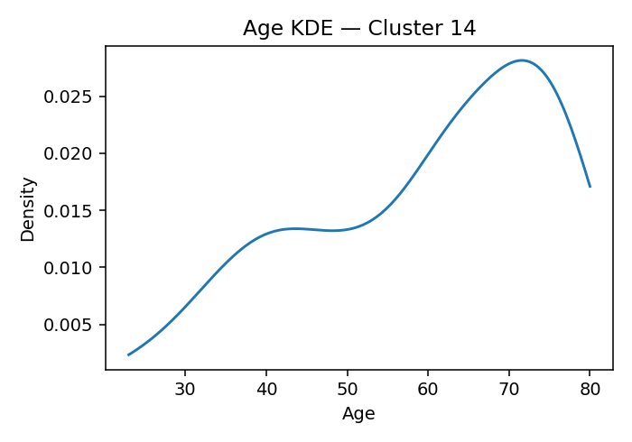

# ANES Ideology Clusters (K=18, silhouette=0.137 if computed)

## Cluster 13
**Population share (weighted):** 19.2%  ·  **Sample size (n):** 904
**Avg Party ID:** 1.95 (p10–p90: 1.0–3.0)
**Vote intention (weighted):** Harris 92.2% · Trump 2.6% · Other 5.2% · Non-voting 4.4%
**Gender (weighted):** Man 49.3% · Woman 44.6% · Nonbinary 6.1% · Other 0.1%
**Education (weighted):** College 82.7% | No college 17.3%
**Homogeneity:** avg z-dist 1.5609, feature z-std 0.3464, domain dispersion 0.1726

**Ideology summary:** Cluster 13 holds consistently liberal views across all domains, with negative mean z-scores indicating opposition to conservative positions on abortion (-0.52), immigration (-0.92), redistribution (-0.53), environment (-0.63), health (-0.37), defense (-0.41), and religion (-0.68). Variation within domains is generally low, especially for health and defense (SD=0.05), indicating high homogeneity in these areas, while immigration and religion show somewhat more internal diversity (SD=0.39 and 0.42). Overall, the cluster is relatively homogeneous (domain dispersion 0.173) and leans strongly Democratic (Party ID mean 1.95), with high college education (82.7%) and overwhelming support for Biden (Harris 92.2%).

## Cluster 14
**Population share (weighted):** 2.7%  ·  **Sample size (n):** 88
**Avg Party ID:** 2.49 (p10–p90: 1.0–6.0)
**Vote intention (weighted):** Harris 84.9% · Trump 11.5% · Other 3.6% · Non-voting 6.4%
**Gender (weighted):** Man 46.5% · Woman 53.5% · Nonbinary 0.0% · Other 0.0%
**Education (weighted):** College 74.4% | No college 25.6%
**Homogeneity:** avg z-dist 2.8762, feature z-std 0.7118, domain dispersion 0.6081

**Ideology summary:** Cluster 14 holds generally liberal views on abortion, immigration, redistribution, environment, health, and defense, as indicated by negative domain means ranging from -0.21 to -0.47. In contrast, they are strongly conservative on religion, with a high positive mean of +1.39. Variation within domains is moderate, with immigration and health showing the greatest diversity (SDs 0.66 and 0.64), while religion is relatively homogeneous (SD 0.36). Overall, the cluster exhibits moderate internal heterogeneity (avg z-dist 2.876), reflecting some diversity in opinions despite a predominantly liberal orientation except for religion.

## Cluster 5
**Population share (weighted):** 11.1%  ·  **Sample size (n):** 791
**Avg Party ID:** 2.77 (p10–p90: 1.0–5.0)
**Vote intention (weighted):** Harris 80.6% · Trump 12.3% · Other 7.2% · Non-voting 10.5%
**Gender (weighted):** Man 48.9% · Woman 50.4% · Nonbinary 0.2% · Other 0.5%
**Education (weighted):** College 77.6% | No college 22.4%
**Homogeneity:** avg z-dist 1.7716, feature z-std 0.3766, domain dispersion 0.2173

**Ideology summary:** Cluster 5 holds generally liberal views on abortion (-0.43), immigration (-0.47), environment (-0.50), health (-0.34), defense (-0.39), and religion (-0.63), with a slight conservative tilt on redistribution (+0.11). Variation is low for health (0.06) and defense (0.04), indicating consensus, while religion (0.43) and immigration (0.39) show more internal diversity. Overall homogeneity is moderate (avg z-dist 1.772), reflecting some within-cluster differences despite a predominantly liberal orientation. The cluster leans Democratic (Harris 80.6%) and is highly college-educated (77.6%).

## Cluster 1
**Population share (weighted):** 4.8%  ·  **Sample size (n):** 193
**Avg Party ID:** 2.95 (p10–p90: 1.0–6.0)
**Vote intention (weighted):** Harris 75.9% · Trump 21.1% · Other 3.1% · Non-voting 17.6%
**Gender (weighted):** Man 23.0% · Woman 75.4% · Nonbinary 0.0% · Other 1.6%
**Education (weighted):** College 58.8% | No college 41.2%
**Homogeneity:** avg z-dist 2.9329, feature z-std 0.6191, domain dispersion 1.0337

**Ideology summary:** Cluster 1 holds generally liberal views on abortion, immigration, redistribution, environment, health, and religion, as indicated by negative mean z-scores ranging from -0.24 to -0.36. They are strongly conservative on defense (+2.64) with no variation, showing uniformity in this domain. Variation is moderate in immigration (0.67) and religion (0.54), but very low in health (0.06) and defense (0.00), suggesting consistent views on health and defense but more diversity on immigration and religion. Overall, the cluster is moderately heterogeneous (avg z-dist 2.933) with a strong Democratic leaning (Harris 75.9%) and a majority college-educated (58.8%).

## Cluster 7
**Population share (weighted):** 4.6%  ·  **Sample size (n):** 198
**Avg Party ID:** 3.63 (p10–p90: 1.0–7.0)
**Vote intention (weighted):** Harris 45.5% · Trump 45.0% · Other 9.5% · Non-voting 15.9%
**Gender (weighted):** Man 43.3% · Woman 56.1% · Nonbinary 0.0% · Other 0.6%
**Education (weighted):** College 41.1% | No college 58.9%
**Homogeneity:** avg z-dist 2.6121, feature z-std 0.5478, domain dispersion 0.1116

**Ideology summary:** Cluster 7 exhibits generally liberal views, with negative mean z-scores on abortion (-0.17), redistribution (-0.26), environment (-0.25), health (-0.33), defense (-0.37), and religion (-0.26), while immigration is neutral (-0.00). Variation is low in health (0.07) and defense (0.05), indicating consensus, but higher in immigration (0.70) and religion (0.64), showing more diverse opinions. Overall, the cluster is moderately homogeneous (domain dispersion 0.112) with mixed party ID and balanced support for Harris and Trump.

## Cluster 3
**Population share (weighted):** 3.3%  ·  **Sample size (n):** 136
**Avg Party ID:** 3.87 (p10–p90: 1.0–7.0)
**Vote intention (weighted):** Harris 44.1% · Trump 50.8% · Other 5.1% · Non-voting 34.1%
**Gender (weighted):** Man 41.4% · Woman 58.6% · Nonbinary 0.0% · Other 0.0%
**Education (weighted):** College 53.0% | No college 47.0%
**Homogeneity:** avg z-dist 4.0097, feature z-std 0.9193, domain dispersion 0.7451

**Ideology summary:** Cluster 3 shows generally liberal views on abortion (-0.14) and religion (-0.33), with moderate conservatism on immigration (+0.08) and redistribution (+0.29). They are strongly conservative on environment (+1.21), health (+1.21), and especially defense (+1.77). Variation is highest in health (SD=1.73) and defense (SD=1.36), indicating diverse opinions, while redistribution (0.45) and abortion (0.55) are more homogeneous. Overall, the cluster is moderately heterogeneous (avg z-dist=4.01) with a slight conservative tilt in some domains despite liberal stances in others.

## Cluster 15
**Population share (weighted):** 1.9%  ·  **Sample size (n):** 111
**Avg Party ID:** 3.88 (p10–p90: 1.0–7.0)
**Vote intention (weighted):** Harris 57.2% · Trump 34.6% · Other 8.2% · Non-voting 36.9%
**Gender (weighted):** Man 45.6% · Woman 53.9% · Nonbinary 0.5% · Other 0.0%
**Education (weighted):** College 29.5% | No college 70.5%
**Homogeneity:** avg z-dist 3.8364, feature z-std 0.8763, domain dispersion 1.1784

**Ideology summary:** Cluster 15 shows generally liberal views on abortion (-0.10) and religion (-0.49), with moderate conservatism on immigration (+0.17), environment (+0.29), and defense (+0.74). They are notably liberal on redistribution (-0.56) but strongly conservative on health (+3.16), indicating a unique stance. Variation is low for health (SD=0.00), suggesting uniformity, while defense shows high variation (SD=1.45), indicating diverse opinions. Overall, the cluster is moderately heterogeneous (avg z-dist 3.836) with a strong Republican lean (Party ID mean 3.88) and low college education (29.5%).

## Cluster 16
**Population share (weighted):** 3.0%  ·  **Sample size (n):** 179
**Avg Party ID:** 3.91 (p10–p90: 1.0–7.0)
**Vote intention (weighted):** Harris 51.7% · Trump 40.4% · Other 7.9% · Non-voting 13.8%
**Gender (weighted):** Man 38.1% · Woman 59.8% · Nonbinary 0.0% · Other 2.1%
**Education (weighted):** College 47.7% | No college 52.3%
**Homogeneity:** avg z-dist 3.2661, feature z-std 0.7525, domain dispersion 0.375

**Ideology summary:** Cluster 16 holds moderately liberal views on abortion (-0.20), immigration (-0.10), environment (-0.05), health (-0.32), defense (-0.02), and strongly liberal views on religion (-0.61), while showing a notably conservative stance on redistribution (+0.71). Variation is lowest in health (0.07) and redistribution (0.44), indicating consensus there, but higher in defense (0.97) and environment (0.81), reflecting more diverse opinions. Overall, the cluster is moderately heterogeneous (avg z-dist 3.266) with moderate domain dispersion (0.375), suggesting some internal diversity despite a generally liberal orientation except on redistribution.

## Cluster 12
**Population share (weighted):** 5.6%  ·  **Sample size (n):** 228
**Avg Party ID:** 3.99 (p10–p90: 1.0–7.0)
**Vote intention (weighted):** Harris 41.5% · Trump 47.0% · Other 11.5% · Non-voting 16.7%
**Gender (weighted):** Man 31.1% · Woman 68.9% · Nonbinary 0.0% · Other 0.0%
**Education (weighted):** College 57.3% | No college 42.7%
**Homogeneity:** avg z-dist 3.2726, feature z-std 0.7138, domain dispersion 0.5977

**Ideology summary:** Cluster 12 shows generally liberal views on abortion (-0.14), redistribution (-0.23), health (-0.33), and religion (-0.33), with a neutral stance on immigration (0.00). They are notably conservative on the environment (+1.36) and defense (+0.72). Variation is low for health (0.07) and environment (0.44), indicating consensus, but high for defense (1.44) and immigration (0.70), suggesting diverse opinions. Overall, the cluster is moderately heterogeneous (avg z-dist 3.273) with a slight Republican lean (Party ID mean 3.99) and mixed electoral preferences.

## Cluster 8
**Population share (weighted):** 3.6%  ·  **Sample size (n):** 171
**Avg Party ID:** 4.22 (p10–p90: 1.0–7.0)
**Vote intention (weighted):** Harris 38.0% · Trump 59.1% · Other 2.9% · Non-voting 28.0%
**Gender (weighted):** Man 65.3% · Woman 32.5% · Nonbinary 0.4% · Other 1.8%
**Education (weighted):** College 41.1% | No college 58.9%
**Homogeneity:** avg z-dist 4.2348, feature z-std 1.0113, domain dispersion 0.7414

**Ideology summary:** Cluster 8 shows a strongly conservative stance on abortion (+2.22) and moderately conservative views on defense (+0.62), environment (+0.40), health (+0.35), and immigration (+0.20). Redistribution (-0.17) and religion (-0.06) lean slightly liberal but are near neutral. Variation is highest in defense (1.41) and health (1.38), indicating diverse opinions there, while abortion (0.77) and immigration (0.69) are more homogeneous. Overall, the cluster is moderately heterogeneous (domain dispersion 0.741) with a strong Republican identification (mean 4.22) and majority support for Trump (59.1%).

## Cluster 6
**Population share (weighted):** 2.9%  ·  **Sample size (n):** 123
**Avg Party ID:** 4.24 (p10–p90: 1.0–7.0)
**Vote intention (weighted):** Harris 44.4% · Trump 37.5% · Other 18.1% · Non-voting 35.7%
**Gender (weighted):** Man 43.1% · Woman 55.0% · Nonbinary 0.8% · Other 1.1%
**Education (weighted):** College 42.9% | No college 57.1%
**Homogeneity:** avg z-dist 3.7296, feature z-std 0.9247, domain dispersion 1.0569

**Ideology summary:** Cluster 6 exhibits strongly conservative views on abortion (+2.12), health (+2.76), defense (+2.12), and environment (+1.26), with moderately conservative stances on immigration (+0.04), redistribution (+0.10), and religion (+0.14). Variation within domains is moderate to high, especially for health (SD=1.11), defense (1.13), and religion (1.11), indicating some internal diversity despite overall conservatism. The cluster shows moderate homogeneity (avg z-dist 3.73), suggesting members share broadly similar conservative orientations but with notable individual differences. Party ID mean of 4.24 reflects a centrist-to-conservative leaning, with a mix of partisan affiliations and 42.9% college-educated.

## Cluster 9
**Population share (weighted):** 2.4%  ·  **Sample size (n):** 151
**Avg Party ID:** 4.36 (p10–p90: 1.0–7.0)
**Vote intention (weighted):** Harris 38.5% · Trump 57.1% · Other 4.4% · Non-voting 5.2%
**Gender (weighted):** Man 43.1% · Woman 56.1% · Nonbinary 0.0% · Other 0.7%
**Education (weighted):** College 64.5% | No college 35.5%
**Homogeneity:** avg z-dist 3.3709, feature z-std 0.7808, domain dispersion 1.1385

**Ideology summary:** Cluster 9 shows slightly liberal views on abortion (-0.10) and religion (-0.53), and mildly conservative stances on immigration (+0.08), redistribution (+0.22), environment (+0.09), and defense (+0.04). Health stands out with a strongly conservative mean (+3.16) and zero variation, indicating uniformity on this domain. Variation is moderate to high in defense (1.04) and environment (0.84), suggesting less consensus there, while abortion and redistribution show moderate homogeneity. Overall, the cluster is moderately heterogeneous (avg z-dist 3.371), with a party ID mean of 4.36 reflecting a slight Republican lean and a majority Trump support (57.1%).

## Cluster 0
**Population share (weighted):** 10.4%  ·  **Sample size (n):** 553
**Avg Party ID:** 4.67 (p10–p90: 1.0–7.0)
**Vote intention (weighted):** Harris 29.6% · Trump 60.6% · Other 9.8% · Non-voting 10.9%
**Gender (weighted):** Man 53.4% · Woman 44.7% · Nonbinary 1.3% · Other 0.5%
**Education (weighted):** College 61.7% | No college 38.3%
**Homogeneity:** avg z-dist 2.1014, feature z-std 0.4242, domain dispersion 0.3337

**Ideology summary:** Cluster 0 shows generally moderate to slightly liberal views, with abortion (-0.05), redistribution (-0.09), environment (-0.19), health (-0.31), defense (-0.36), and religion (-0.57) all leaning liberal, while immigration (+0.57) is notably conservative. Variation is low in health (0.07) and defense (0.14), indicating consensus, but higher in abortion (0.48) and religion (0.49), suggesting diverse opinions. Overall homogeneity is moderate (avg z-dist 2.101), reflecting some internal diversity despite a moderate conservative Party ID mean of 4.67 and a majority Trump support (60.6%).

## Cluster 10
**Population share (weighted):** 3.1%  ·  **Sample size (n):** 188
**Avg Party ID:** 5.37 (p10–p90: 2.0–7.0)
**Vote intention (weighted):** Harris 19.1% · Trump 74.1% · Other 6.8% · Non-voting 10.5%
**Gender (weighted):** Man 38.1% · Woman 61.6% · Nonbinary 0.3% · Other 0.0%
**Education (weighted):** College 56.9% | No college 43.1%
**Homogeneity:** avg z-dist 2.9968, feature z-std 0.7006, domain dispersion 0.3591

**Ideology summary:** Cluster 10 shows a moderately conservative stance on immigration (+0.54) and environment (+0.19), with near-neutral views on abortion (+0.01). They lean liberal on redistribution (-0.51), health (-0.27), and religion (-0.54), and are slightly liberal on defense (-0.14). Variation is highest in defense (0.79) and environment (0.73), indicating diverse opinions there, while health is more homogeneous (0.26). Overall, the cluster is moderately conservative with some internal variation, reflected in a Party ID mean of 5.37 and a strong Trump support (74.1%).

## Cluster 11
**Population share (weighted):** 6.9%  ·  **Sample size (n):** 431
**Avg Party ID:** 5.38 (p10–p90: 3.0–7.0)
**Vote intention (weighted):** Harris 11.7% · Trump 81.5% · Other 6.8% · Non-voting 12.2%
**Gender (weighted):** Man 65.4% · Woman 34.6% · Nonbinary 0.0% · Other 0.0%
**Education (weighted):** College 73.8% | No college 26.2%
**Homogeneity:** avg z-dist 2.1091, feature z-std 0.4527, domain dispersion 0.3476

**Ideology summary:** Cluster 11 shows moderately conservative views on abortion (+0.31), immigration (+0.15), redistribution (+0.47), and environment (+0.33), while being more liberal on health (-0.26), defense (-0.35), and religion (-0.46). Variation is low for health (0.06) and moderate for other domains, with religion showing the highest variation (0.59), indicating diverse opinions on religion within the cluster. Overall homogeneity is moderate (avg z-dist 2.109), suggesting some internal diversity. The cluster leans strongly Republican (Trump 81.5%) with a high college education rate (73.8%).

## Cluster 17
**Population share (weighted):** 5.0%  ·  **Sample size (n):** 161
**Avg Party ID:** 5.68 (p10–p90: 4.0–7.0)
**Vote intention (weighted):** Harris 9.8% · Trump 82.3% · Other 7.9% · Non-voting 3.1%
**Gender (weighted):** Man 54.2% · Woman 45.5% · Nonbinary 0.0% · Other 0.3%
**Education (weighted):** College 67.4% | No college 32.6%
**Homogeneity:** avg z-dist 3.1036, feature z-std 0.8111, domain dispersion 0.5224

**Ideology summary:** Cluster 17 holds generally conservative views on abortion (+0.77), immigration (+0.56), redistribution (+0.27), environment (+0.37), and strongly conservative views on religion (+1.50). They are slightly more liberal on health (-0.13) and defense (-0.12). Variation is moderate to high in defense (0.82), health (0.65), and environment (0.64), indicating some internal diversity, while religion is more homogeneous (0.33 SD). Overall, the cluster is moderately homogeneous (avg z-dist 3.104) with a strong Republican leaning (Trump 82.3%) and high college attendance (67.4%).

## Cluster 4
**Population share (weighted):** 3.6%  ·  **Sample size (n):** 115
**Avg Party ID:** 5.93 (p10–p90: 4.0–7.0)
**Vote intention (weighted):** Harris 8.7% · Trump 85.4% · Other 6.0% · Non-voting 6.1%
**Gender (weighted):** Man 48.9% · Woman 51.1% · Nonbinary 0.0% · Other 0.0%
**Education (weighted):** College 57.0% | No college 43.0%
**Homogeneity:** avg z-dist 2.9033, feature z-std 0.7069, domain dispersion 0.4296

**Ideology summary:** Cluster 4 holds generally conservative views on abortion (+0.72), immigration (+0.64), redistribution (+0.30), and environment (+0.29), while showing more liberal stances on health (-0.27), defense (-0.23), and religion (-0.46). Variation is moderate to high in immigration (0.65), environment (0.62), and defense (0.61), indicating diverse opinions within these domains, but very low variation in health (0.07) suggests consensus there. Overall, the cluster is moderately homogeneous (avg z-dist 2.903) with some internal diversity, especially on immigration and defense. Their partisan leaning is strongly toward Trump (85.4%) with a mean Party ID of 5.93, and a majority have college education (57%).

## Cluster 2
**Population share (weighted):** 6.0%  ·  **Sample size (n):** 529
**Avg Party ID:** 6.07 (p10–p90: 5.0–7.0)
**Vote intention (weighted):** Harris 2.6% · Trump 94.4% · Other 2.9% · Non-voting 7.1%
**Gender (weighted):** Man 57.9% · Woman 42.1% · Nonbinary 0.0% · Other 0.0%
**Education (weighted):** College 66.4% | No college 33.6%
**Homogeneity:** avg z-dist 1.8909, feature z-std 0.4422, domain dispersion 0.5072

**Ideology summary:** Cluster 2 shows moderately conservative views on abortion (+0.23), strongly conservative on immigration (+1.12), and moderately conservative on redistribution (+0.60) and environment (+0.47). They lean slightly liberal on health (-0.23), defense (-0.32), and religion (-0.31). Variation is lowest on immigration (0.30) and redistribution (0.32), indicating relative agreement, while religion (0.57) and abortion (0.48) show more internal diversity. Overall, the cluster is fairly homogeneous (avg z-dist 1.891) with a strong conservative Party ID (mean 6.07) and high support for Trump (94.4%).

## Cross-cluster comparison
The provided data delineates 18 distinct ideology clusters characterized by their population shares, party identification (PID) distributions, vote shares for Harris and Trump, educational attainment, and positions across seven policy domains: abortion, immigration, redistribution, environment, health, defense, and religion. A comparative analysis reveals several clusters that are broadly similar across most domains but diverge notably on one or two dimensions, as well as clusters that stand out due to their unique ideological profiles.

Clusters 0 and 5, for example, share several similarities. Both have relatively low mean PID scores (4.67 and 2.77 respectively), indicating a moderate Democratic leaning, and both exhibit negative stances on abortion, immigration, redistribution, environment, health, defense, and religion domains, reflecting generally conservative or moderate positions. Their Harris vote shares are 29.6% and 80.6%, respectively, with cluster 5 showing a stronger Democratic preference. Notably, cluster 5 has a higher college attainment rate (77.6% vs. 61.7%) and a slightly more negative position on immigration (-0.47 vs. 0.57 in cluster 0, where cluster 0 is actually positive), marking immigration as a key contrasting dimension. Cluster 0 is more positive on immigration (0.57), suggesting a more pro-immigration stance compared to cluster 5’s opposition. This contrast is significant given their otherwise similar moderate-to-conservative profiles.

Clusters 2 and 4 both exhibit strong Republican leanings, with mean PID scores of 6.07 and 5.93, and high Trump vote shares (94.4% and 85.4%). Both clusters hold positive positions on abortion (0.23 and 0.72) and immigration (1.12 and 0.64), indicating conservative stances on these issues. However, cluster 4 is somewhat more moderate on redistribution (0.30) and environment (0.29) compared to cluster 2’s more positive redistribution (0.60) and environment (0.47) scores. Additionally, cluster 4’s religion score is more negative (-0.46) than cluster 2’s (-0.31), suggesting a slightly less religiously conservative orientation. These differences highlight nuanced ideological distinctions within strongly Republican clusters, particularly on redistribution and religion.

Clusters 1 and 13 both demonstrate strong Democratic leanings, with mean PID scores of 2.95 and 1.95, and high Harris vote shares (75.9% and 92.2%). Both clusters hold negative positions across abortion, immigration, redistribution, environment, health, defense, and religion domains, consistent with liberal policy preferences. Cluster 13, however, is more uniformly liberal, with stronger negative scores on immigration (-0.92 vs. -0.29) and redistribution (-0.53 vs. -0.32), and a higher college attainment rate (82.7% vs. 58.8%). Cluster 1 shows a notably high positive defense score (2.64), contrasting with cluster 13’s negative defense stance (-0.41). This defense domain divergence is a key differentiator, indicating that cluster 1 may prioritize defense more than cluster 13 despite similar liberal orientations elsewhere.

Clusters 3 and 8 present another interesting comparison. Both have relatively small population shares (3.3% and 3.6%) and moderate PID means (3.87 and 4.22), with mixed vote shares for Harris and Trump (44.1% vs. 38.0% Harris; 50.8% vs. 59.1% Trump). Both clusters show positive positions on environment (1.21 and 0.40) and health (1.21 and 0.35), indicating progressive stances on these domains. However, cluster 3 has a notably high defense score (1.77) compared to cluster 8’s moderate defense score (0.62), and cluster 8 exhibits a strong positive abortion score (2.22) while cluster 3’s abortion score is negative (-0.14). These contrasts suggest that while both clusters share progressive views on environment and health, they diverge sharply on abortion and defense, with cluster 8 being more socially conservative on abortion and cluster 3 more hawkish on defense.

Finally, clusters 6 and 9 both have moderate PID means (4.24 and 4.36) and similar Trump vote shares (37.5% and 57.1%), but differ markedly in health and defense domains. Cluster 6 has extremely high positive scores on health (2.76) and defense (2.12), whereas cluster 9 shows a very high health score (3.16) but a near-neutral defense score (0.04). Additionally, cluster 6’s abortion score is strongly positive (2.12), contrasting with cluster 9’s slightly negative abortion score (-0.10). These differences highlight that despite similar partisan leanings and vote shares, clusters 6 and 9 diverge significantly on social and defense issues.

In summary, the clusters reveal patterns of ideological similarity punctuated by key domain-specific contrasts. Clusters with comparable partisan identities and vote shares often differ notably on defense, abortion, immigration, or religion domains. These distinctions underscore the multidimensional nature of political ideology within the population, with nuanced variations that are not fully captured by party identification or vote choice alone. Population shares range widely, with cluster 13 representing the largest Democratic-leaning group at 19.2%, while clusters such as 15 and 17 represent smaller but distinct ideological segments. College attainment and nonvoting rates also vary, providing additional context for understanding the composition and potential influence of each cluster.

## Methodology
- **Data:** ANES 2024 Time Series. Weighted stats use the first available pre-election weight in the file. Clustering is unweighted (K-means).
- **Ideology features:** Seven domains (abortion, immigration, redistribution/government role, environment/climate, health insurance, defense spending, religiosity). Signs aligned so higher = more conservative. Leader/candidate evaluations, issue salience, and “party better on issue” are excluded.
- **Missingness:** Negative ANES codes treated as missing. Keep respondents with ≥60% ideology items. Median impute per feature for clustering.
- **Scaling & clustering:** Standardize features (z). Choose K by silhouette over K=12…20; fit K-means with many starts.
- **Per-cluster outputs:** weighted vote shares (Harris/Trump/Other/Non-voting), weighted party-ID mean and p10–p90, weighted gender shares, weighted college/no-college, age KDE image, **population share (weighted)** and **sample size (n)**.
- **Homogeneity:** Report (1) average z-distance to centroid, (2) mean per-feature z-std, (3) dispersion across domain z-means.
- **LLM text:** Summaries and comparison are generated from the domain means/SDs and toplines; they must reference homogeneity and discuss both means and variation. The OpenAI API key is supplied externally via a variable named `key`.