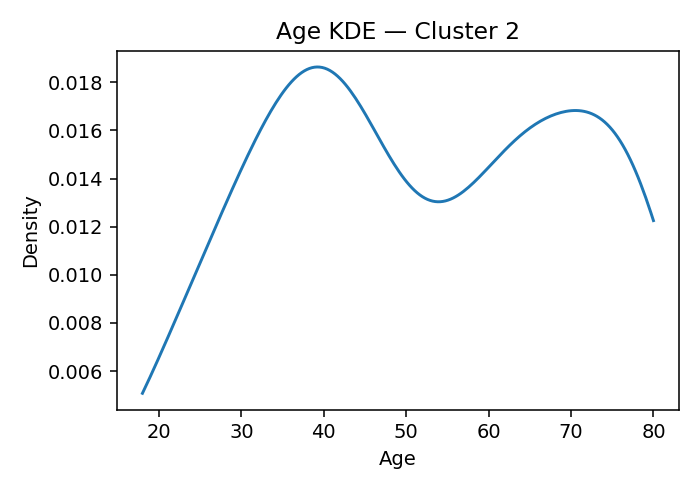
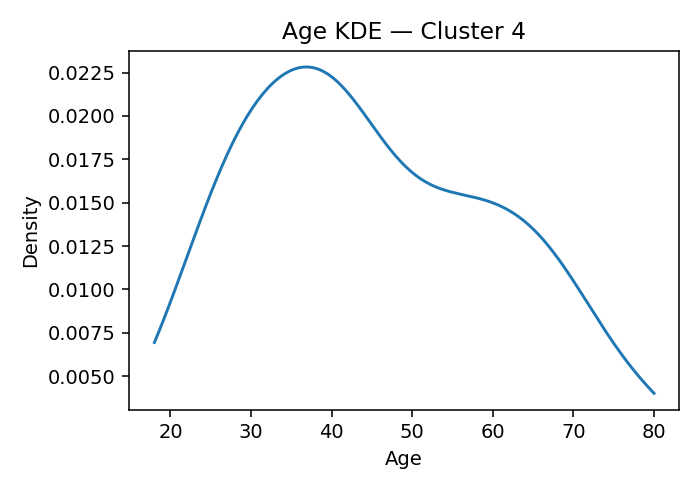
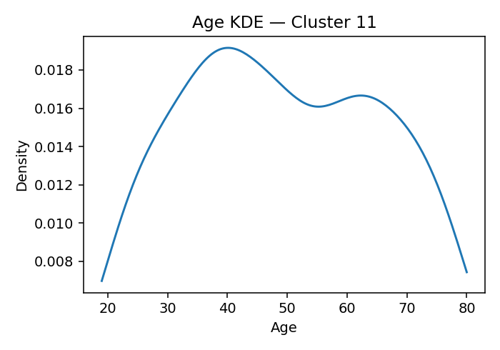

# ANES Ideology Clusters (K=17, silhouette=0.069 if computed)

## Cluster 8
**Population share (weighted):** 6.0%  ·  **Sample size (n):** 167
**Avg Party ID:** 1.81 (p10–p90: 1.0–3.0)
**Vote (weighted, normalized):** Harris 87.6% · Trump 0.5% · Other 0.6% · Non-voting 0.6% · Unknown 10.7%
**Gender (weighted):** Man 50.8% · Woman 48.4% · Nonbinary 0.3% · Other 0.0%
**Race & Hispanic (weighted):** White NH 71.9% · Black NH 11.8% · Hispanic 5.9% · Asian/NHPI NH 8.8% · Native/Other NH 0.4% · Multiracial NH 1.2%
**Education (weighted):** College 90.8% | No college 9.2%
**Economic vulnerability (higher=worse):** mean 2.3 (p20–p80: 2.0-3.0)
**Homogeneity:** avg z-dist 5.8785, feature z-std 0.8613, domain dispersion 0.4186

## Cluster 10
**Population share (weighted):** 12.5%  ·  **Sample size (n):** 622
**Avg Party ID:** 1.97 (p10–p90: 1.0–3.0)
**Vote (weighted, normalized):** Harris 78.5% · Trump 4.0% · Other 3.9% · Non-voting 3.9% · Unknown 9.8%
**Gender (weighted):** Man 41.1% · Woman 51.1% · Nonbinary 7.2% · Other 0.3%
**Race & Hispanic (weighted):** White NH 50.7% · Black NH 18.8% · Hispanic 19.3% · Asian/NHPI NH 5.2% · Native/Other NH 0.2% · Multiracial NH 5.5%
**Education (weighted):** College 77.6% | No college 21.2%
**Economic vulnerability (higher=worse):** mean 2.69 (p20–p80: 2.0-3.83)
**Homogeneity:** avg z-dist 2.7384, feature z-std 0.4497, domain dispersion 0.484

## Cluster 2
**Population share (weighted):** 11.9%  ·  **Sample size (n):** 597
**Avg Party ID:** 2.35 (p10–p90: 1.0–4.03)
**Vote (weighted, normalized):** Harris 76.2% · Trump 7.7% · Other 3.7% · Non-voting 4.2% · Unknown 8.1%
**Gender (weighted):** Man 46.8% · Woman 49.8% · Nonbinary 3.4% · Other 0.0%
**Race & Hispanic (weighted):** White NH 61.4% · Black NH 8.8% · Hispanic 20.0% · Asian/NHPI NH 5.2% · Native/Other NH 0.2% · Multiracial NH 4.3%
**Education (weighted):** College 84.8% | No college 15.1%
**Economic vulnerability (higher=worse):** mean 2.7 (p20–p80: 2.0-4.0)
**Homogeneity:** avg z-dist 3.2482, feature z-std 0.5304, domain dispersion 0.3163

## Cluster 14
**Population share (weighted):** 3.9%  ·  **Sample size (n):** 106
**Avg Party ID:** 2.4 (p10–p90: 1.0–5.0)
**Vote (weighted, normalized):** Harris 70.7% · Trump 8.1% · Other 7.4% · Non-voting 10.6% · Unknown 3.2%
**Gender (weighted):** Man 41.1% · Woman 54.5% · Nonbinary 2.7% · Other 1.7%
**Race & Hispanic (weighted):** White NH 48.5% · Black NH 20.9% · Hispanic 15.7% · Asian/NHPI NH 3.7% · Native/Other NH 0.0% · Multiracial NH 9.5%
**Education (weighted):** College 78.3% | No college 21.7%
**Economic vulnerability (higher=worse):** mean 2.57 (p20–p80: 2.0-3.0)
**Homogeneity:** avg z-dist 6.7975, feature z-std 1.0503, domain dispersion 0.3878

## Cluster 0
**Population share (weighted):** 5.5%  ·  **Sample size (n):** 181
**Avg Party ID:** 3.15 (p10–p90: 1.0–6.0)
**Vote (weighted, normalized):** Harris 39.2% · Trump 20.8% · Other 0.8% · Non-voting 28.5% · Unknown 10.7%
**Gender (weighted):** Man 22.5% · Woman 76.0% · Nonbinary 0.0% · Other 0.2%
**Race & Hispanic (weighted):** White NH 39.9% · Black NH 40.1% · Hispanic 13.8% · Asian/NHPI NH 0.7% · Native/Other NH 0.9% · Multiracial NH 3.8%
**Education (weighted):** College 42.1% | No college 56.3%
**Economic vulnerability (higher=worse):** mean 3.94 (p20–p80: 3.0-6.0)
**Homogeneity:** avg z-dist 5.3259, feature z-std 0.7908, domain dispersion 0.5289

## Cluster 4
**Population share (weighted):** 5.8%  ·  **Sample size (n):** 292
**Avg Party ID:** 3.37 (p10–p90: 1.0–6.23)
**Vote (weighted, normalized):** Harris 46.8% · Trump 23.6% · Other 5.6% · Non-voting 11.0% · Unknown 12.9%
**Gender (weighted):** Man 45.1% · Woman 52.4% · Nonbinary 1.1% · Other 1.0%
**Race & Hispanic (weighted):** White NH 39.3% · Black NH 26.8% · Hispanic 20.1% · Asian/NHPI NH 2.6% · Native/Other NH 0.0% · Multiracial NH 7.5%
**Education (weighted):** College 58.5% | No college 41.4%
**Economic vulnerability (higher=worse):** mean 3.58 (p20–p80: 2.0-5.0)
**Homogeneity:** avg z-dist 4.3147, feature z-std 0.6464, domain dispersion 0.3831

## Cluster 7
**Population share (weighted):** 4.2%  ·  **Sample size (n):** 116
**Avg Party ID:** 3.46 (p10–p90: 1.0–7.0)
**Vote (weighted, normalized):** Harris 58.3% · Trump 30.6% · Other 1.1% · Non-voting 5.3% · Unknown 4.7%
**Gender (weighted):** Man 55.4% · Woman 44.6% · Nonbinary 0.0% · Other 0.0%
**Race & Hispanic (weighted):** White NH 68.7% · Black NH 6.7% · Hispanic 7.0% · Asian/NHPI NH 16.7% · Native/Other NH 0.0% · Multiracial NH 0.9%
**Education (weighted):** College 67.5% | No college 32.5%
**Economic vulnerability (higher=worse):** mean 2.53 (p20–p80: 2.0-3.0)
**Homogeneity:** avg z-dist 6.5675, feature z-std 1.0119, domain dispersion 0.3712

## Cluster 3
**Population share (weighted):** 8.8%  ·  **Sample size (n):** 542
**Avg Party ID:** 4.15 (p10–p90: 1.0–7.0)
**Vote (weighted, normalized):** Harris 39.2% · Trump 38.0% · Other 2.1% · Non-voting 11.4% · Unknown 9.3%
**Gender (weighted):** Man 54.0% · Woman 44.4% · Nonbinary 0.4% · Other 1.2%
**Race & Hispanic (weighted):** White NH 80.7% · Black NH 0.8% · Hispanic 9.4% · Asian/NHPI NH 5.2% · Native/Other NH 0.0% · Multiracial NH 3.2%
**Education (weighted):** College 63.2% | No college 36.8%
**Economic vulnerability (higher=worse):** mean 2.77 (p20–p80: 2.0-4.0)
**Homogeneity:** avg z-dist 3.6243, feature z-std 0.5866, domain dispersion 0.3522

## Cluster 6
**Population share (weighted):** 3.9%  ·  **Sample size (n):** 191
**Avg Party ID:** 4.16 (p10–p90: 1.0–7.0)
**Vote (weighted, normalized):** Harris 26.5% · Trump 29.0% · Other 3.9% · Non-voting 35.0% · Unknown 5.6%
**Gender (weighted):** Man 45.1% · Woman 50.5% · Nonbinary 1.1% · Other 2.8%
**Race & Hispanic (weighted):** White NH 45.9% · Black NH 16.1% · Hispanic 19.1% · Asian/NHPI NH 8.8% · Native/Other NH 2.3% · Multiracial NH 7.2%
**Education (weighted):** College 48.1% | No college 51.7%
**Economic vulnerability (higher=worse):** mean 3.83 (p20–p80: 2.0-6.0)
**Homogeneity:** avg z-dist 6.0884, feature z-std 0.9394, domain dispersion 0.7695

## Cluster 9
**Population share (weighted):** 3.1%  ·  **Sample size (n):** 195
**Avg Party ID:** 4.32 (p10–p90: 2.0–7.0)
**Vote (weighted, normalized):** Harris 29.4% · Trump 45.2% · Other 10.8% · Non-voting 11.7% · Unknown 2.9%
**Gender (weighted):** Man 44.4% · Woman 51.5% · Nonbinary 0.3% · Other 0.7%
**Race & Hispanic (weighted):** White NH 58.1% · Black NH 7.0% · Hispanic 18.2% · Asian/NHPI NH 6.7% · Native/Other NH 0.0% · Multiracial NH 10.1%
**Education (weighted):** College 56.7% | No college 43.0%
**Economic vulnerability (higher=worse):** mean 3.56 (p20–p80: 2.0-4.5)
**Homogeneity:** avg z-dist 5.4562, feature z-std 0.8245, domain dispersion 0.7902

## Cluster 11
**Population share (weighted):** 2.6%  ·  **Sample size (n):** 59
**Avg Party ID:** 4.8 (p10–p90: 2.0–7.0)
**Vote (weighted, normalized):** Harris 10.6% · Trump 43.1% · Other 7.0% · Non-voting 35.5% · Unknown 3.8%
**Gender (weighted):** Man 55.9% · Woman 44.1% · Nonbinary 0.0% · Other 0.0%
**Race & Hispanic (weighted):** White NH 49.4% · Black NH 10.7% · Hispanic 28.4% · Asian/NHPI NH 4.1% · Native/Other NH 0.4% · Multiracial NH 7.0%
**Education (weighted):** College 40.6% | No college 59.4%
**Economic vulnerability (higher=worse):** mean 3.28 (p20–p80: 2.0-4.0)
**Homogeneity:** avg z-dist 9.5797, feature z-std 1.4563, domain dispersion 0.6393

## Cluster 1
**Population share (weighted):** 6.1%  ·  **Sample size (n):** 313
**Avg Party ID:** 5.02 (p10–p90: 2.07–7.0)
**Vote (weighted, normalized):** Harris 18.2% · Trump 61.8% · Other 2.8% · Non-voting 9.2% · Unknown 8.0%
**Gender (weighted):** Man 55.3% · Woman 44.3% · Nonbinary 0.0% · Other 0.0%
**Race & Hispanic (weighted):** White NH 71.1% · Black NH 7.2% · Hispanic 13.0% · Asian/NHPI NH 3.8% · Native/Other NH 0.3% · Multiracial NH 3.9%
**Education (weighted):** College 60.8% | No college 39.2%
**Economic vulnerability (higher=worse):** mean 2.89 (p20–p80: 2.0-4.0)
**Homogeneity:** avg z-dist 3.9125, feature z-std 0.5997, domain dispersion 0.27

## Cluster 13
**Population share (weighted):** 3.2%  ·  **Sample size (n):** 179
**Avg Party ID:** 5.1 (p10–p90: 2.0–7.0)
**Vote (weighted, normalized):** Harris 22.9% · Trump 59.5% · Other 6.1% · Non-voting 9.2% · Unknown 2.4%
**Gender (weighted):** Man 46.6% · Woman 52.5% · Nonbinary 0.0% · Other 0.9%
**Race & Hispanic (weighted):** White NH 74.1% · Black NH 5.0% · Hispanic 11.4% · Asian/NHPI NH 4.7% · Native/Other NH 0.4% · Multiracial NH 0.7%
**Education (weighted):** College 58.5% | No college 37.7%
**Economic vulnerability (higher=worse):** mean 3.19 (p20–p80: 2.0-4.0)
**Homogeneity:** avg z-dist 4.8845, feature z-std 0.736, domain dispersion 0.2904

## Cluster 12
**Population share (weighted):** 5.8%  ·  **Sample size (n):** 129
**Avg Party ID:** 5.67 (p10–p90: 4.0–7.0)
**Vote (weighted, normalized):** Harris 4.9% · Trump 71.2% · Other 4.7% · Non-voting 9.7% · Unknown 9.4%
**Gender (weighted):** Man 50.5% · Woman 48.9% · Nonbinary 0.0% · Other 0.0%
**Race & Hispanic (weighted):** White NH 86.0% · Black NH 1.1% · Hispanic 6.9% · Asian/NHPI NH 1.0% · Native/Other NH 0.9% · Multiracial NH 3.3%
**Education (weighted):** College 47.0% | No college 51.3%
**Economic vulnerability (higher=worse):** mean 2.72 (p20–p80: 2.0-3.14)
**Homogeneity:** avg z-dist 7.8645, feature z-std 1.218, domain dispersion 0.4498

## Cluster 15
**Population share (weighted):** 3.2%  ·  **Sample size (n):** 243
**Avg Party ID:** 5.89 (p10–p90: 4.0–7.0)
**Vote (weighted, normalized):** Harris 3.8% · Trump 84.0% · Other 0.5% · Non-voting 7.1% · Unknown 4.7%
**Gender (weighted):** Man 71.5% · Woman 26.7% · Nonbinary 0.0% · Other 0.6%
**Race & Hispanic (weighted):** White NH 71.3% · Black NH 6.4% · Hispanic 7.1% · Asian/NHPI NH 0.7% · Native/Other NH 0.6% · Multiracial NH 11.5%
**Education (weighted):** College 55.1% | No college 44.9%
**Economic vulnerability (higher=worse):** mean 3.22 (p20–p80: 2.0-4.0)
**Homogeneity:** avg z-dist 3.973, feature z-std 0.614, domain dispersion 0.4314

## Cluster 16
**Population share (weighted):** 5.4%  ·  **Sample size (n):** 158
**Avg Party ID:** 6.09 (p10–p90: 5.0–7.0)
**Vote (weighted, normalized):** Harris 3.7% · Trump 88.2% · Other 2.6% · Non-voting 2.6% · Unknown 2.9%
**Gender (weighted):** Man 52.2% · Woman 47.4% · Nonbinary 0.0% · Other 0.3%
**Race & Hispanic (weighted):** White NH 86.7% · Black NH 0.9% · Hispanic 7.7% · Asian/NHPI NH 1.0% · Native/Other NH 0.4% · Multiracial NH 2.9%
**Education (weighted):** College 64.3% | No college 35.2%
**Economic vulnerability (higher=worse):** mean 2.68 (p20–p80: 2.0-4.0)
**Homogeneity:** avg z-dist 6.66, feature z-std 0.9862, domain dispersion 0.4848

## Cluster 5
**Population share (weighted):** 8.1%  ·  **Sample size (n):** 615
**Avg Party ID:** 6.17 (p10–p90: 5.0–7.0)
**Vote (weighted, normalized):** Harris 3.2% · Trump 81.9% · Other 3.4% · Non-voting 4.7% · Unknown 6.9%
**Gender (weighted):** Man 57.0% · Woman 42.7% · Nonbinary 0.1% · Other 0.0%
**Race & Hispanic (weighted):** White NH 82.7% · Black NH 1.0% · Hispanic 5.6% · Asian/NHPI NH 2.6% · Native/Other NH 0.1% · Multiracial NH 5.2%
**Education (weighted):** College 67.3% | No college 32.3%
**Economic vulnerability (higher=worse):** mean 2.84 (p20–p80: 2.0-4.0)
**Homogeneity:** avg z-dist 3.6062, feature z-std 0.5644, domain dispersion 0.3809

## Methodology
- **Data:** ANES 2024 Time Series. Weighted stats use the first available pre-election weight. Clustering is unweighted (K-means).
- **Domains (pre + post):** abortion; immigration (PRE + POST); redistribution; environment; health; defense; religion; racial disparity (V241728/29); efficacy/trust/corruption (V241726/37/38); democracy (V241731/743); vaccines (V241732); Israel aid (V241741); Ukraine aid (V241740); gay rights (V241381x/V241385x); trans laws (V241742); DEI/affirmative (V242237/241x/242); minority representation (V242526–29).
- **Coding:** Conservative-leaning options coded higher; racial disparity kept interpretive (higher = Whites **not** advantaged; Blacks **disadvantaged**). Israel/Ukraine are separate axes; both flipped so higher = more support.
- **Missingness:** Negative ANES codes set to missing. Keep respondents with ≥60% items answered. Median impute per feature for clustering inputs.
- **Scaling & clustering:** z-scores; K chosen by silhouette in [12,20]; K-means (multi-start).
- **Vote shares:** Computed on a **single denominator** (cluster’s total weight) so *Harris + Trump + Other + Non-voting + Unknown = 100%*, using post reported vote/turnout when available, else pre intention.
- **Outputs:** per cluster — normalized vote shares; weighted party-ID mean + p10–p90; gender & race/Hispanic shares; college/no-college; economic vulnerability (mean & p20–p80 from income summary, inverted); age KDE; population share (weighted) & sample size (n).
- **Homogeneity:** avg z-distance to centroid, mean per-feature z-std, dispersion across domain indices.